# 链表
---
链表题最重要的是掌握链表的一些基本操作（技巧），很多题目都是由这些技巧进行组合：
1. 找到链表中点（快慢指针）
2. 找到链表倒数第N个节点（先后指针/快慢指针）
3. 找到链表第N个节点
4. 反转链表（头插法）
5. 合并链表（使用一个头节点）
6. 链表按照条件插入节点
7. 链表按照条件删除节点
8. 检测链表中的环并找到环入口以及链表相交
9. 获取链表长度
10. 链表按照条件产生新链表

------------------------


### 876. [链表的中间结点](https://leetcode-cn.com/problems/middle-of-the-linked-list/) ```easy```
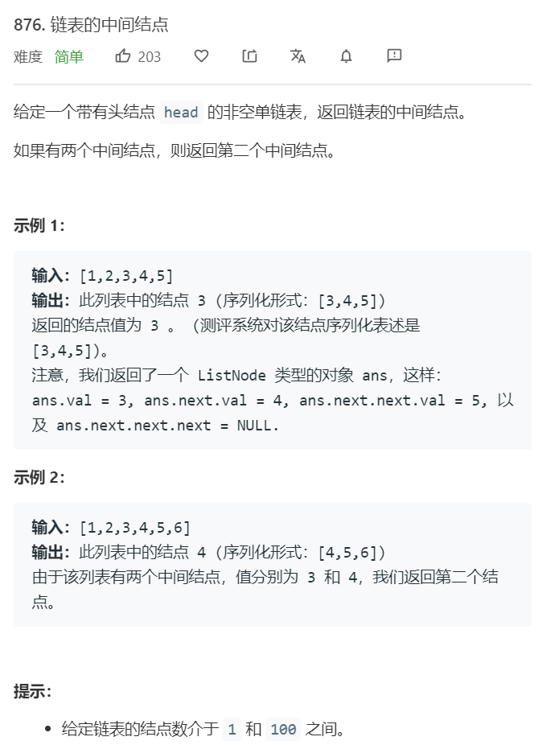

**分析**<br/><br/>
使用快慢指针来找到链表的中间节点。当fast, slow均为head时，while(fast and fast.next): fast = fast.next.next slow = slow.next 此时，对于奇数情况，slow停止在中间节点，对于偶数情况，slow停止在后面一个中间节点。若fast初始化为head.next时，slow会停止在前面一个中间节点。当fast，slow均初始化为dummy时，slow同样停止在前面一个中间节点。


**算法如下**<br/>
```python
class Solution(object):
    def middleNode(self, head):
        """
        :type head: ListNode
        :rtype: ListNode
        """
        if not head: return None
        slow, fast = head, head
        while fast and fast.next:
            fast = fast.next.next 
            slow = slow.next 
        return slow
```

### 02.02. [返回倒数第 k 个节点](https://leetcode-cn.com/problems/kth-node-from-end-of-list-lcci/) ```easy```
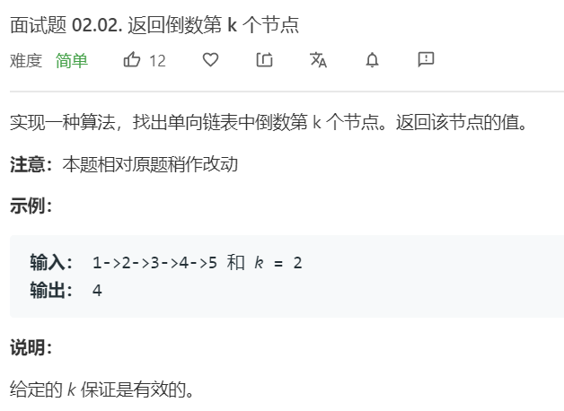

**分析**<br/><br/>
使用先后指针来获取倒数第k个节点。首先让fast指针先走k步，然后slow和fast同样步调，当fast到None时，slow指向第k个指针。

**算法如下**<br/>
```python
class Solution(object):
    def kthToLast(self, head, k):
        """
        :type head: ListNode
        :type k: int
        :rtype: int
        """
        slow, fast = head, head
        for _ in range(k):
            fast = fast.next 
        while fast:
            slow = slow.next 
            fast = fast.next 
        return slow.val
```


### 19. [删除链表的倒数第N个节点](https://leetcode-cn.com/problems/remove-nth-node-from-end-of-list/) ```easy```
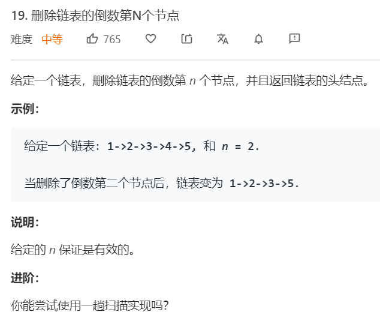

**分析**<br/><br/>
这里需要删除倒数第n个节点，这种情况下可以设置一个prev指针，或者直接找到倒数第n+1个节点。然后删除后面一个节点。值得注意的是，由于可能需要删除第一个节点，因此设置一个头节点比较简单。

**算法如下**<br/>
```python
class Solution(object):
    def removeNthFromEnd(self, head, n):
        """
        :type head: ListNode
        :type n: int
        :rtype: ListNode
        """
        dummy = ListNode(None)
        dummy.next = head 
        slow, fast = dummy, dummy

        for _ in range(n+1):
            fast = fast.next 
        while fast:
            slow = slow.next 
            fast = fast.next 
        
        slow.next = slow.next.next
        return dummy.next
```

或者设置一个prev
**算法如下**<br/>
```python
class Solution(object):
    def removeNthFromEnd(self, head, n):
        """
        :type head: ListNode
        :type n: int
        :rtype: ListNode
        """
        dummy = ListNode(None)
        dummy.next = head 
        prev, slow, fast = dummy, dummy, dummy

        for _ in range(n):
            fast = fast.next 
        while fast:
            prev = slow
            slow = slow.next 
            fast = fast.next 
        
        prev.next = prev.next.next
        return dummy.next
```


### 206. [反转链表](https://leetcode-cn.com/problems/reverse-linked-list/) ```easy```
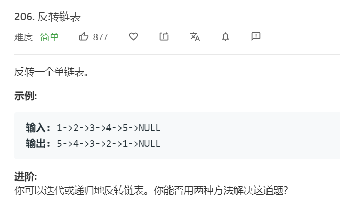

**分析**<br/><br/>
添加一个头节点，然后使用头插法。

**算法如下**<br/>
```python
class Solution(object):
    def reverseList(self, head):
        """
        :type head: ListNode
        :rtype: ListNode
        """
        dummy = ListNode(None)
        while head:
            next_head = head.next
            head.next = dummy.next 
            dummy.next = head
            head = next_head
        return dummy.next
```


### 92. [反转链表II](https://leetcode-cn.com/problems/reverse-linked-list-ii/) ```middle```


**分析**<br/><br/>
首先找到第m个链表节点，并设置一个prev节点，然后把prev节点做为头插法的头。当head设置为dummy时，循环m次即可以找到第m个节点。然后循环头插节点，直到第n个节点。需要注意的是，此时第m个节点将是新的尾节点，将这个尾节点和第n+1个节点连接即可。

**算法如下**<br/>
```python
class Solution(object):
    def reverseBetween(self, head, m, n):
        """
        :type head: ListNode
        :type m: int
        :type n: int
        :rtype: ListNode
        """
        dummy = ListNode(None)
        dummy.next = head 

        head, prev = dummy, dummy
        for i in range(m):
            prev = head 
            head = head.next

        prev_head = prev    # 头插法的头
        prev_head.next = None  # 断掉头
        tail = head             # 新的尾节点
        for i in range(m-1, n):     # 之前是m-1停止，继续循环，第n次即到第n个节点
            next_head = head.next 
            head.next = prev_head.next
            prev_head.next = head
            head = next_head
        tail.next = head 
        return dummy.next
```


### 82. [删除排序链表中的重复元素 II](https://leetcode-cn.com/problems/remove-duplicates-from-sorted-list-ii/) ```medium```
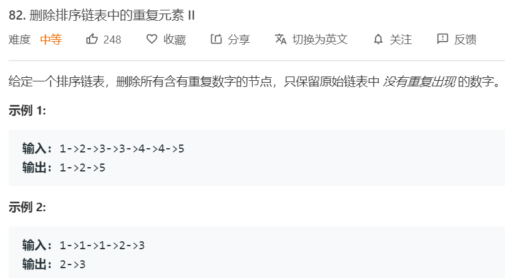

**分析**<br/><br/>
首先构建一个头节点，这里需要注意的是，需要删除所有出现过重复的元素。使用两个指针和一个指示量，一个prev指针表示前面一个节点，head则表示当前正在遍历的节点。需要注意的是，当出现重复元素时，head不断前移，但prev不进行移动，当不再存在重复元素时，prev将next置为当前的head。只有当head没有碰到重复元素时，prev才前移。


**算法如下**<br/>
```python
class Solution:
    def deleteDuplicates(self, head: ListNode) -> ListNode:
        dummy = ListNode(None)
        dummy.next = head 
        prev = dummy

        while head and head.next:
            duplicate = 0
            while head and head.next and head.val == head.next.val:
                duplicate += 1
                head = head.next
            if duplicate == 0:
                prev = head 
                head = head.next 
            else:
                head = head.next
                prev.next = head

        return dummy.next
```


### 61. [旋转链表](https://leetcode-cn.com/problems/rotate-list/) ```medium```
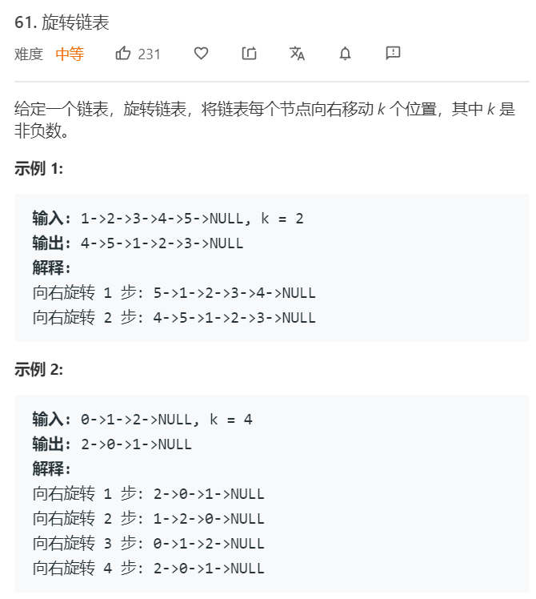

**分析**<br/><br/>
向右移动k个位置，实际上是找到倒数第k个节点，然后将这个节点作为头节点。前面的节点则接在最后。首先需要获取链表的长度L，然后k重置为k%L。
设置prev和tail指针，tail是fast的前驱指针，prev是slow的前驱指针。fast先走k步，当fast到None时，tail为尾节点，slow为倒数第k个节点，也是新的头节点，prev为倒数第k+1个节点，也是新的尾节点。


**算法如下**<br/>
```python
class Solution(object):
    def rotateRight(self, head, k):
        """
        :type head: ListNode
        :type k: int
        :rtype: ListNode
        """
        if k == 0 or head is None: return head
        L = 0
        cur = head
        while cur:
            L += 1
            cur = cur.next 
        
        k=k%L
        if k == 0: return head 

        prev, slow, fast, tail = head, head, head, head
        for _ in range(k):
            tail = fast
            fast = fast.next
        while fast:
            tail = fast
            fast = fast.next 
            prev = slow 
            slow = slow.next 
        
        new_head = slow 
        tail.next = head 
        prev.next = None 
        return new_head
```

### 21. [合并两个有序链表](https://leetcode-cn.com/problems/merge-two-sorted-lists/) ```easy```
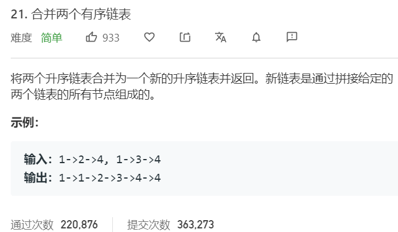

**分析**<br/><br/>
建立一个头节点，然后依次遍历链表。接到头节点上。

**算法如下**<br/>
```python
class Solution(object):
    def mergeTwoLists(self, l1, l2):
        """
        :type l1: ListNode
        :type l2: ListNode
        :rtype: ListNode
        """
        dummy = ListNode(None)
        head = dummy
        while l1 and l2:
            if l1.val < l2.val:
                head.next = l1
                l1 = l1.next 
            else:
                head.next = l2 
                l2 = l2.next 
            head = head.next
        if l1: head.next = l1 
        if l2: head.next = l2 
        return dummy.next
```


### 23. [合并K个有序链表](https://leetcode-cn.com/problems/merge-k-sorted-lists/) ```hard```
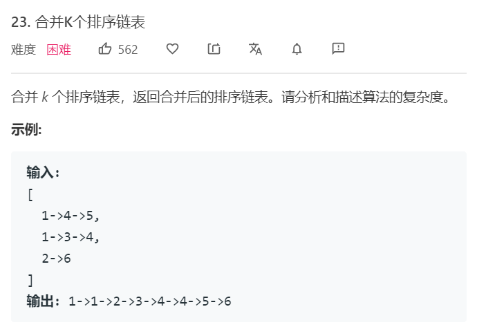

**分析**<br/><br/>
需要合并k个排序链表，这里主要是用堆来获取K个节点里面的最小值，可以简历一个最小堆。

**算法如下**<br/>
```python
import heapq
class Solution(object):
    def mergeKLists(self, lists):
        """
        :type lists: List[ListNode]
        :rtype: ListNode
        """
        dummy = ListNode(None)
        heap = [(l.val, l) for l in lists if l is not None]
        heapq.heapify(heap)

        head = dummy
        while heap:
            _, smallest = heapq.heappop(heap)
            head.next = smallest
            head = head.next 

            if smallest.next:
                heapq.heappush(heap, (smallest.next.val, smallest.next))
        return dummy.next
```


或者使用分治Merge的方法
```python
class Solution(object):
    def mergeKLists(self, lists):
        """
        :type lists: List[ListNode]
        :rtype: ListNode
        """
        if len(lists) == 0: return None 
        if len(lists) == 1: return lists[0]
        
        mid = len(lists) // 2
        left = self.mergeKLists(lists[:mid])
        right = self.mergeKLists(lists[mid:])
        
        # merge left and right
        dummy = ListNode(None)
        head = dummy
        while left and right:
            if left.val < right.val:
                head.next = left
                left = left.next 
            else:
                head.next = right 
                right = right.next 
            head = head.next 
        if left: head.next = left 
        if right: head.next = right 
        return dummy.next
```


### 109. [有序链表转换二叉搜索树](https://leetcode-cn.com/problems/convert-sorted-list-to-binary-search-tree/) ```middle```
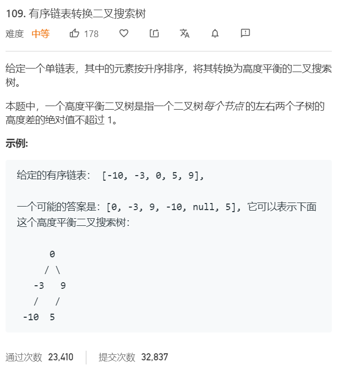

**分析**<br/><br/>
递归查找。每次找到链表的中点，然后递归调用产生子树。值得注意的是，在这里，当节点数为偶数时，应该找到后面的中间节点。以防止出现以下情况:有1 2两个节点，若找到的是1节点，则prev节点也为1节点，会循环产生left子树。若找到的第二个节点，则不存在这一情况。slow.next为None，函数会产生None.

**算法如下**<br/>
```python
class Solution(object):
    def sortedListToBST(self, head):
        """
        :type head: ListNode
        :rtype: TreeNode
        """
        if head is None: return None 
        if head.next is None: return TreeNode(head.val)

        prev, slow, fast = head, head, head
        while fast and fast.next:
            prev = slow 
            slow = slow.next 
            fast = fast.next.next

        prev.next = None 
        root = TreeNode(slow.val)
        root.left = self.sortedListToBST(head)
        root.right = self.sortedListToBST(slow.next)
        return root
```

### 141. [环形链表](https://leetcode-cn.com/problems/linked-list-cycle/) ```easy```
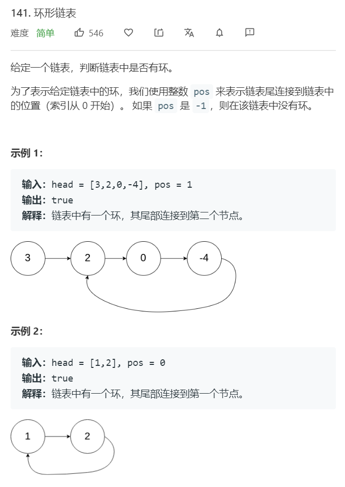

**分析**<br/><br/>
使用快慢指针判断是否有环，需要加上头节点。不然可能停在第一个节点上。

**算法如下**<br/>
```python
class Solution(object):
    def hasCycle(self, head):
        """
        :type head: ListNode
        :rtype: bool
        """
        if head is None: return False
        dummy = ListNode(None)
        dummy.next = head
        slow, fast = dummy, dummy
        while fast and fast.next:
            slow = slow.next 
            fast = fast.next.next
            if slow == fast: break
        return slow == fast 
```

### 142. [环形链表II](https://leetcode-cn.com/problems/linked-list-cycle-ii/) ```middle```
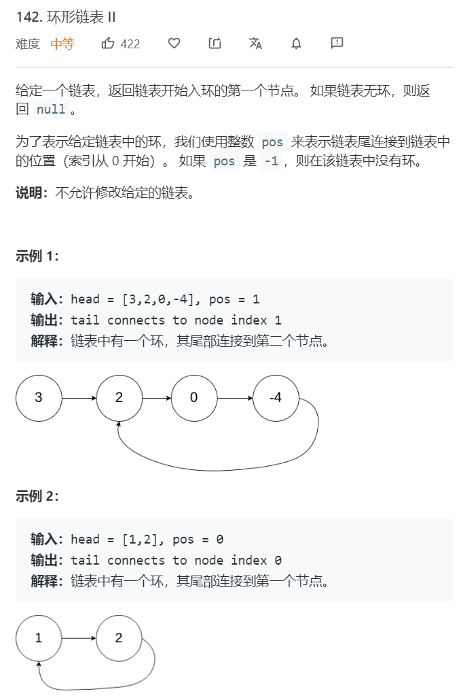

**分析**<br/><br/>
直接判断无节点和只有一个节点的情况。

**算法如下**<br/>
```python
class Solution(object):
    def detectCycle(self, head):
        """
        :type head: ListNode
        :rtype: ListNode
        """
        if head is None or head.next is None: return None
        slow, fast = head, head
        while fast and fast.next:
            slow = slow.next 
            fast = fast.next.next 
            if slow == fast: break 

        if slow != fast:
            return None
        cur = head 
        while cur != slow:
            cur = cur.next 
            slow = slow.next 
        return cur
```


### 160. [相交链表](https://leetcode-cn.com/problems/intersection-of-two-linked-lists/) ```easy```
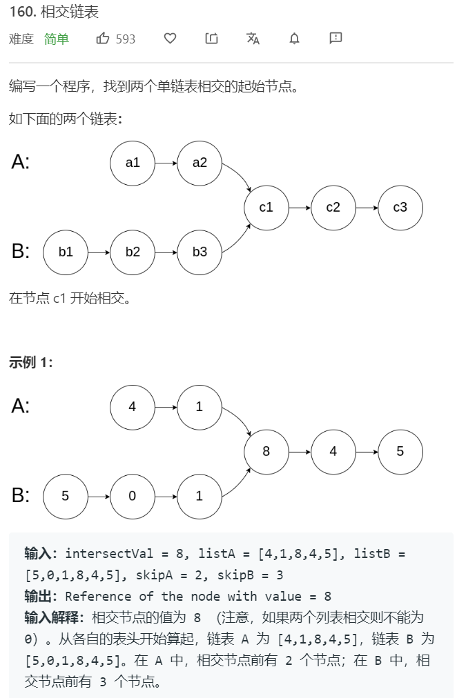

**分析**<br/><br/>
相交链表，将A链表和B链表头尾相接，若其中有环则说明相交。且相交起始节点即是环入口。这里需要先把两个均为None和两个均只有1个节点的情况摘出来。

**算法如下**<br/>
```python
class Solution(object):
    def getIntersectionNode(self, headA, headB):
        """
        :type head1, head1: ListNode
        :rtype: ListNode
        """
        if headA is None or headB is None: return None
        if (headA.next is None and headB.next is None):
            if headA == headB: return headA
            else: return None

        tailA = headA
        while tailA.next:
            tailA = tailA.next 
        tailA.next = headB

        slow, fast = headA, headA
        while fast and fast.next:
            slow = slow.next 
            fast = fast.next.next 
            if slow == fast: break 
        if slow != fast: 
            tailA.next = None
            return None 
        cur = headA
        while cur != slow:
            cur = cur.next 
            slow = slow.next 
        tailA.next = None
        return cur
```


### 234. [回文链表](https://leetcode-cn.com/problems/palindrome-linked-list/) ```easy```


**分析**<br/><br/>
使用双向链表。需要特别注意的是，不能采用while tail.next的循环，这种情况下，最后一个节点会没有prev成员。

**算法如下**<br/>
```python
class Solution(object):
    def isPalindrome(self, head):
        """
        :type head: ListNode
        :rtype: bool
        """
        if head is None or head.next is None: return True

        prev, tail = head, head.next
        tail.prev = prev
        L = 1
        while tail:
            tail.prev = prev
            prev = tail 
            tail = tail.next 
            L += 1
        tail = prev
        
        for _ in range(L//2):
            if head.val != tail.val:
                return False
            head = head.next
            tail = tail.prev 
        return True
```


### 143. [重排链表](https://leetcode-cn.com/problems/reorder-list/) ```middle```
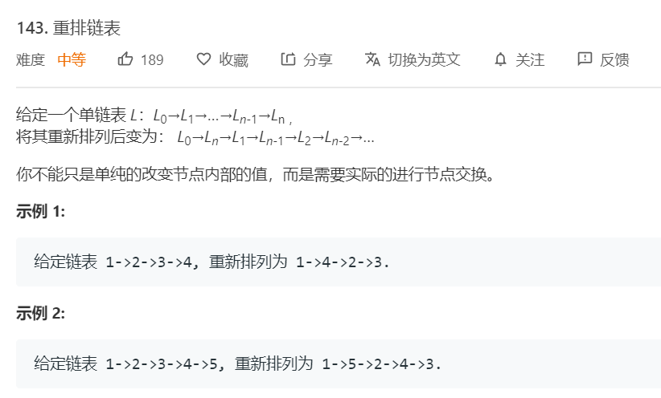

**分析**<br/><br/>
首先找到中点（偶数情况取后面一个），分为前后两部分。然后反转后面一部分，再合并两个链表。


**算法如下**<br/>
```python
class Solution(object):
    def reorderList(self, head):
        """
        :type head: ListNode
        :rtype: None Do not return anything, modify head in-place instead.
        """
        if head is None or head.next is None: return head
        slow, fast, prev = head, head, head
        while fast and fast.next:   # found mid node
            prev = slow 
            slow = slow.next 
            fast = fast.next.next 
        # head insert to reverse latter part
        prev.next = None 
        while slow:
            next_slow = slow.next 
            slow.next = prev.next
            prev.next = slow 
            slow = next_slow
        
        # merge two part
        left, right = head, prev.next 
        prev.next = None
        dummy = ListNode(None)
        head = dummy
        i = 0
        while left and right:
            if i % 2 == 0:
                head.next = left
                left = left.next 
            else:
                head.next = right 
                right = right.next 
            i += 1
            head = head.next 
        if left: head.next = left
        if right: head.next = right 
        return dummy.next
```


### 328. [奇偶链表](https://leetcode-cn.com/problems/odd-even-linked-list/) ```middle```
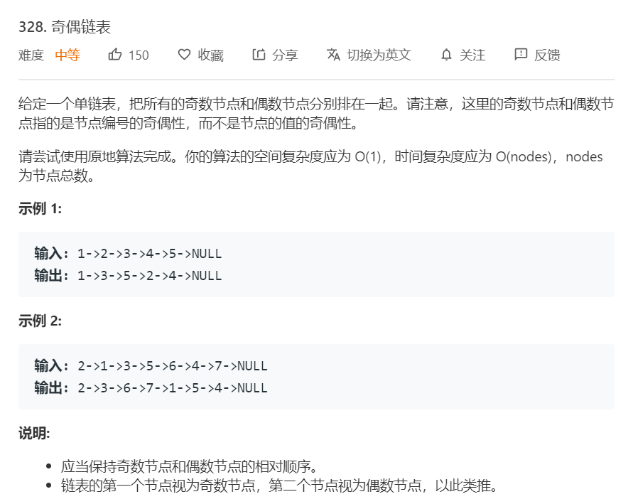

**分析**<br/><br/>
遍历链表节点，若满足条件则赋给相应的头节点。


**算法如下**<br/>
```python
class Solution(object):
    def oddEvenList(self, head):
        """
        :type head: ListNode
        :rtype: ListNode
        """
        if head is None: return head
        odd_dummy, even_dummy = ListNode(None), ListNode(None)
        odd, even = odd_dummy, even_dummy
        i = 0
        while head:
            if i % 2 == 0:
                odd.next = head 
                odd = odd.next 
            else:
                even.next = head
                even = even.next 
            head = head.next 
            i += 1
        
        odd.next = even_dummy.next
        even.next = None 
        return odd_dummy.next 
```


### 83. [删除排序链表中的重复元素](https://leetcode-cn.com/problems/remove-duplicates-from-sorted-list/) ```easy```
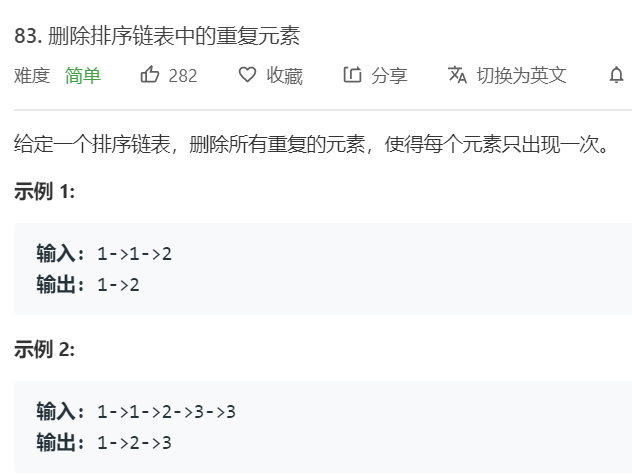

**分析**<br/><br/>
遍历链表节点，若满足条件则赋给相应的头节点。


**算法如下**<br/>
```python
class Solution(object):
    def oddEvenList(self, head):
        """
        :type head: ListNode
        :rtype: ListNode
        """
        if head is None: return head
        odd_dummy, even_dummy = ListNode(None), ListNode(None)
        odd, even = odd_dummy, even_dummy
        i = 0
        while head:
            if i % 2 == 0:
                odd.next = head 
                odd = odd.next 
            else:
                even.next = head
                even = even.next 
            head = head.next 
            i += 1
        
        odd.next = even_dummy.next
        even.next = None 
        return odd_dummy.next 
```


### 82. [删除排序链表中的重复元素II](https://leetcode-cn.com/problems/remove-duplicates-from-sorted-list-ii/) ```middle```


**分析**<br/><br/>
遍历链表节点，若满足条件则赋给相应的头节点。在这道题中，满足的条件略为复杂。中间进行一个二重循环，跳过与下一个值相等的节点。该步骤会停止在相等序列的最后一个节点上。为区分存在相等序列和不存在相等序列的情况，增加一个flag值。当没有碰到过相等序列时，即为满足条件，加入到新的链表中。


**算法如下**<br/>
```python
class Solution(object):
    def deleteDuplicates(self, head):
        """
        :type head: ListNode
        :rtype: ListNode
        """
        if head is None or head.next is None: return head
        dummy = ListNode(None)
        cur = head 
        head = dummy
        while cur:
            same = False
            while cur and cur.next and cur.val == cur.next.val:
                same = True 
                cur = cur.next 
            if not same:
                head.next = cur 
                head = head.next 
            if cur: 
                cur = cur.next 
        head.next = None   # 该步必须且重要
        return dummy.next
```


### 725. [分隔链表](https://leetcode-cn.com/problems/split-linked-list-in-parts/) ```middle```
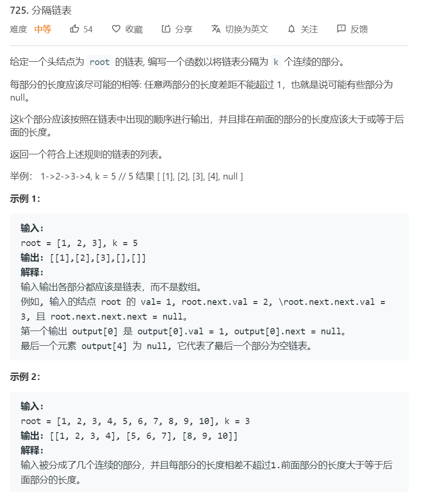

**分析**<br/><br/>


**算法如下**<br/>
```python
import math
class Solution:
    def splitListToParts(self, root: ListNode, k: int) -> List[ListNode]:
        if k == 1: return [root]
        ans = [[] for i in range(k)]
        cur = root 
        L = 0
        while cur:
            cur = cur.next 
            L += 1
        
        cur = root 
        for i in range(k):
            l = int(math.ceil(L/(k-i)))
            if l == 0:
                ans[i] = None
                continue
            L -= l
            ans[i] = cur 
            for _ in range(l-1):
                cur = cur.next
            next_cur = cur.next 
            cur.next = None 
            cur = next_cur
        return ans
```

### 1171. [从链表中删去总和值为零的连续节点](https://leetcode-cn.com/problems/remove-zero-sum-consecutive-nodes-from-linked-list/) ```middle```
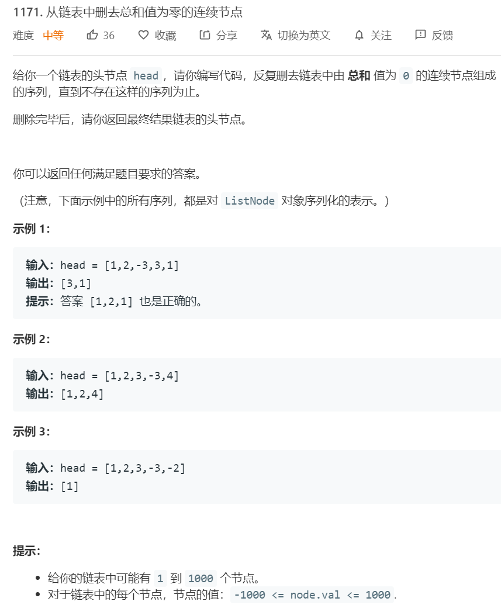

**分析**<br/><br/>
使用前缀和hashmap，key为当前为止的前缀和，value为当前节点。首先第一遍先保存一遍前缀和，由于我们需要检查前面是否存在和当前相当的前缀和，并删除中间的区间，以及区间内的全部前缀和。有个聪明的做法，即在保存前缀和时，采用覆盖的方式，当前缀和相等时，我们永远获取的是排在后面的位置。当第二次计算前缀和并遍历链表时，通过获取当前前缀和的节点位置就可以实现跳过区间。


**算法如下**<br/>
```python
class Solution(object):
    def removeZeroSumSublists(self, head):
        """
        :type head: ListNode
        :rtype: ListNode
        """
        dummy = ListNode(0)
        dummy.next = head 
        prefix = {}

        sum = 0
        cur = dummy
        while cur:
            sum += cur.val 
            prefix[sum] = cur 
            cur = cur.next
        
        sum = 0
        cur = dummy
        while cur:
            sum += cur.val
            cur.next = prefix[sum].next 
            cur = cur.next 
        return dummy.next
```

### 1367. [二叉树中的列表](https://leetcode-cn.com/problems/linked-list-in-binary-tree/) ```middle```


**分析**<br/><br/>
这题和判断子数结构几乎一样。


**算法如下**<br/>
```python
class Solution(object):
    def isSubPath(self, head, root):
        """
        :type head: ListNode
        :type root: TreeNode
        :rtype: bool
        """
        if root is None: return False
        stack = [root]
        while stack:
            root = stack.pop()
            if self.helper(head, root):
                return True 
            if root.right: stack.append(root.right)
            if root.left: stack.append(root.left)
        return False
            
            
    def helper(self, head, root):
        if head is None:
            return True
        if root is None:
            return False
        return head.val == root.val and (self.helper(head.next, root.left) or self.helper(head.next, root.right))
```

### 24. [两两交换链表中的节点](https://leetcode-cn.com/problems/swap-nodes-in-pairs/) ```middle```
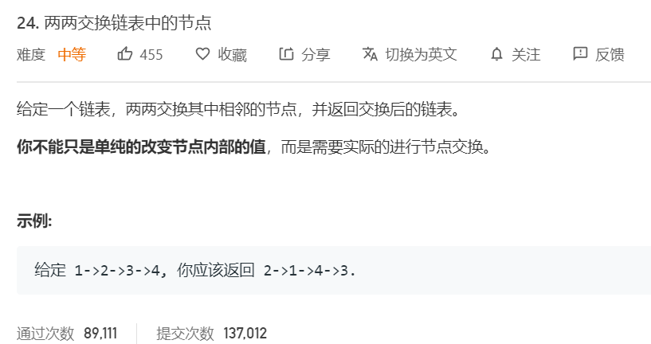

**分析**<br/><br/>
这道题主要是用头插法。记录当前是第几个节点，需要区分的是每组的第一个节点和最后一个节点。每组的第一个节点将是下一组的头插节点，而每组的最后一个节点需要重置头插节点为下一个头插节点。

**算法如下**<br/>
```python
class Solution(object):
    def swapPairs(self, head):
        """
        :type head: ListNode
        :rtype: ListNode
        """
        dummy = ListNode(None)
        prev_tail = dummy
        i = 0
        while head:
            i += 1
            if i % 2 == 1: next_prev_tail = head
            next_head = head.next 
            head.next = prev_tail.next 
            prev_tail.next = head
            head = next_head
            if i % 2 == 0: prev_tail = next_prev_tail
        return dummy.next
```

### 25. [K 个一组翻转链表](https://leetcode-cn.com/problems/reverse-nodes-in-k-group/) ```hard```
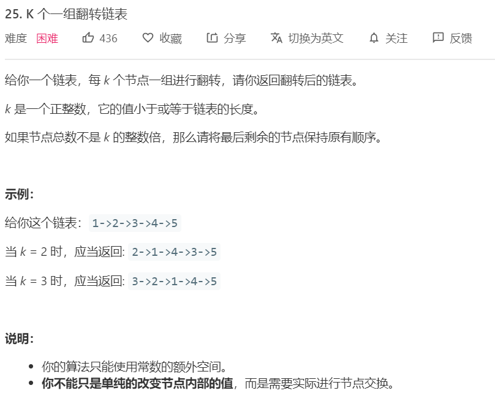

**分析**<br/><br/>
与前面一题类似。是用头插法。记录当前是第几个节点，需要区分的是每组的第一个节点和最后一个节点。每组的第一个节点将是下一组的头插节点，而每组的最后一个节点需要重置头插节点为下一个头插节点。需要注意的一点在于，如果一组不满足长度的话，则保持原有顺序。这种情况下，我们需要在每组第一个节点的时候去判断，该组的长度是否足够。若长度不够，则直接将后面的节点连接在prev_tail上。

**算法如下**<br/>
```python
class Solution(object):
    def reverseKGroup(self, head, k):
        """
        :type head: ListNode
        :type k: int
        :rtype: ListNode
        """
        if k == 1 or head is None: return head
        dummy = ListNode(None)
        prev_tail = dummy
        i = 0
        while head:
            i += 1
            if i % k == 1:
                next_prev_tail = head
                # check length
                L, cur = 0, head
                while cur:
                    cur = cur.next 
                    L += 1
                if L < k: 
                    prev_tail.next = head 
                    break
            next_head = head.next 
            head.next = prev_tail.next
            prev_tail.next = head
            head = next_head
            if i % k == 0: prev_tail = next_prev_tail
        return dummy.next
```