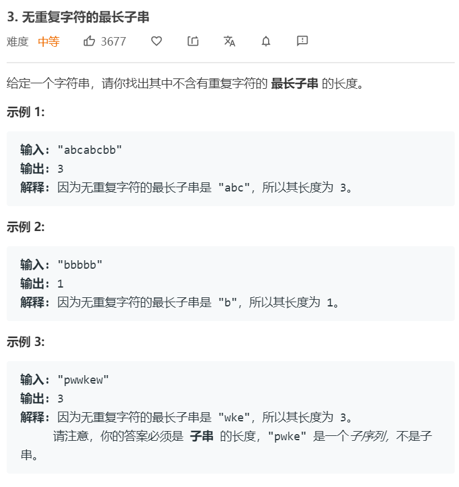

# 滑动窗口篇（双指针）
---

设置窗口为开区间 [l, r)，并将l和r初始化为0，0。循环增加r直到r等于数组的长度，主循环不断扩增窗口，并检查窗口是否满足条件。内循环检查窗口是否满足条件，若满足条件则收缩窗口。整个过程，右指针前移是在寻找解，而左指针前移是在收缩解，目的是找到更优的解。

双指针模板：
```python
def sliding_windos():
    l, r = 0, 0
    while r < length:
        n = Array[r]
        r += 1
        将n加入窗口，并进行相应的更新

        # 判断是否要减小窗口
        while window需要收缩（一般是直到窗口不满足输出条件之前都要收缩，直到窗口不满足输出条件）
            n = Array[l]
            l += 1
            将n删除窗口，并进行相应更新
```


### 76. [最小覆盖子串](https://leetcode-cn.com/problems/minimum-window-substring/) ```hard```


**分析**<br/><br/>
这道题需要设置一个window字典，然后设置一个container保存每个字母需要的数量。利用一个valid整型数表示现在已经有多少个字母满足要求。窗口需要满足的条件是所有字母都满足个数要求。

**算法如下**<br/>
```python
class Solution:
    def minWindow(self, s: str, t: str) -> str:
        container = {}
        maximum = {}
        for c in t:
            maximum[c] = maximum.get(c, 0)+1
            container[c] = 0

        valid = 0  
        ans = len(s)+1
        ans_s = ""
        l, r = 0, 0
        while r < len(s):
            c = s[r]
            r += 1
            if c in container:
                container[c] += 1
                if container[c] == maximum[c]:
                    valid += 1
                if valid == len(container):
                    if r-l < ans:
                        ans = r-l
                        ans_s = s[l:r]
            while valid == len(container):
                c = s[l]
                l += 1
                if c in container:
                    container[c] -= 1
                    if container[c] < maximum[c]:
                        valid -= 1
                if valid == len(container):
                    if r-l < ans:
                        ans = r-l
                        ans_s = s[l:r]

        return ans_s
```


### 438. [找到字符串中所有字母异位词](https://leetcode-cn.com/problems/find-all-anagrams-in-a-string/) ```middle```


**分析**<br/><br/>
这道题和前一题类似，但这次更新需要检查目前的窗口长度是否等于给定字符串的长度（窗口里面是不是只有字符串的字符）。

**算法如下**<br/>
```python
class Solution:
    def findAnagrams(self, s: str, p: str) -> List[int]:
        container, window = {}, {}
        for c in p:
            container[c] = container.get(c, 0) + 1
            window[c] = 0

        l, r = 0, 0
        valid = 0
        ans = []

        while r < len(s):
            c = s[r]
            r += 1
            if c in container:
                window[c] += 1
                if window[c] == container[c]:
                    valid += 1
                    if valid == len(container) and r-l == len(p):
                        ans.append(l)
            
            while valid == len(container):
                c = s[l]
                l += 1
                if c in container:
                    window[c] -= 1
                    if window[c] < container[c]:
                        valid -= 1
                if valid == len(container) and r-l == len(p):
                    ans.append(l)
        return ans
```


### 3. [无重复字符的最长子串](https://leetcode-cn.com/problems/longest-substring-without-repeating-characters/) ```middle```


**分析**<br/><br/>
这道题和前面的题目有些区别。它的特殊性在于它可以进行简化。如果用dict保存所有的字母出现的次数，这套题可以套用之前的框架。但实际上我们可以只用一个set进行保存。右指针右移时，我们不直接把右指针的结果放入set，而是先收缩左指针，直到右指针的数组元素不在set里面。然后更新最大长度。这样的目的是保证，window内永远只有个数不超过1的字母。

**算法如下**<br/>
```python
class Solution:
    def lengthOfLongestSubstring(self, s: str) -> int:
        if len(s) == 0 or len(s) == 1: return len(s)
        window = set()
        l, r = 0, 0
        ans = 1
        while r < len(s):
            c = s[r]
            r += 1
            while c in window:
                lc = s[l]
                l += 1
                window.remove(lc)
            window.add(c)
            ans = max(ans, r-l)
        return ans 
```

解法2
```python
class Solution:
    def lengthOfLongestSubstring(self, s: str) -> int:
        if len(s) == 0 or len(s) == 1: return len(s)
        window = {}
        l, r = 0, 0
        ans = 1

        while r < len(s):
            c = s[r]
            r += 1
            window[c] = window.get(c,0)+1
            while window[c]>1:
                lc = s[l]
                l += 1
                window[lc] -= 1
            ans = max(ans, r-l)
        return ans 
```


### 1004. [最大连续1的个数 III](https://leetcode-cn.com/problems/max-consecutive-ones-iii/) ```middle```


**分析**<br/><br/>
实际上就是找到窗口内0个数小于等于K的最大窗口。窗口需要满足的条件是window <= K

**算法如下**<br/>
```python
class Solution:
    def longestOnes(self, A: List[int], K: int) -> int:
        window = 0
        l, r = 0, 0
        ans = 0
        while r < len(A):
            n = A[r]
            r += 1
            if n == 0:
                window += 1
            if window <= K:
                ans = max(ans, r-l)
            
            while window > K:
                n = A[l]
                l += 1
                if n == 0:
                    window -= 1
        return ans
``` 

