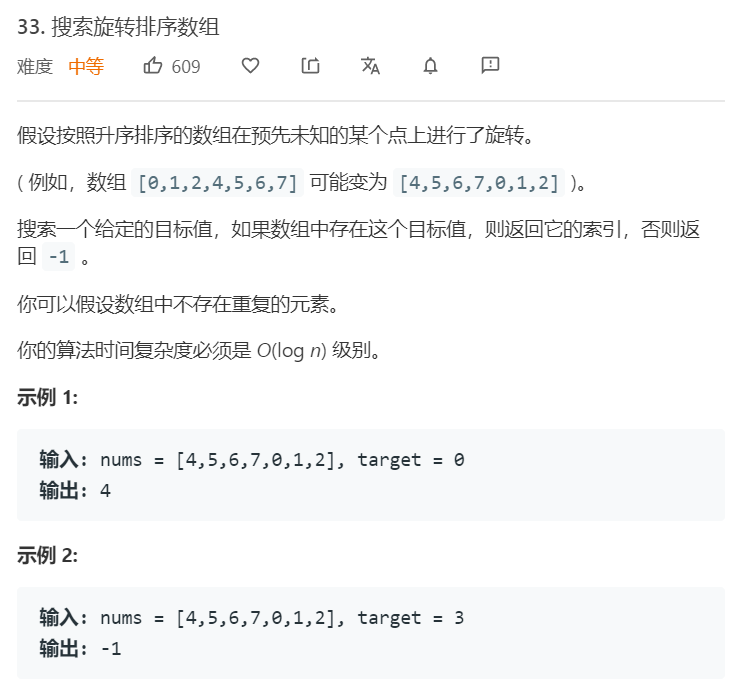
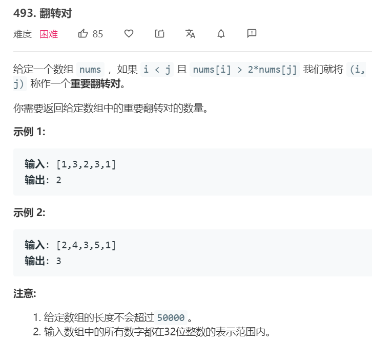
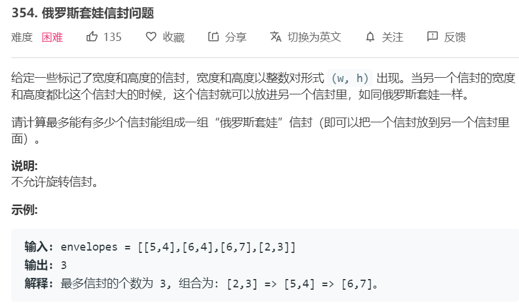

# 二分法
---


二分算法可以用在一切已排序好的搜索空间中。主要需要记住几种不同的查找方法，lower_bound（第一个不小于target的元素），upper_bound（第一个严格大于target的元素）和equal_range


### 34. [在排序数组中查找元素的第一个和最后一个位置](https://leetcode-cn.com/problems/find-first-and-last-position-of-element-in-sorted-array/) ```medium```


**分析**<br/><br/>
这道题求的是equal_range，首先求出lower_bound，若lower_bound返回的结果不等于target，则说明数组中不存在该元素。否则调用upper_bound，[lower_bound, upper_bound-1]即为equal_range

**算法如下**<br/>
```python
class Solution:
    def searchRange(self, nums: List[int], target: int) -> List[int]:
        if len(nums) == 0: return [-1, -1]
        lower = self.lower_bound(nums, target)
        if nums[lower] != target:
            return [-1, -1]
        upper = self.upper_bound(nums, target)
        return [lower, upper-1]
        
    def lower_bound(self, nums, target):
        l, r = 0, len(nums)-1   # 选取len(nums)-1是为了后面方便比较nums[lower]
        while l < r:
            m = l + (r-l)//2
            if nums[m] < target:
                l = m+1
            else:
                r = m 
        return l 
    
    def upper_bound(self, nums, target):
        l, r = 0, len(nums) # 注意upper_bound的r，选取len(nums)是因为可能不存在比target严格大的数
        while l < r:
            m = l + (r-l)//2
            if nums[m] <= target:   # 与lower_bound的区别
                l = m+1
            else:
                r = m 
        return l 
```

### 35. [搜索插入位置](https://leetcode-cn.com/problems/search-insert-position/) ```easy```


**分析**<br/><br/>
实际上就是找到lower_bound，若元素存在返回其位置，若元素不存在返回第一个比它大的位置。注意right的初始值

**算法如下**<br/>
```python
class Solution:
    def searchInsert(self, nums: List[int], target: int) -> int:
        l, r = 0, len(nums)
        while l < r:
            m = l + (r-l)//2
            if nums[m] < target:
                l = m+1
            else:
                r = m 
        return l
```


### 33. [搜索旋转排序数组](https://leetcode-cn.com/problems/search-in-rotated-sorted-array/) ```middle```


**分析**<br/><br/>
这个问题中，排序数组发生了一次旋转。同样可以采用二分法解决此问题，值得注意的是，当数组分成两个部分时，最多只有一个部分是存在旋转点的，换句话说，一定至少有一个部分是有序的，且两部分的数字范围不重合（数组中没有重复元素）。我们可以每次二分数组，找到其中有序的部分，并对有序的部分进行判断元素是否在该部分内。由于数组中不含有重复元素，我们只需要判断L，M的相对关系既可以判断左边部分是否有序。当只剩下两个元素时，直接判断。

**算法如下**<br/>
```python
class Solution:
    def search(self, nums: List[int], target: int) -> int:
        if len(nums) == 0: return -1
        l, r = 0, len(nums)-1
        while l < r:
            if r - l + 1 <= 2:
                if nums[l] == target: return l 
                elif nums[r] == target: return r 
                else:
                    return -1
            m = l + (r-l) // 2
            if nums[m] == target:
                return m 
            if nums[m] > nums[l]:   # left is ordered
                if target >= nums[l] and target < nums[m]:
                    r = m 
                else:
                    l = m + 1
            else:   # right is ordered
                if target > nums[m] and target <= nums[r]:
                    l = m+1
                else:
                    r = m 
        if nums[l] == target: return l 
        return -1
```

### 81. [搜索旋转排序数组 II](https://leetcode-cn.com/problems/search-in-rotated-sorted-array-ii/) ```middle```


**分析**<br/><br/>
这个问题和前一个问题类似，但由于存在相等元素。当判断M和L的相对关系时，若M>L和M\<的情况可以直接判断，当M=L时，无法判断左区间是否有序。此时则通过左移L一位来将此元素丢弃即可。

**算法如下**<br/>
```python
class Solution:
    def search(self, nums: List[int], target: int) -> bool:
        if len(nums) == 0: return False
        l, r = 0, len(nums)-1
        while l < r:
            m = l + (r-l)//2
            if nums[m] == target:
                return True
            elif nums[l] == nums[m]:
                l += 1
            elif nums[l] < nums[m]: # left is softed
                if target >= nums[l] and target < nums[m]:
                    r = m 
                else:
                    l = m+1
            else:   # right is softed
                if target > nums[m] and target <= nums[r]:
                    l = m+1
                else:
                    r = m
        return nums[l] == target
```


### 153. [寻找旋转排序数组中的最小值](https://leetcode-cn.com/problems/find-minimum-in-rotated-sorted-array/) ```middle```


**分析**<br/><br/>
所谓最小值其实就是要找到那个第一个无序的点。和前面题目类似，但注意的是，由于要找到的是最小值，因此应该与R进行比较。这是因为，当搜索的区域中不再存在无序区间时，若不断与L进行比较，并收缩L，会导致错误的结果。而与R进行比较，当nums[m] < nums[r]时，此时认为right有序，收缩r到m，是可以正确收缩到最小值的。


**算法如下**<br/>
```python
class Solution:
    def findMin(self, nums: List[int]) -> int:
        l, r = 0, len(nums)-1
        while l < r:
            m = l + (r-l) // 2
            if nums[m] < nums[r]:   # right is ordered
                r = m 
            else:   # left is ordered
                l = m + 1
        return nums[l]
```

### 154. [寻找旋转排序数组中的最小值II](https://leetcode-cn.com/problems/find-minimum-in-rotated-sorted-array-ii/) ```hard```


**分析**<br/><br/>
该题与前一题类似，区别在于存在相等值。当R与M相等时，收缩R一步即可。


**算法如下**<br/>
```python
class Solution:
    def findMin(self, nums: List[int]) -> int:
        l, r = 0, len(nums)-1
        while l < r:
            m = l+(r-l)//2
            if nums[m] == nums[r]:
                r -= 1
            elif nums[m] > nums[r]:
                l = m+1
            else:
                r = m
        return nums[l]
```


### 74. [搜索二维矩阵](https://leetcode-cn.com/problems/find-minimum-in-rotated-sorted-array-ii/) ```hard```


**分析**<br/><br/>
这道题的二维矩阵实际上可以把它铺平来看，直接当做一维矩阵搜索即可。


**算法如下**<br/>
```python
class Solution:
    def searchMatrix(self, matrix: List[List[int]], target: int) -> bool:
        if len(matrix) == 0 or len(matrix[0]) == 0: return False
        x, y = len(matrix), len(matrix[0])
        l, r = 0, x*y-1
        while l < r:
            m = l+(r-l)//2
            if matrix[m//y][m%y] < target:
                l = m + 1
            else:
                r = m 
        return matrix[l//y][l%y] == target
```

### 852. [山脉数组的峰顶索引](https://leetcode-cn.com/problems/peak-index-in-a-mountain-array/) ```easy```


**分析**<br/><br/>
由于限制了，数组一定是山脉数组，因此等同于找到山脉数组的最大值。直接二分查找即可。

**算法如下**<br/>
```python
class Solution:
    def peakIndexInMountainArray(self, A: List[int]) -> int:
        l, r = 0, len(A)-1
        while l < r:
            m = l+(r-l)//2
            if A[m] < A[m+1]:
                l = m+1
            else:
                r = m   
        return l
```


### 162. [寻找峰值](https://leetcode-cn.com/problems/find-peak-element/) ```middle```


**分析**<br/><br/>
由于给定的数组相邻一定不相等，则所谓的峰值元素一定存在。一直往更大的区域查找即可。使用二分法求解，若m小于m+1，则l=m+1，否则，r=m

**算法如下**<br/>
```python

class Solution:
    def findPeakElement(self, nums: List[int]) -> int:
        l, r = 0, len(nums)-1
        while l < r:
            m = l+(r-l)//2
            after = nums[m+1] if m < len(nums)-1 else -math.inf
            if nums[m] < after:
                l = m + 1
            else:
                r = m 
        return l 
```

### 1095. [山脉数组中查找目标值](https://leetcode-cn.com/problems/find-in-mountain-array/) ```hard```


**分析**<br/><br/>
这道题要求在山脉数组中查找目标值，解题过程繁琐但思路简单。使用二分法进行搜索，在搜索时需要判断，当前的m是处于峰顶，还是上坡，或者是下坡上。三种情况分别考虑即可

**算法如下**<br/>
```python
import math 
class Solution:
    def findInMountainArray(self, target: int, mountain_arr: 'MountainArray') -> int:
        l, r = 0, mountain_arr.length()-1
        return self.helper(target, mountain_arr, l, r)
        
    def helper(self, target, mountain_arr, l, r):
        if l == r:
            if mountain_arr.get(l) == target:
                return l 
            else:
                return -1 
        elif l > r:
            return -1

        n = mountain_arr.length()

        m = l + (r-l)//2
        # check m is the peak or m is up or m is down
        cur = mountain_arr.get(m)
        prev = -math.inf if m == 0 else mountain_arr.get(m-1)
        after = -math.inf if m == n-1 else mountain_arr.get(m+1)


        if cur > prev and cur > after:  # m is the peak
            if target > cur:
                return -1 
            elif target == cur:
                return m 
            else:
                left = self.helper(target, mountain_arr, l, m)
                if left != -1:
                    return left 
                else:
                    return self.helper(target, mountain_arr, m+1, r)
        elif cur > after:    # down
            if target > cur:    # search left part 
                return self.helper(target, mountain_arr, l, m)
            else:
                left = self.helper(target, mountain_arr, l, m)
                if left != -1:
                    return left 
                else:
                    if target == cur:
                        return m 
                    else:
                        return self.helper(target, mountain_arr, m+1, r)
        else:   # up 
            if target > cur:    # just search right part 
                return self.helper(target, mountain_arr, m+1, r)
            elif target == cur:
                return m 
            else: # search left and right part 
                left = self.helper(target, mountain_arr, l, m)
                if left != -1:
                    return left 
                else:
                    return self.helper(target, mountain_arr, m+1, r)
```


### 1283. [使结果不超过阈值的最小除数](https://leetcode-cn.com/problems/find-the-smallest-divisor-given-a-threshold/) ```middle```


**分析**<br/><br/>
该类题目可采用二分搜索法求解，因为实际上其解空间是已排序好的。首先设立最小值和最大值，然后采用二分搜索法，找到第一个符合（也就是最小的）解。

**算法如下**<br/>
```python
import math
class Solution:
    def smallestDivisor(self, nums: List[int], threshold: int) -> int:
        l, r = 1, max(nums)
        while l < r:
            m = l+(r-l)//2
            ans = self.check(nums, m)
            if ans > threshold:
                l = m+1
            else:
                r = m 
        return l
            
    def check(self, nums, divident):
        ans = 0
        for n in nums:
            ans += math.ceil(n/divident)
        return ans
```


### 875. [爱吃香蕉的珂珂](https://leetcode-cn.com/problems/koko-eating-bananas/) ```middle```


**分析**<br/><br/>
该类题目可采用二分搜索法求解，因为实际上其解空间是已排序好的。首先设立最小值和最大值，然后采用二分搜索法，找到第一个符合（也就是最小的）解。

**算法如下**<br/>
```python
import math 

class Solution:
    def minEatingSpeed(self, piles: List[int], H: int) -> int:
        count = 0
        for p in piles:
            count += p 
        l = math.ceil(count/H)
        r = max(piles)

        while l < r:
            m = l + (r-l)//2
            if self.time(piles, m) > H:
                l = m+1
            else:
                r = m
        return l

    def time(self, piles, s):
        count = 0
        for p in piles:
            count += math.ceil(p/s)
        return count
```


### 1011. [在 D 天内送达包裹的能力](https://leetcode-cn.com/problems/capacity-to-ship-packages-within-d-days/) ```middle```


**分析**<br/><br/>
该类题目可采用二分搜索法求解，因为实际上其解空间是已排序好的。首先设立最小值和最大值，然后采用二分搜索法，找到第一个符合（也就是最小的）解。

**算法如下**<br/>
```python
import math 

class Solution:
    def shipWithinDays(self, weights: List[int], D: int) -> int:
        sw = sum(weights)
        l, r = math.ceil(sw/D), sw
        while l < r:
            m = l + (r-l)//2
            if self.count(weights, m) > D:
                l = m+1
            else:
                r = m 
        return l

    

    def count(self, weights, s):
        days = 0
        cur_weight = 0
        for w in weights:
            if w > s:
                return math.inf
            cur_weight += w 
            if cur_weight >= s:
                days += 1
                cur_weight = 0 if cur_weight == s else w
        return days if cur_weight == 0 else days+1
```


### 1300. [转变数组后最接近目标值的数组和](https://leetcode-cn.com/problems/sum-of-mutated-array-closest-to-target/) ```middle```


**分析**<br/><br/>
该类题目可采用二分搜索法求解，因为实际上其解空间是已排序好的。首先设立最小值和最大值，然后采用二分搜索法，找到第一个符合（也就是最小的）解。

**算法如下**<br/>
```python
class Solution:
    def findBestValue(self, arr: List[int], target: int) -> int:
        l, r = 1, max(arr)
        while l < r:
            m = l + (r-l)//2
            if self.turn_and_sum(arr, m) < target:
                l = m + 1
            else:
                r = m 

        delta1 = abs(self.turn_and_sum(arr, l) - target)
        if delta1 == 0:
            return l 
        else:
            delta2 = abs(self.turn_and_sum(arr, l-1)-target)
            return l if delta1 < delta2 else l-1
            

    def turn_and_sum(self, arr, value):
        s = 0 
        for a in arr:
            s += a if a < value else value
        return s
``` 

### 275. [H指数 II](https://leetcode-cn.com/problems/h-index-ii/) ```middle```


**分析**<br/><br/>
同样采用二分搜索法求解，二分法会找到第一个citation数大于等于paper数的位置。此时返回二者的较小值。


**算法如下**<br/>
```python
class Solution:
    def hIndex(self, citations: List[int]) -> int:
        if len(citations) == 0: return 0
        l, r = 0, len(citations)-1
        while l < r:
            m = l + (r-l)//2
            if citations[m] < len(citations) - m:
                l = m + 1
            else:
                r = m 
        if citations[l] == len(citations)-l:
            return citations[l]
        else:
            return min(citations[l], len(citations)-l)
``` 


### 410. [分割数组的最大值](https://leetcode-cn.com/problems/split-array-largest-sum/) ```hard```


**分析**<br/><br/>
这道题可以采用二分法求解，搜索每一个可能的最大值，按照这个最大值去划分数组，得到划分数组的大小。通过这个来对搜索空间进行二分。


**算法如下**<br/>
```python
class Solution:
    def splitArray(self, nums: List[int], m: int) -> int:
        l, r = max(nums), sum(nums)
        while l < r:
            mid = l + (r-l)//2
            cnt = self.helper(nums, mid)
            if cnt > m:
                l = mid+1
            else:
                r = mid
        return l
            
    def helper(self, nums, target):
        cur_sum = 0
        cnt = 0
        for n in nums:
            cur_sum += n 
            if cur_sum > target:
                cur_sum = n # add to next sub array 
                cnt += 1
                continue
            elif cur_sum == target:
                cur_sum = 0 # start the next sub array 
                cnt += 1
        if cur_sum > 0:
            cnt += 1
        return cnt 
``` 


### 878. [第 N 个神奇数字](https://leetcode-cn.com/problems/nth-magical-number/) ```hard```


**分析**<br/><br/>
由于是第几个神奇数字是单调递增的，这道题可以采用二分法求解。每次迭代时确认它前面有多少个神奇数字。由于采用的是找到lower_bound的二分法，因此找到的是第一个等于N的数字，它一定是神奇数字。


**算法如下**<br/>
```python
class Solution:
    def nthMagicalNumber(self, N: int, A: int, B: int) -> int:
        l = min(A, B)
        r = min(A, B) * N
        
        L = A*B / self.gcd(A, B)
        
        while l < r:
            m = l + (r-l)//2
            n = m//A + m//B - m//L 
            if n < N:
                l = m + 1
            else:
                r = m 
        return l % (10**9+7)


    def gcd(self, a, b):
        if a == 0: return b
        return self.gcd(b%a, a)
``` 


### 牛客1. [分石子](https://www.nowcoder.com/questionTerminal/1ea5b4eaeff841a4918931791b000756) ```middle```


**分析**<br/><br/>
这道题同样采用二分法求解。我们搜索石子的最小值，得到这个最小值后，我们去按照这个最小值去找到最多可以分出多少堆石子，设为cnt。若cnt大于m，可以判断这个最小值过小了，需要变大。若cnt小于m，可以判断这个最小值过大了，即使最多的情况也分不出m堆石子。当cnt等于m时如何处理？由于我们这里要找的是最大值，即，我们需要找到的是令cnt等于m时的最大值，则采用**upper_bound**算法，再根据情况对结果进行减1处理。


**算法如下**<br/>
```python
class Solution:
    def nthMagicalNumber(self, N: int, A: int, B: int) -> int:
        l = min(A, B)
        r = min(A, B) * N
        
        L = A*B / self.gcd(A, B)
        
        while l < r:
            m = l + (r-l)//2
            n = m//A + m//B - m//L 
            if n < N:
                l = m + 1
            else:
                r = m 
        return l % (10**9+7)


    def gcd(self, a, b):
        if a == 0: return b
        return self.gcd(b%a, a)
``` 


### 08.03. [魔术索引](https://leetcode-cn.com/problems/magic-index-lcci/) ```easy```


**分析**<br/><br/>
使用二分法解此题，

若A[i] > i，则可以判断的一点是，在[i, A[A[i])之间，不可能存在解
因为 i <= j < A[i] 中，A[j]一定大于等于A[i]，而j < A[i]，此时分别在 L，i 和 A[i]，R中进行搜索

若A[i] < i，则可以判断的一点是，在 [A[A[i]], i]之间，不可能存在解，
因为 A[i] < j <= i中，A[j]一定小于等于A[i]，而i大于等于A[i]
此时在 L，A[i]和 i+1, R中进行搜索

若A[i] == i，则仍需要继续在左边进行搜索。

**算法如下**<br/>
```python   
class Solution:
    def findMagicIndex(self, nums: List[int]) -> int:
        return self.helper(nums, 0, len(nums)-1)

    
    def helper(self, nums, l, r):
        if l == r:
            return l if nums[l] == l else -1 
        elif l > r:
            return -1
        m = l+(r-l)//2       
        if nums[m] > m:
            left = self.helper(nums, l, m)
            if left == -1:
                return self.helper(nums, nums[m], r)
            return left 
        elif nums[m] < m:
            left = self.helper(nums, l, nums[m])
            if left == -1:
                return self.helper(nums, m+1, r)
            return left 
        else:
            left = self.helper(nums, l, m)
            if left == -1:
                return m 
            else:
                return left 
``` 


### 10.05. [稀疏数组搜索](https://leetcode-cn.com/problems/sparse-array-search-lcci/) ```easy```


**分析**<br/><br/>
使用二分法解此题，当碰到空字符串时，需要在两边继续搜索。

**算法如下**<br/>
```python   
class Solution:
    def findString(self, words: List[str], s: str) -> int:
        ans = self.helper(words, s, 0, len(words)-1)
        return -1 if ans == len(words) else ans
        
    def helper(self, words, s, l, r):
        if l == r:
            return len(words) if words[l] != s else l 
        elif l > r:
            return len(words)
    
        m = l + (r-l) // 2
        if words[m] == "":
            return min(self.helper(words,s, l, m), self.helper(words,s, m+1, r))
        elif words[m] > s:
            return self.helper(words,s, l, m)
        elif words[m] < s:
            return self.helper(words,s, m+1, r)
        else:
            return m
``` 


### 315. [计算右侧小于当前元素的个数](https://leetcode-cn.com/problems/count-of-smaller-numbers-after-self/) ```hard```


**分析**<br/><br/>
找到右侧第一个小于当前元素的元素可用单调栈，但这里需要计算个数。暴力算法是O(N^2)的复杂度。这里可以采用类似归并排序的方法，把复杂度优化到O(NlogN)。

使用降序归并排序，在归并时可以注意到，当加入left部分时，该元素右边元素小于它的个数为len(right)-r个，因为当加入它时，当前r指针指向的元素一定小于它，且r指针后面的元素也小。若采用升序排序，则需要循环遍历，时间复杂度过高。

**算法如下**<br/>
```python   
class Solution(object):
    def countSmaller(self, nums):
        """
        :type nums: List[int]
        :rtype: List[int]
        """
        if len(nums) == 0:
            return []
        nums = [(i, n) for i, n in enumerate(nums)]
        res = [0 for i in range(len(nums))]
        r = self.helper(nums, res)
        # print(r)
        return res

    def helper(self, nums, res):
        if len(nums) <= 1:
            return nums
        m = len(nums) // 2
        left = self.helper(nums[:m], res)
        right = self.helper(nums[m:], res)
        # merge left and right
        merge = []
        
        l, r = 0, 0
        while l < len(left) and r < len(right):
            if left[l][1] > right[r][1]:
                res[left[l][0]] += len(right)-r
                merge.append(left[l])
                l += 1
            else:   # right < left
                merge.append(right[r])
                r += 1
        
        if l < len(left):
            merge.extend(left[l:])
        if r < len(right):
            merge.extend(right[r:])
        return merge
``` 


## 面试题51. [数组中的逆序对][(https://leetcode-cn.com/problems/count-of-smaller-numbers-after-self/](https://leetcode-cn.com/problems/shu-zu-zhong-de-ni-xu-dui-lcof/)) ```hard```


**分析**<br/><br/>
归并排序法，在merge时计算逆序对的个数。当merge的是right部分的元素时，左边还没有merge的部分和这个元素都构成逆序对。

**算法如下**<br/>
```python   
class Solution:
    def reversePairs(self, nums: List[int]) -> int:
        merge, c = self.helper(nums)
        # print(merge)
        return c

    def helper(self, nums):
        if len(nums) <= 1:
            return nums, 0

        m = len(nums) // 2
        left, lc = self.helper(nums[:m])
        right, rc = self.helper(nums[m:])

        # merge 
        c = 0 
        l, r = 0, 0
        merge = []
        while l < len(left) and r < len(right):
            if left[l] <= right[r]:
                merge.append(left[l])
                l += 1
            else:
                merge.append(right[r])
                r += 1
                c += len(left)-l 

        while l < len(left):
            merge.append(left[l])
            l += 1
        while r < len(right):
            merge.append(right[r])
            r += 1
        
        c += lc + rc 
        return merge, c
``` 


## 439. [翻转对][(https://leetcode-cn.com/problems/reverse-pairs/)) ```hard```


**分析**<br/><br/>
归并排序法。但该问题与上面的问题不同，该问题不能仅在merge时添加翻转对的数目。这是由于在负数中会存在问题，如-4 -3这个例子，虽然-4小于-3，但-4比-3的两倍，即-6小。若只在merge right，也就是right比较小的时候进行计数，会漏掉这种情况。在这道题中，我们把merge和计数过程分开。在merge前计算翻转对的数目。遍历left数组的每个元素，由于left和right数组都是递增的，无论数组元素的正负，越大的数，其2倍值越大。因此我们可以设置一个right数组的边界，从左到该边界内的元素都满足，其两倍小于当前正在遍历的left元素的条件。当继续往后遍历left元素时，由于left元素在增大，因此可以找到的right元素在增大，则移动该边界即可。

**算法如下**<br/>
```python   
class Solution:
    def reversePairs(self, nums: List[int]) -> int:
        if len(nums) == 0:
            return 0
        merge, c = self.helper(nums)
        # print(merge)
        return c

    def helper(self, nums):
        if len(nums) <= 1:
            return nums, 0

        m = len(nums) // 2
        left, lc = self.helper(nums[:m])
        right, rc = self.helper(nums[m:])

        # find pair
        c = 0 
        rt = 0 
        for i in range(len(left)):
            while rt < len(right) and left[i] > 2*right[rt]:
                rt += 1
            c += rt
            
        l, r = 0, 0
        merge = []
        while l < len(left) and r < len(right):
            if left[l] < right[r]:
                merge.append(left[l])
                l += 1
            else:
                merge.append(right[r])
                r += 1
        while l < len(left):
            merge.append(left[l])
            l += 1
        while r < len(right):
            merge.append(right[r])
            r += 1
        
        c += lc + rc 
        return merge, c
``` 


## 354. [俄罗斯套娃信封问题][(https://leetcode-cn.com/problems/russian-doll-envelopes/) ```hard```


**分析**<br/><br/>
将数组按照长度和宽度进行排序。当长度相等时，按照宽度倒序排序。实际上等同于求宽度数组的最长递增子序列。时间复杂度O(NlogN)。倒序排序的目的是为了求递增子序列时不会取到长度相同的信封。


**算法如下**<br/>
```python   
class Solution(object):
    def maxEnvelopes(self, envelopes):
        """
        :type envelopes: List[List[int]]
        :rtype: int
        """
        envelopes = sorted(envelopes, key=lambda x:(x[0], -x[1]))
        # find longest incrising subsequence
        heights = [e[1] for e in envelopes]
        dp = []
        for h in heights:
            pos = self.lower_bound(dp, h)
            if pos == len(dp):
                dp.append(h)
            else:
                dp[pos] = h 
        return len(dp)

    def lower_bound(self, dp, x):
        l, r = 0, len(dp)
        while l < r:
            m = l + (r-l) // 2
            if dp[m] < x:
                l = m + 1
            else:
                r = m 
        return l
``` 


## 面试题.21. [调整数组顺序使奇数位于偶数前面][(https://leetcode-cn.com/problems/diao-zheng-shu-zu-shun-xu-shi-qi-shu-wei-yu-ou-shu-qian-mian-lcof/) ```easy```


**分析**<br/><br/>
partition算法的题目，partition算法，首先置L为0，R为len(nums)-1，选择第一个为pivot，循环到L==R为止，先移动R，找到第一个奇数，nums[L] = nums[R]，然后移动L，找到第一个偶数，nums[R] = nums[L]。循环结束后将nums[L]设置为pivot.


**算法如下**<br/>
```python   
class Solution:
    def exchange(self, nums: List[int]) -> List[int]:
        l, r = 0, len(nums)-1
        if len(nums) == 0:
            return nums
        pivot = nums[0]
        while l < r:
            while r > l and nums[r] % 2 == 0:
                r -= 1
            nums[l] = nums[r]
            while l < r and nums[l] % 2 == 1:
                l += 1
            nums[r] = nums[l]
        nums[l] = pivot
        return numss
``` 


## 912. [排序数组][(https://leetcode-cn.com/problems/sort-an-array/) ```middle```


**分析**<br/><br/>
排序算法。实现递归式快速排序和迭代式快速排序。快速排序每次选择一个pivot，然后将小于pivot的放在pivot左边，大于的放在右边。然后递归式地对左右两边在进行排序。


**算法如下**<br/>
```python   
class Solution:
    def sortArray(self, nums: List[int]) -> List[int]:
        stack = [(0, len(nums)-1)]
        while stack:
            l, r = stack.pop()
            if r - l + 1 <= 1:
                continue 
            m = self.partition(nums, l, r)
            stack.append((m+1, r))
            stack.append((l, m-1))
        return nums
    def partition(self, nums, l, r):
        if len(nums) == 2:
            if nums[l] > nums[r]:
                nums[l], nums[r] = nums[r], nums[l]
            return l
            
        pivot = nums[l]
        while l < r:
            while l < r and nums[r] >= pivot:
                r -= 1 
            nums[l] = nums[r]
            while l < r and nums[l] < pivot:
                l += 1
            nums[r] = nums[l]
        nums[l] = pivot 
        return l
``` 

递归式写法
```python
class Solution:
    def sortArray(self, nums: List[int]) -> List[int]:
        self.sort(nums, 0, len(nums)-1)
        return nums

    def sort(self, nums, l, r):
        if r - l + 1 <= 1:
            return nums
        m = self.partition(nums, l, r)
        self.sort(nums, l, m-1)
        self.sort(nums, m+1, r)

    def partition(self, nums, l, r):
        if len(nums) == 1:
            return nums
        pivot = nums[l]
        while l < r:
            while l < r and nums[r] >= pivot:
                r -= 1 
            nums[l] = nums[r]
            while l < r and nums[l] < pivot:
                l += 1
            nums[r] = nums[l]
        nums[l] = pivot 
        return l

```


## 75. [颜色分类][(https://leetcode-cn.com/problems/sort-colors/) ```middle```


**分析**<br/><br/>
三路划分，将数组分成三个区域，l, cur, r。其中[0, l)为0区域，[l, r]为1区域，(r, len(nums)-1]为2区域。将l, cur, r初始化为0, 0, len(nums)-1，遍历cur，若发现0，将l, cur的位置的元素互换（l位置的元素一定为1）,递增l和cur。若发现1，递增cur。若发现2，将r，cur的位置的元素互换（r位置元素可能为0,1,2），递减r，对cur不做操作（因为不确定r换过来的内容）
循环直到cur > r，因为2区域为开区间。


**算法如下**<br/>
```python   
class Solution:
    def sortColors(self, nums: List[int]) -> None:
        """
        Do not return anything, modify nums in-place instead.
        """
        l, r, cur = 0, len(nums)-1, 0
        while cur <= r:
            if nums[cur] == 0:
                nums[l], nums[cur] = nums[cur], nums[l]
                l += 1 
                cur += 1
            elif nums[cur] == 1:
                cur += 1
            else:
                nums[r], nums[cur] = nums[cur], nums[r]
                r -= 1
``` 


## 215. [数组中第K个最大元素][(https://leetcode-cn.com/problems/kth-largest-element-in-an-array/) ```middle```


**分析**<br/><br/>


**算法如下**<br/>
```python   
class Solution:
    def findKthLargest(self, nums: List[int], k: int) -> int:
        ret = self.helper(nums, 0, len(nums)-1, len(nums)-k+1)
        return ret


    def helper(self, nums, l, r, k):
        # partition 
        s, e = l, r
        pivot = nums[s]
        while s < e:
            while s < e and nums[e] >= pivot:
                e -= 1
            nums[s], nums[e] = nums[e], nums[s]
            while s < e and nums[s] < pivot:
                s += 1
            nums[e], nums[s] = nums[s], nums[e]
        nums[s] = pivot
        m = s 
        if m == k-1:
            return nums[m]
        elif m < k-1:
            return self.helper(nums, m+1, r, k)
        else:
            return self.helper(nums, l, m-1, k)
``` 


## 57. [插入区间][(https://leetcode-cn.com/problems/insert-interval/) ```hard```


**分析**<br/><br/>
首先用upper_bound的二分法找到第一个start严格大于新区间的位置，然后可知insert的位置在这里，假设该位置为i，则不需要改变的数组为intervals[:i]，需要合并的数组为[newInterval] + intervals[i:]，然后采用合并区间的算法即可。遍历需要合并的区间数组，若该区间需要合并到结果数组的最后一个区间（start<=结果数组最后一个区间的end），则修改该区间的end为二者间的最大值，否则将区间加入结果数组。


**算法如下**<br/>
```python   
class Solution:
    def insert(self, intervals: 'List[Interval]', newInterval: 'Interval') -> 'List[Interval]':
        # init data
        l, r = 0, len(intervals)
        while l <= r:
            m = l + (r-l) // 2
            if intervals[m][0] < newInterval[0]:
                l = m + 1
            else:
                r = m 

        if l == 0:
            ans = [newInterval]
            need_add = intervals
        elif l == len(intervals):
            ans = intervals
            need_add = [newInterval]
        else:
            ans = intervals[:l]
            need_add = [newInterval] + intervals[l:]

        # merge left intervals
        for cur in need_add:
            if cur[0] <= ans[-1][1]:
                ans[-1][1] = max(ans[-1][1], cur[1])
            else:
                ans.append(cur)
        return ans

``` 
