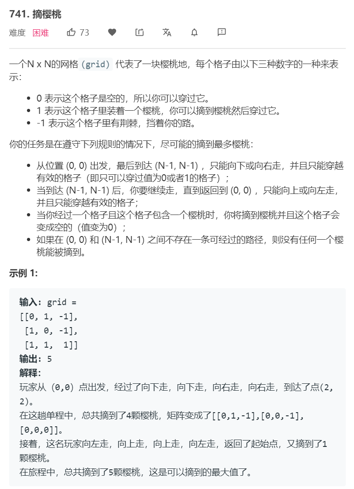
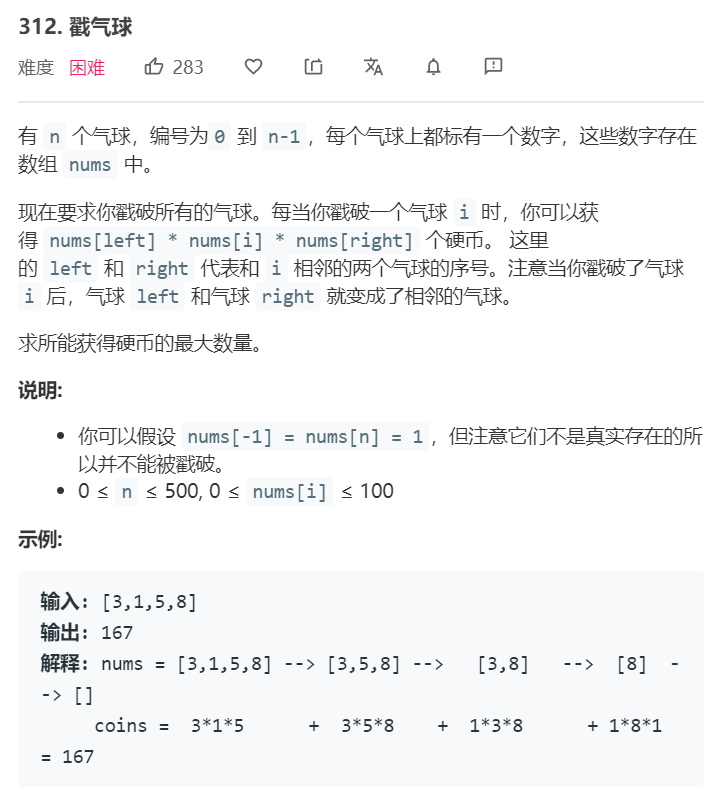

# 动态规划篇
---


## 完全背包问题
完全背包问题是01背包问题的扩展，给定背包最大容量 $V$ ，给定一组 $N$ 个物品，物品的重量为 $w[1], w[2], ... w[N]$ ，物品的价值分别为 $v[1], v[2], ..., v[N]$ ，要求求可以放入背包的物品的最大价值总和。求解方式如下：两重遍历，遍历可选的物品，内层遍历总和价值。

```python
dp = [0 for i in range(V+1)]
for i in range(1, N+1): # 尝试放入第i个物品
    for j in range(1, V+1):     # 总价值为j
        dp[j] = max(dp[j], dp[j-w[i]]+v[i])              #dp[j]为不选当前这个物品，直接用上一轮的物品
return max(dp)
```

### 14.1. [剪绳子](https://leetcode-cn.com/problems/jian-sheng-zi-lcof/) ```medium```


**分析**<br/><br/>
该题可以看作一个完全背包问题。给定N，由于要求至少要有2段，可选的数字有1至N-1，将每个数字的重量看作1，则总容量为N，即要求找到一种数字组合使得总价值最大，且数字重量之和为N。我们可以可选数字的范围约简为1至math.ceil(N/2)，因为是两边是对称的。


**算法如下**<br/>
```python
import math
class Solution:
    def cuttingRope(self, n: int) -> int:
        dp = [1 for i in range(n+1)]
        for i in range(1, math.ceil(n/2)+1):
            for v in range(i, n+1):
                dp[v] = max(dp[v], dp[v-i]*i)
        return dp[-1]
```


## 路径动态规划


### .47 [礼物的最大价值](https://leetcode-cn.com/problems/li-wu-de-zui-da-jie-zhi-lcof/) ```medium```


**分析**<br/><br/>
由于只能往右或下走，因此可以采用迭代法求解该动态规划，dp[i, j] = max(dp[i-1, j], dp[i, j-1]) + grid[i,j]


**算法如下**<br/>
```python
class Solution:
    def maxValue(self, grid: List[List[int]]) -> int:
        dp = [[0 for i in range(len(grid[0]))] for j in range(len(grid))]
        for i in range(len(grid)):
            for j in range(len(grid[0])):
                up = dp[i-1][j] if i > 0 else 0 
                left = dp[i][j-1] if j > 0 else 0 
                dp[i][j] = max(up, left) + grid[i][j]
        return dp[-1][-1]
```


### 62. [不同路径](https://leetcode-cn.com/problems/unique-paths/) ```medium```


**分析**<br/><br/>
这道题可以用排列组合也可以用动态规划，动态规划法，dp[x][y] = dp[x-1][y] + dp[x][y-1]，可以对空间复杂度进行优化，因为每一步仅与左边和右边相关，可设置dp长度为min(长,宽)。

**算法如下**<br/>
```python
class Solution:
    def uniquePaths(self, m: int, n: int) -> int:
        if m == 0 or n == 0:
            return 0
        if m == 1 and n == 1:
            return 1

        smaller = min(m, n)
        if m < n:
            smaller, larger = m, n 
        else:
            smaller, larger = n, m 
        
        dp = [0 for i in range(smaller)]
        dp[0] = 1

        for i in range(larger):
            for j in range(smaller):
                dp[j] += (dp[j-1] if j > 0 else 0)
        return dp[-1]
```


### 63. [不同路径II](https://leetcode-cn.com/problems/unique-paths-ii/) ```medium```


**分析**<br/><br/>
动态规划法，与上题区别在于，若存在障碍则dp[x][y] = 0。

**算法如下**<br/>
```python
class Solution:
    def uniquePathsWithObstacles(self, obstacleGrid: List[List[int]]) -> int:
        if len(obstacleGrid) == 0 or len(obstacleGrid[0]) == 0: return 0
        nrow, ncol = len(obstacleGrid), len(obstacleGrid[0])

        if nrow < ncol:
            smaller, larger = nrow, ncol
            row_larger = False
        else:
            smaller, larger = ncol, nrow
            row_larger = True
        

        dp = [0 for i in range(smaller)]
        dp[0] = 1
        for i in range(larger):
            for j in range(smaller):
                if row_larger:
                    x, y = i, j
                else:
                    x, y = j, i
                if obstacleGrid[x][y] == 1: # obstacle
                    dp[j] = 0
                else:
                    dp[j] += (dp[j-1] if j > 0 else 0)
        return dp[-1]
```

### 741. [摘樱桃](https://leetcode-cn.com/problems/cherry-pickup/) ```hard```


**分析**<br/><br/>
这道题其实相当于找到两条从(0,0)到(n-1,n-1)的路径，并求得这两条路径的得分之和的最大值。设dp[x1,x2,y1,y2]为两个人从(x1,y1)和(x2,y2)所能获得最大收益。由于两人步数相同，因此可以缩减为dp[x1,x2,k]，k为步数。

关于如何确保算法一定要遍历到右下角的问题：当遇到无路可走的情况时，算法无法遍历到右下角。此时对应gain均为负数，碰到这个情况就不再加上当前的位置的cur，直接返回-1即可。而仅当算法找到(n-1,n-1)时，才直接return结果。考虑如下情况：
0 0 0 0
0 0 0 0
1 1 -1 0
1 1 -1 0
当算法找到第三行，第三列时，此时算法找到的任何路径都是-1，则会直接返回-1，则该路径上的其他点，如第三行第二列，也被设置成-1。只有走一直往右，再往下到右下角的路径，才会返回0。这也是最大值。

**算法如下**<br/>
```python
class Solution:
    def cherryPickup(self, grid: List[List[int]]) -> int:
        self.dp = {}
        n = len(grid)
        gain = self.helper(grid, 0, 0, 0)
        if gain == -1:
            return 0
        else:
            return gain

    def helper(self, grid, x1, x2, k):
        y1 = k - x1 
        y2 = k - x2 

        n = len(grid)
        if x1 < 0 or x1 >= n or x2 < 0 or x2 >=n or y1 < 0 or y1 >= n or y2 < 0 or y2 >= n:
            return -1 
        
        if (x1, x2, k) in self.dp:
            return self.dp[(x1, x2, k)]
        
        if grid[x1][y1] == -1 or grid[x2][y2] == -1:
            return -1
        
        if (x1 == n-1 or x2 == n-1) and k == 2*n-2:
            if x1 == n-1 and x2 == n-1:
                return grid[n-1][n-1]
            else:
                return -1
        
        if x1 == x2:
            cur = grid[x1][y1]
        else:
            cur = grid[x1][y1] + grid[x2][y2]

        gain = max(
            self.helper(grid, x1+1, x2+1, k+1),
            self.helper(grid, x1, x2+1, k+1),
            self.helper(grid, x1+1, x2, k+1),
            self.helper(grid, x1, x2, k+1))
        
        if gain < 0:
            gain = -1
        else:
            gain += cur 
        self.dp[(x1, x2, k)] = gain
        return gain
```


## 需要加总内部状态的DP

### 312. [戳气球](https://leetcode-cn.com/problems/burst-balloons/) ```medium```


**分析**<br/><br/>
这道题 dp[i][j]为戳完开区间(i,j)内的气球可以获得的最大coin数。可知，$dp[i][j] = max_k dp[i][k] + dp[k][j] + nums[i]*nums[k]*nums[j]$ ，需要对i到j内的所有k进行遍历，意思是戳破第k个气球。当戳破第k个气球时，其和等于左边(i,k)，此时只有i没被戳，右边同理是j，因此左右邻居是i和j。

分析可知，该题每个状态依赖的同行左边和同列下面的状态，因此从下往上，从左往右遍历状态。

**算法如下**<br/>
```python
class Solution:
    def maxCoins(self, nums: List[int]) -> int:
        nums = [1] + nums + [1]
        n = len(nums)
        dp = [[0 for i in range(n)] for j in range(n)]
        for i in range(n-1, -1, -1):
            for j in range(i+2, n):
                for k in range(i+1, j):
                    explode = nums[i] * nums[k] * nums[j]
                    dp[i][j] = max(dp[i][j], explode+dp[i][k]+dp[k][j])
        return dp[0][-1]
```


