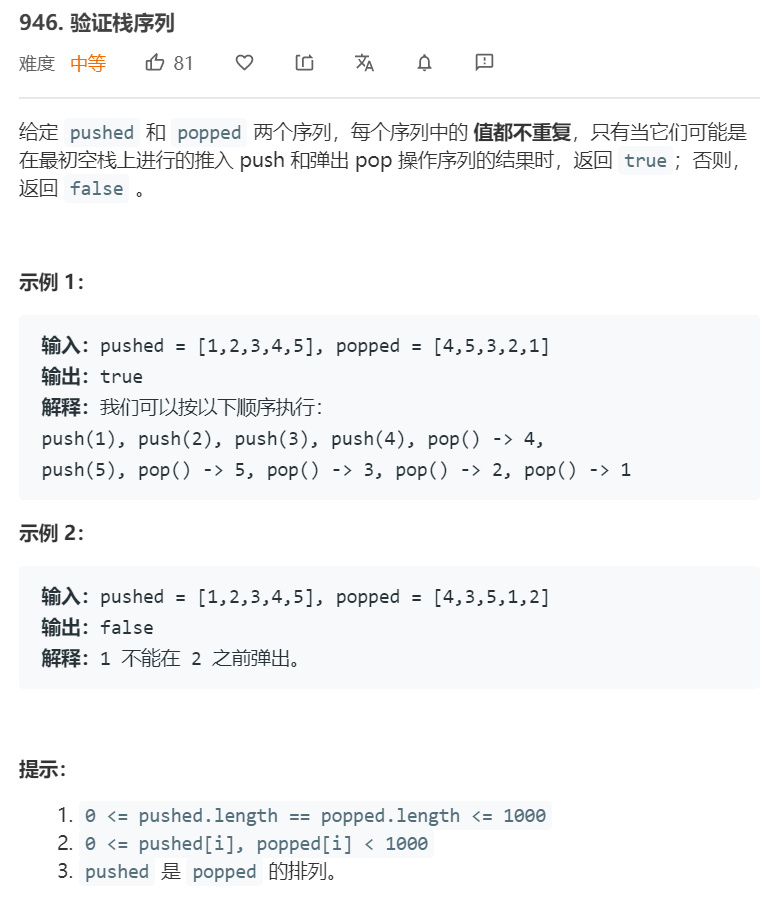

### 946. [合并区间](https://leetcode-cn.com/problems/validate-stack-sequences/) ```middle```


**分析**<br/><br/>
模拟栈，两种解法。第一种解法，判断目前的栈顶元素是否等于出栈序列当前位置的元素，若不等则入栈（找到可以出栈的元素）。若等于出栈序列当前位置的元素，则出栈。循环。当遍历完入栈序列后，一个个出栈，判断是否和出栈序列相等。

第二种解法，遍历入栈元素，一个个入栈，同时内部循环出栈。循环结束后，判断栈内是否还有元素。


**算法如下**<br/>
解法1
```python
class Solution:
    def validateStackSequences(self, pushed: List[int], popped: List[int]) -> bool:
        stack = []
        push_idx, pop_idx = 0, 0
        while push_idx < len(pushed):
            if len(stack) == 0 or stack[-1] != popped[pop_idx]:
                stack.append(pushed[push_idx])
                push_idx += 1
            if stack[-1] == popped[pop_idx]:
                stack.pop(-1)
                pop_idx += 1
        while stack:
            if stack.pop() != popped[pop_idx]:
                return False
            pop_idx += 1
        return True
```

解法2
```python
class Solution:
    def validateStackSequences(self, pushed: List[int], popped: List[int]) -> bool:
        stack = []
        idx = 0
        for num in pushed:
            stack.append(num)
            while stack and stack[-1] == popped[idx]:
                stack.pop()
                idx += 1
        return not stack
```