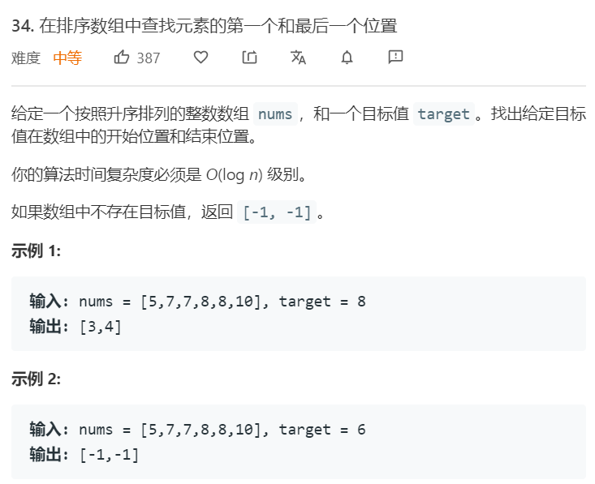
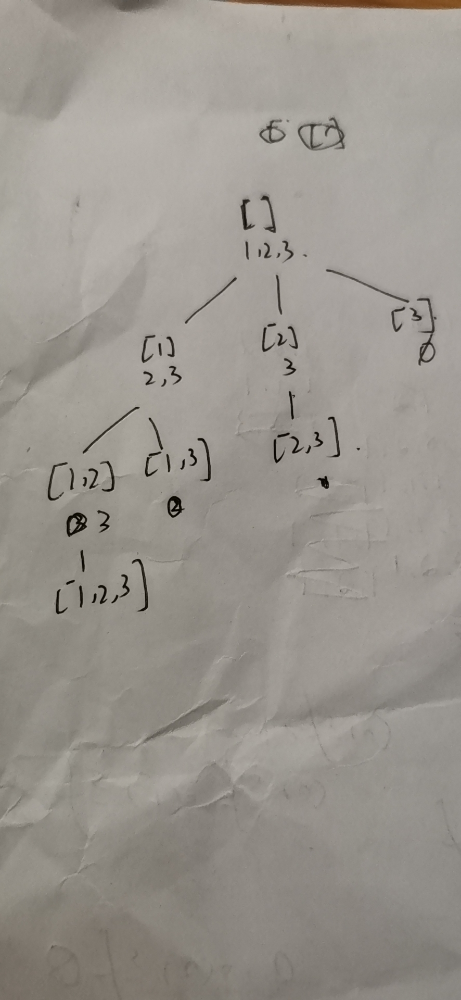

# 回溯法
---


### .08.07. [无重复字符串的排列组合](https://leetcode-cn.com/problems/permutation-i-lcci/) ```medium```


**分析**<br/><br/>

**算法如下**<br/>
```python
class Solution:
    def permutation(self, S: str) -> List[str]:
        alphas = list(S)
        self.res = []
        self.helper([], alphas)
        return self.res

    def helper(self, res, alphas):
        if len(alphas) == 0:
            self.res.append(''.join(res))
            return 
        
        for i in range(len(alphas)):
            alphas[i], alphas[0] = alphas[0], alphas[i]
            res.append(alphas[0])
            self.helper(res, alphas[1:])
            # backtracking
            alphas[i], alphas[0] = alphas[0], alphas[i]
            res.pop(-1)
```


### 784. [字母大小全排列](https://leetcode-cn.com/problems/letter-case-permutation/) ```easy```


**分析**<br/><br/>

**算法如下**<br/>
```python
class Solution:
    def letterCasePermutation(self, S: str) -> List[str]:
        flags = []
        self.res = []
        for idx, s in enumerate(S):
            if s.isalpha():
                flags.append(idx)
        self.helper(list(S), flags, 0)
        return self.res
     
    def helper(self, alphas, flags, start):
        if start == len(flags):
            self.res.append(''.join(alphas))
            return

        pos = flags[start]

        alphas[pos] = alphas[pos].upper()
        self.helper(alphas, flags, start+1)
        alphas[pos] = alphas[pos].lower()

        self.helper(alphas, flags, start+1)
        alphas[pos] = alphas[pos].upper()
```


### 08.04. [幂集](https://leetcode-cn.com/problems/power-set-lcci/) ```middle```


**分析**<br/><br/>



**算法如下**<br/>
```python
class Solution:
    def subsets(self, nums: List[int]) -> List[List[int]]:
        self.res = [[]]
        self.helper([], nums, 0)
        return self.res


    def helper(self, res, nums, start):
        if start == len(nums):
            return 
        
        for idx in range(start, len(nums)):
            res.append(nums[idx])
            self.res.append(res[:])
            self.helper(res, nums, idx+1)
            res.pop(-1)
```


### 46. [全排列](https://leetcode-cn.com/problems/permutations/) ```middle```


**分析**<br/><br/>

**算法如下**<br/>
```python
class Solution:
    def permute(self, nums: List[int]) -> List[List[int]]:
        self.res = []
        self.helper([], nums, 0)
        return self.res
    

    def helper(self, res, nums, start):
        # print(res, nums, start)
        if start == len(nums):
            self.res.append(res.copy())

        for idx in range(start, len(nums)):
            res.append(nums[idx])
            nums[idx], nums[start] = nums[start], nums[idx]
            self.helper(res, nums, start+1)
            nums[idx], nums[start] = nums[start], nums[idx]
            res.pop(-1)
        
```

### 78. [子集](https://leetcode-cn.com/problems/subsets/) ```middle```


**分析**<br/><br/>

**算法如下**<br/>
```python
class Solution:
    def subsets(self, nums: List[int]) -> List[List[int]]:
        self.res = []
        self.helper([], nums, 0)
        return self.res


    def helper(self, res, nums, start):
        if start == len(nums):
            self.res.append(res[:])
            return 
        
        # not take
        self.helper(res, nums, start+1)
        # take
        res.append(nums[start])
        self.helper(res, nums, start+1)
        res.pop(-1)       
```

### 90. [子集II](https://leetcode-cn.com/problems/subsets-ii/) ```middle```


**分析**<br/><br/>


**算法如下**<br/>
```python
class Solution:
    def permuteUnique(self, nums: List[int]) -> List[List[int]]:
        self.res = []
        nums = sorted(nums)
        self.helper(nums, [], [0 for n in nums])
        return self.res
        
    
    def helper(self, nums, res, usage):
        if len(res) == len(nums):
            self.res.append(res[:])
            return  

        for idx in range(len(nums)):
            if usage[idx] == 1: continue
            if idx != 0 and nums[idx] == nums[idx-1] and usage[idx-1] == 0:
                continue
            usage[idx] = 1
            res.append(nums[idx])
            self.helper(nums, res, usage)
            usage[idx] = 0
            res.pop(-1)
```


### 77. [组合](https://leetcode-cn.com/problems/combinations/) ```middle```


**分析**<br/><br/>
这题可以做个简单的剪枝

**算法如下**<br/>
```python
class Solution:
    def combine(self, n: int, k: int) -> List[List[int]]:
        self.res = []
        self.helper(n, k, 1, [])
        return self.res


    def helper(self, n, k, start, res):
        if k == 0:
            self.res.append(res[:])
            return
        else:
            if start == n+1 or n-start+1+len(res) < k:
                return
        
        # not take
        self.helper(n, k, start+1, res)
        
        # take
        res.append(start)
        self.helper(n, k-1, start+1, res)
        res.pop(-1)  
```


### 40. [组合总和II](https://leetcode-cn.com/problems/combination-sum-ii/) ```middle```


**分析**<br/><br/>
相当于找加和等于target的子集，由于存在重复元素，在路径选取上需要剪枝。

**算法如下**<br/>
```python
class Solution:
    def combinationSum2(self, candidates: List[int], target: int) -> List[List[int]]:
        self.res = []
        candidates = sorted(candidates)
        self.helper([], candidates, target, 0)
        return self.res


    def helper(self, res, cands, target, start):
        if target == 0:
            self.res.append(res[:])
            return 
        elif target < 0:
            return 
        
        for idx in range(start, len(cands)):
            if idx != start and cands[idx] == cands[idx-1]:
                continue
            res.append(cands[idx])
            self.helper(res, cands, target-cands[idx], idx+1)
            res.pop(-1)
```


### 47. [全排列II](https://leetcode-cn.com/problems/permutations-ii/) ```middle```


**分析**<br/><br/>
由于存在重复元素，需要剪枝。且该题不能使用无重复全排列的交换法划分已使用的元素。
分析如下，这是因为在交换的时候，破坏了需要的有序条件。


该题的递归树如下，采用usage数组来判断是否遍历过该状态。


**算法如下**<br/>
```python
class Solution:
    def permuteUnique(self, nums: List[int]) -> List[List[int]]:
        self.res = []
        nums = sorted(nums)
        self.helper(nums, [], [0 for n in nums])
        return self.res
        
    
    def helper(self, nums, res, usage):
        if len(res) == len(nums):
            self.res.append(res[:])
            return  

        for idx in range(len(nums)):
            if usage[idx] == 1: continue
            if idx != 0 and nums[idx] == nums[idx-1] and usage[idx-1] == 0:
                continue
            usage[idx] = 1
            res.append(nums[idx])
            self.helper(nums, res, usage)
            usage[idx] = 0
            res.pop(-1)
```


### 39. [组合总和](https://leetcode-cn.com/problems/combination-sum/) ```middle```


**分析**<br/><br/>
这道题的递归树如下，我们可以做提前剪枝。首先把candidates排序，然后先算一个target，如果已经小于0，后面的就不用算了，进一步减少函数的调用次数。这种题目我可以简单的去仅在后面的元素进行查找来排除重复。


**算法如下**<br/>
```python
class Solution:
    def combinationSum(self, candidates: List[int], target: int) -> List[List[int]]:
        self.res = []
        candidates = sorted(candidates)
        self.helper(candidates, [], target, 0)
        return self.res


    def helper(self, cands, res, target, start):
        if target == 0:
            self.res.append(res[:])
            return
        elif target < 0:
            return 

        for idx in range(start, len(cands)):
            new_target = target-cands[idx]
            if new_target < 0:
                break 
            res.append(cands[idx])
            self.helper(cands, res, new_target, idx)
            res.pop(-1)
```

### 216. [组合总和III](https://leetcode-cn.com/problems/combination-sum-iii/) ```middle```


**分析**<br/><br/>
这道题和上道题的区别是两个，一个是每个元素只能选一次，另外一个是有选择个数的要求。第一个要求，只要令每次从这次的idx+1开始选取元素即可。而另外一个要求，在函数开始时进行判断即可。

**算法如下**<br/>
```python
class Solution:
    def combinationSum3(self, k: int, n: int) -> List[List[int]]:
        self.res = []
        self.helper(k, n, [], 1)
        return self.res
    

    def helper(self, k, n, res, start):
        if len(res) == k:
            if n == 0:
                self.res.append(res[:])
            return 
        else:
            if n <= 0:
                return 
        
        for idx in range(start, 10):
            new_n = n - idx 
            if new_n < 0:
                break 
            res.append(idx)
            self.helper(k, new_n, res, idx+1)
            res.pop(-1)
```


### 79. [单词搜索](https://leetcode-cn.com/problems/word-search/) ```middle```


**分析**<br/><br/>
二维的回溯搜索，对每个起点搜索。

**算法如下**<br/>
```python
class Solution:
    def exist(self, board: List[List[str]], word: str) -> bool:
        paths = [[False for i in range(len(board[0]))] for j in range(len(board))]
        for x in range(len(board)):
            for y in range(len(board[0])):
                found = self.search(board, word, 0, x, y, paths)
                if found:
                    return True 
        return False


    
    def search(self, board, word, widx, x, y, paths):
        if widx == len(word)-1:
            return board[x][y] == word[-1]
        if board[x][y] != word[widx]:
            return False


        paths[x][y] = True
        for dx, dy in ((0,1),(1,0),(-1,0),(0,-1)):
            nx, ny = x+dx, y+dy
            if nx >= 0 and ny >= 0 and nx < len(board) and ny < len(board[0]) and not paths[nx][ny]:
                found = self.search(board, word, widx+1, nx, ny, paths)
                if found:
                    return True 

        paths[x][y] = False
        return False
```


### 131. [分割回文串](https://leetcode-cn.com/problems/palindrome-partitioning/) ```middle```


**分析**<br/><br/>
先用DP算出每个起始终止点是否为回文串，然后再用回溯法，遍历每种分割方式。

**算法如下**<br/>
```python
class Solution:
    def partition(self, s: str) -> List[List[str]]:
        self.res = []
        # create dp 
        self.dp = [[False for _ in range(len(s))] for j in range(len(s))]
        for i in range(len(s)):
            self.dp[i][i] = True 

        for i in range(len(s)-1, -1, -1):
            for j in range(i+1, len(s)):
                if s[i] == s[j]:
                    if j == i+1:
                        self.dp[i][j] = True
                    else:
                        self.dp[i][j] = self.dp[i+1][j-1]


        self.helper(s, [], 0)
        return self.res

    def helper(self, s, res, start):
        if start == len(s):
            string_s = []
            l = 0
            for r in res:
                string_s.append(s[l:r+1])
                l = r+1
            self.res.append(string_s)

        for idx in range(start, len(s)):
            if not self.dp[start][idx]:
                continue 
            res.append(idx)
            self.helper(s, res, idx+1)
            res.pop(-1)
```


### 08.09. [括号](https://leetcode-cn.com/problems/bracket-lcci/) ```middle```


**分析**<br/><br/>
递归树如下


**算法如下**<br/>
```python
class Solution:
    def generateParenthesis(self, n: int) -> List[str]:
        self.res = []
        self.helper(n, n, [])
        return self.res
        
    def helper(self, left, right, res):
        if left == 0 and right == 0:
            self.res.append(''.join(res))
            return 

        if left != 0:
            res.append('(')
            self.helper(left-1, right, res)
            res.pop(-1)
        if left != right:
            res.append(')')
            self.helper(left, right-1, res)
            res.pop(-1)
```

### 31. [下一个排列](https://leetcode-cn.com/problems/next-permutation/) ```middle```


**分析**<br/><br/>


**算法如下**<br/>
```python
class Solution:
    def nextPermutation(self, nums: List[int]) -> None:
        """
        Do not return anything, modify nums in-place instead.
        """
        if len(nums) <= 1: return
        j = len(nums)-1
        while j >= 1 and nums[j] <= nums[j-1]:
            j -= 1
        if j == 0: 
            nums[:] = nums[::-1]
            return
        i, k = j-1, len(nums)-1
        while nums[k] <= nums[i]:
            k -= 1
        nums[i], nums[k] = nums[k], nums[i]
        nums[i+1:] = nums[-1:i:-1]
        return
```


### 60. [第k个排列](https://leetcode-cn.com/problems/permutation-sequence/) ```middle```


**分析**<br/><br/>
可知，以1为首的排列有(n-1)!个，通过这种方式可以定位到每一位元素。


**算法如下**<br/>
```python
class Solution:
    def getPermutation(self, n: int, k: int) -> str:
        nums = list(range(1, n+1))
        k -= 1
        ans = []
        for i in range(n):
            temp = self.factorial(n-i-1)
            cur = k // temp 
            ans.append(str(nums[cur]))
            del nums[cur]
            k = k % temp 
        return "".join(ans)

    def factorial(self, n):
        ans = 1
        for i in range(1, n+1):
            ans *= i
        return ans 
```


### 332. [重新安排行程](https://leetcode-cn.com/problems/reconstruct-itinerary/) ```middle```


**分析**<br/><br/>
DFS找到第一个成功的路径即可，因为只要每次贪心的找最小的站，一定找到的是字符串顺序最小的。

**算法如下**<br/>
```python
from collections import defaultdict
class Solution:
    def findItinerary(self, tickets: List[List[str]]) -> List[str]:
        all_paths = defaultdict(list)
        visited = defaultdict(list)
        for from_, to_ in tickets:
            all_paths[from_].append(to_)
            visited[from_].append(False)
        
        for from_, tos in all_paths.items():
            tos = sorted(tos)
            all_paths[from_] = tos
        
        self.res = []
        self.dfs(all_paths, visited, 'JFK', len(tickets), ['JFK'])
        return self.res
        

    
    def dfs(self, all_paths, visited, cur, left, res):
        if left == 0:
            self.res = res[:]
            return True 
        
        for idx, to_ in enumerate(all_paths[cur]):
            if visited[cur][idx]: continue
            visited[cur][idx] = True
            res.append(to_)
            ret = self.dfs(all_paths, visited, to_, left-1, res)
            if ret:
                return True 
            res.pop(-1)
            visited[cur][idx] = False
        return False

```


### 329. [矩阵中的最长递增路径](https://leetcode-cn.com/problems/longest-increasing-path-in-a-matrix/) ```hard```


**分析**<br/><br/>
记忆化搜索，对每个起点进行DFS，并记录下以当前位置起始的最大长度。值得注意的是，这道题不需要visited数组，因为我们搜索的是一定比现在大的，且不包括相等的。因此一定不会搜索到重复的位置。

**算法如下**<br/>
```python
class Solution:
    def longestIncreasingPath(self, matrix: List[List[int]]) -> int:
        if len(matrix) == 0 or len(matrix[0]) == 0:
            return 0
        self.dp = [[None for j in range(len(matrix[0]))] for i in range(len(matrix))]
        ans = 0
        for sx in range(len(matrix)):
            for sy in range(len(matrix[0])):
                ans = max(ans, self.dfs(matrix, sx, sy))
        return ans

    
    def dfs(self, matrix, x, y):
        if self.dp[x][y] is not None:
            return self.dp[x][y]
        ans = 1
        for dx, dy in ((0, 1), (0, -1), (1, 0), (-1, 0)):
            nx, ny = x+dx, y+dy 
            if nx < 0 or nx >= len(matrix) or ny < 0 or ny >= len(matrix[0]):
                continue 
            if matrix[nx][ny] > matrix[x][y]:
                ans = max(ans, self.dfs(matrix, nx, ny)+1)
        self.dp[x][y] = ans 
        return ans
```


### 139. [单词拆分](https://leetcode-cn.com/problems/word-break/) ```middle```


**分析**<br/><br/>
记忆化搜索，这种数组拆分类的题目有一种模式。采用DFS的方式，去搜索当前start是否能够匹配上，每次调用内，遍历所有可能的end，若当前end存在一个单词，则以这个end为下一次搜索的start，遍历所有的搜索树。


**算法如下**<br/>
```python
class Solution:
    def wordBreak(self, s: str, wordDict: List[str]) -> bool:
        self.memo = [None for _ in range(len(s))]
        return self.helper(s, set(wordDict), 0)
    
    def helper(self, s, wordDict, start):
        if start == len(s):
            return True 
        if self.memo[start] is not None:
            return self.memo[start]
        
        for end in range(start+1, len(s)+1):
            if s[start:end] in wordDict and self.helper(s, wordDict, end):
                self.memo[start] = True
                return True 
        self.memo[start] = False
        return False
```


### 140. [单词拆分II](https://leetcode-cn.com/problems/word-break-ii/) ```hard```


**分析**<br/><br/>
与上题一样，区别在于需要保存的不只有True和False，还需要保存答案。


**算法如下**<br/>
```python
class Solution:
    def wordBreak(self, s: str, wordDict: List[str]) -> List[str]:
        self.memo = [None for i in range(len(s))]
        self.dfs(s, set(wordDict), 0)
        bingo, all_words = self.memo[0]
        if bingo:
            return [" ".join(words) for words in all_words]
        else:
            return []
        
    def dfs(self, s, wordDict, start):
        if start == len(s):
            return True, [[]]
        
        if self.memo[start] is not None:
            return self.memo[start]

        ans = []
        for end in range(start+1, len(s)+1):
            if s[start:end] in wordDict:
                bingo, all_words = self.dfs(s, wordDict, end)
                if bingo:
                    for words in all_words:
                        ans.append([s[start:end]] + words)

        if len(ans) > 0:
            self.memo[start] = (True, ans)
        else:
            self.memo[start] = (False, ans)
        
        return self.memo[start]
```

### .29 [顺时针打印矩阵](https://leetcode-cn.com/problems/shun-shi-zhen-da-yin-ju-zhen-lcof/) ```easy```


**分析**<br/><br/>
可以使用DPS求解，需要注意的是，1. 方向有顺序，右下左上。2. 下一轮函数的起始测试方向应从上一轮函数最后选择的方向开始。


**算法如下**<br/>
```python
class Solution:
    def spiralOrder(self, matrix: List[List[int]]) -> List[int]:
        if len(matrix) == 0 or len(matrix[0]) == 0:
            return []
        self.res = []
        self.helper(matrix, 0, 0, 0)
        return self.res
        

    def helper(self, matrix, x, y, cur_d):
        self.res.append(matrix[x][y])
        matrix[x][y] = None
        direction = ((0, 1), (1, 0), (0, -1), (-1, 0))
        for i in range(4):
            dx, dy = direction[(cur_d+i)%4]
            nx, ny = x+dx, y+dy 
            if nx < 0 or nx >= len(matrix) or ny < 0 or ny >= len(matrix[0]) or matrix[nx][ny] is None:
                continue 
            self.helper(matrix, nx, ny, (cur_d+i)%4)
```