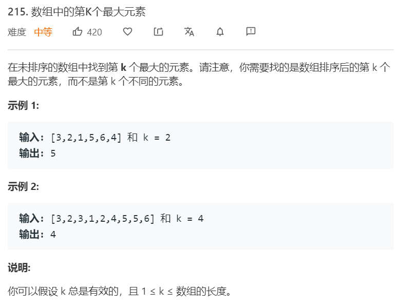

# 二叉堆
---

堆是一种完全二叉树，它的子节点均比自己小（大根堆）或者大（小根堆）。值得注意的是，往往找top小的话用大根堆，找top大用小根堆。


### 17.14. [最小K个数](https://leetcode-cn.com/problems/smallest-k-lcci/) ```medium```


**分析**<br/><br/>
使用大根堆来解这道题。这道题需要找到数组里最小的K个数。当我们维护一个大小为K的大根堆时，其堆顶元素也就是所有K个数里面的最大值。持续获取下一个元素，当该元素大于堆顶元素，那我们忽略这一元素，而当元素小于堆顶元素时，则将堆顶换成这个元素的值，并重新对堆进行规范化操作，popdown。通过这种方式就可以获得最小的K个数。

在实现堆的时候，一定要注意的一点是，元素从数组的第1个而不是第0个开始，parent的index为index // 2，左孩子为 index\*2，右孩子为 index\*2+1。 heapify方法对每个非叶子节点执行popdown操作。

**算法如下**<br/>
```python
# big heap
class Heap:
    def __init__(self, K):
        self.heap = [0]
        self.K = K
    
    def popup(self, idx):
        while idx > 1:
            parent = idx // 2
            if self.heap[parent] < self.heap[idx]:
                self.heap[parent], self.heap[idx] = self.heap[idx], self.heap[parent]
                idx = parent
            else:
                break 
    
    def popdown(self, idx):
        while idx*2 <= self.heap[0]:
            left, right = idx*2, idx*2 + 1
            large_child = right if (right <= self.heap[0] and self.heap[left] < self.heap[right]) else left
            if self.heap[large_child] > self.heap[idx]:
                self.heap[idx], self.heap[large_child] = self.heap[large_child], self.heap[idx]
                idx = large_child
            else:
                break
    
    def heapify(self, vals):
        assert len(vals) <= self.K
        self.heap[0] = len(vals)
        self.heap.extend(vals)

        for idx in range(self.heap[0] // 2, 0, -1):
            self.popdown(idx)
            
    def insert(self, val):
        if self.heap[0] < self.K:
            self.heap[0] += 1
            self.heap.append(val)
            self.popup(self.heap[0])
        else:
            if val < self.heap[1]:
                self.heap[1] = val 
                self.popdown(1)
        
class Solution:
    def smallestK(self, arr: List[int], k: int) -> List[int]:
        if k == 0:
            return []
        heap = Heap(k)
        heap.heapify(arr[:k])
        for i in range(k, len(arr)):
            heap.insert(arr[i])
        return heap.heap[1:]
```

使用Python heapq模块：
**算法如下**<br/>
```python
# big heap
import heapq

class Solution:
    def findKthLargest(self, nums: List[int], k: int) -> int:
        heap = nums[:k]
        heapq.heapify(heap)
        for idx in range(k, len(nums)):
            if nums[idx] > heap[0]:
                heapq.heapreplace(heap, nums[idx])  # heapreplace将最小的元素换成val，然后重新整理heap
        return heap[0]
```


### 215. [数组中的第K个最大元素](https://leetcode-cn.com/problems/kth-largest-element-in-an-array/) ```medium```


**分析**<br/><br/>
第K个最大元素，我们可以采用小根堆的形式。堆顶即K个元素中最小的，也就是说有K-1个比它大，则它是第K个最大元素。遍历数组，若元素比堆顶小则不处理，若元素比堆顶大，则需要更新堆顶，并重新规范堆，使得堆永远保持为数据流中前K个最大的元素。 这道题用小根堆实现的话，则取负数。

**算法如下**<br/>
```python
# big heap
class Heap:
    def __init__(self, K):
        self.heap = [0]
        self.K = K
    
    def popup(self, idx):
        while idx > 1:  # 这里需要注意，不能等于。即当前节点不是根节点
            parent = idx // 2
            if self.heap[parent] < self.heap[idx]:
                self.heap[parent], self.heap[idx] = self.heap[idx], self.heap[parent]
                idx = parent
            else:
                break 
    
    def popdown(self, idx):
        while idx*2 <= self.heap[0]: # 首先验证左子树，若不存在左子树，则该节点一定是叶子节点。
            left, right = idx*2, idx*2 + 1
            large_child = right if (right <= self.heap[0] and self.heap[left] < self.heap[right]) else left
            if self.heap[large_child] > self.heap[idx]:
                self.heap[idx], self.heap[large_child] = self.heap[large_child], self.heap[idx]
                idx = large_child
            else:
                break
    
    def heapify(self, vals):
        assert len(vals) <= self.K
        self.heap[0] = len(vals)
        self.heap.extend(vals)

        for idx in range(self.heap[0] // 2, 0, -1):
            self.popdown(idx)
            
    def insert(self, val):
        if self.heap[0] < self.K:
            self.heap[0] += 1
            self.heap.append(val)
            self.popup(self.heap[0])
        else:
            if val < self.heap[1]:
                self.heap[1] = val 
                self.popdown(1)
        
class Solution:
    def smallestK(self, arr: List[int], k: int) -> List[int]:
        if k == 0:
            return []
        heap = Heap(k)
        heap.heapify(arr[:k])
        for i in range(k, len(arr)):
            heap.insert(arr[i])
        return heap.heap[1:]
```

使用Python heapq模块，由于python的heapq模块是小根堆，因此将元素取负值。等价于找最大k个数。
```python
import heapq
class Solution:
    def smallestK(self, arr: List[int], k: int) -> List[int]:
        if k == 0: return []
        heap = [-v for v in arr[:k]]
        heapq.heapify(heap)
        for i in range(k, len(arr)):
            n = -arr[i]
            if n > heap[0]:
                heapq.heapreplace(heap, n)
        return [-x for x in heap]
```


### 295. [数据流的中位数](https://leetcode-cn.com/problems/find-median-from-data-stream/) ```hard```


**分析**<br/><br/>
将数据分成两部分，保证一部分是最小的，另外一部分是最大的。且两部分的长度差距不大于1。可以使用堆来实现这一点。创建两个堆，一个最大堆一个最小堆。最大堆存储最小的N个元素，最小堆存储最大的N个元素。

**算法如下**<br/>
```python
import heapq

class Solution:
    def topKFrequent(self, nums: List[int], k: int) -> List[int]:
        counter = {}
        for n in nums:
            counter[n] = counter.get(n, 0) + 1
        heap = []
        for n, freq in counter.items():
            if len(heap) < k:
                heapq.heappush(heap, (freq, n))
            else:
                if freq > heap[0][0]:
                    heapq.heapreplace(heap, (freq, n))
        return [n for _, n in heap]
```


### 347. [前 K 个高频元素](https://leetcode-cn.com/problems/top-k-frequent-elements/) ```middle```


**分析**<br/><br/>
先获得每个元素的频度，然后利用最小堆。

**算法如下**<br/>
```python
import heapq

class Solution:
    def topKFrequent(self, nums: List[int], k: int) -> List[int]:
        counter = {}
        for n in nums:
            counter[n] = counter.get(n, 0) + 1
        heap = []
        for n, freq in counter.items():
            if len(heap) < k:
                heapq.heappush(heap, (freq, n))
            else:
                if freq > heap[0][0]:
                    heapq.heapreplace(heap, (freq, n))
        return [n for _, n in heap]
```


# 并查集
---

```python

class UnionFind:
    def __init__(self, n):
        self.parents = [i for i in range(n)]
        self.count = n
    
    def find(self, i):
        if self.parents[i] == i:
            return i 
        else:
            self.parents[i] = self.find(self.parents[i])
            return self.parents[i]
    
    def union(self, i, j):
        pi = self.find(i)
        pj = self.find(j)
        if pi != pj:
            self.parents[pi] = pj 
            self.count -= 1
```

连通性问题，团问题使用并查集求解。


### 1319. [连通网络的操作次数](https://leetcode-cn.com/problems/number-of-operations-to-make-network-connected/) ```middle```


**分析**<br/><br/>
这道题主要是要找到有多少个线是多余的，并且在连接之后还剩多少个团（没有互相连接）。当union时，两个本来就属于同一个团的算一次多余连线，获得所有多余连线后，检查是否可以满足剩下团的连接即可。N个团需要N-1根线去连接。

**算法如下**<br/>
```python
class UnionFind:
    def __init__(self, n):
        self.parents = [i for i in range(n)]
        self.count = n
        self.dup = 0
    
    def find(self, i):
        if self.parents[i] == i:
            return i 
        else:
            self.parents[i] = self.find(self.parents[i])
            return self.parents[i]
    
    def union(self, i, j):
        pi = self.find(i)
        pj = self.find(j)
        if pi != pj:
            self.parents[pi] = pj 
            self.count -= 1
        else:
            self.dup += 1

class Solution:
    def makeConnected(self, n: int, connections: List[List[int]]) -> int:
        uf = UnionFind(n)
        L = len(connections)
        for i, j in connections:
            uf.union(i, j)
        remain = uf.dup
        return -1 if remain < uf.count - 1 else uf.count - 1
```