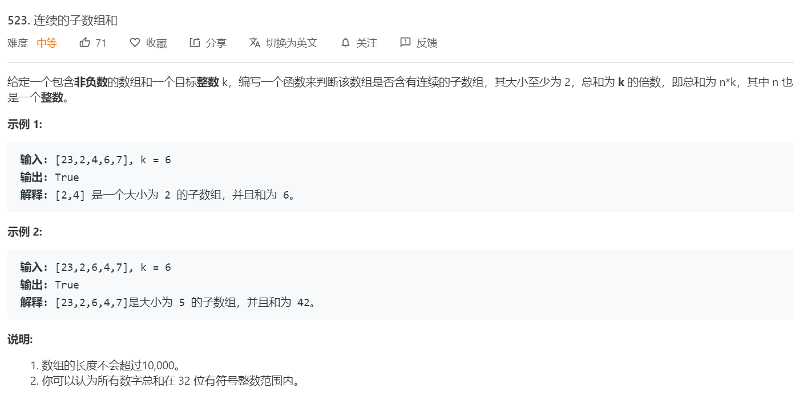
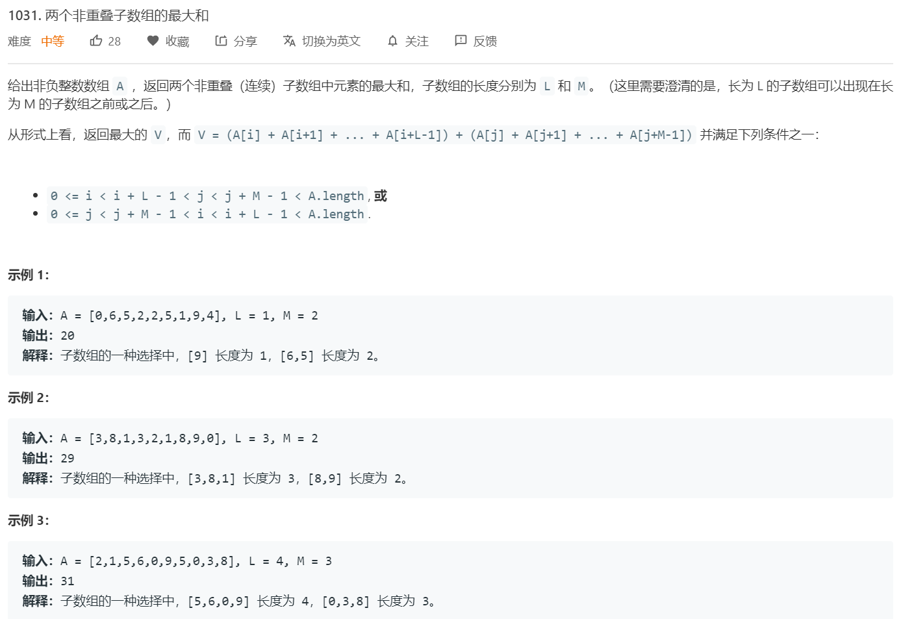
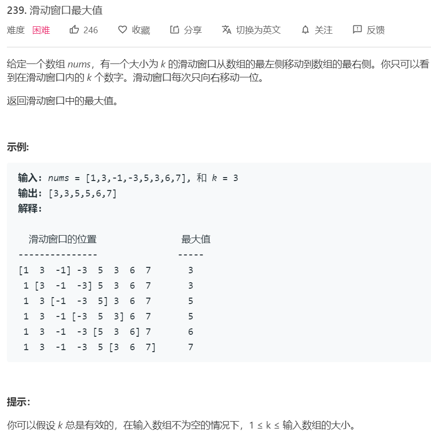
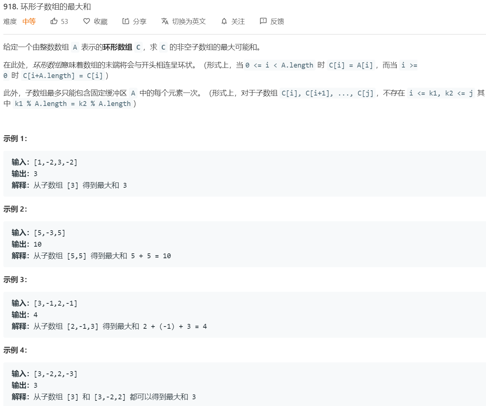
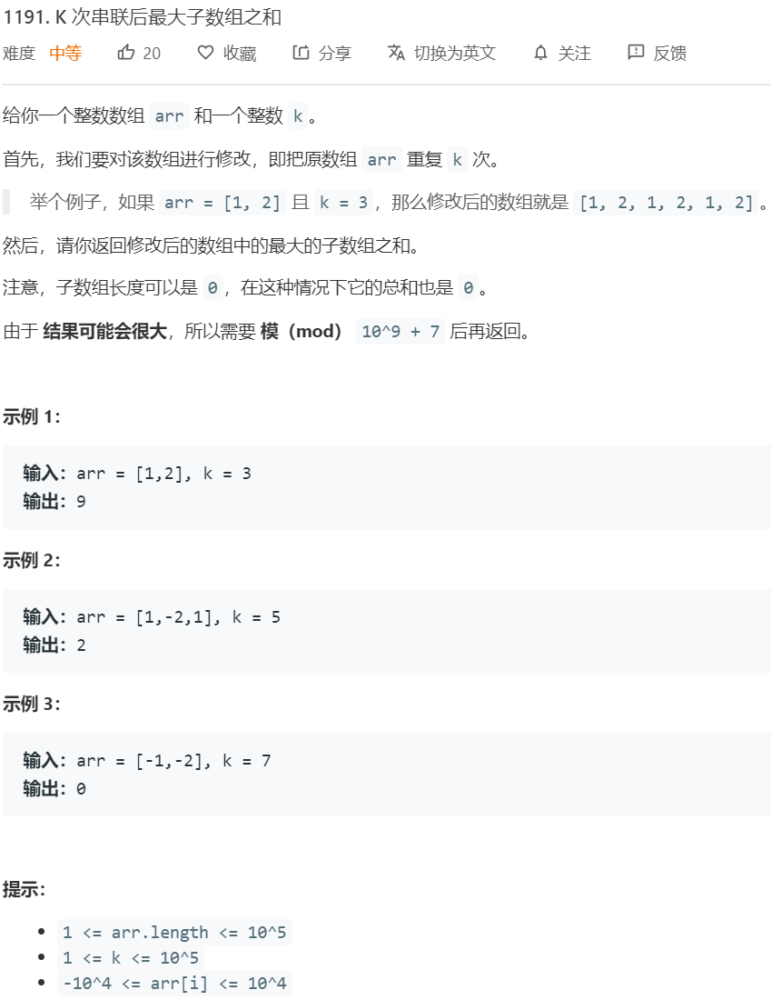
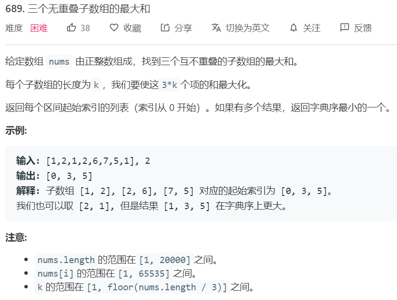
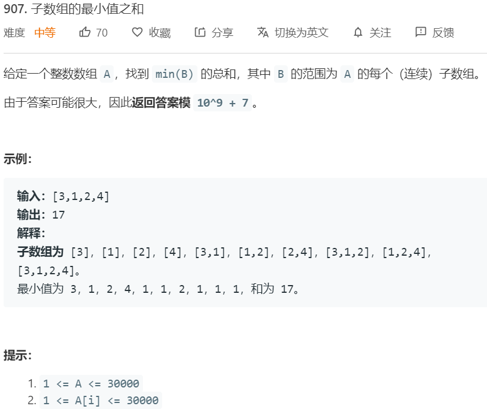

# 子数组和
---


## 找到和=X或取余X的子数组


使用前缀和来求解这种问题，假设给定数组A = {a1, a2, a3, ... , aN}，求其前缀和，$S = \{a_1, a_1+a_2, a_1+a_2+a_3,\dots \}$，则可以在常数时间内求解 $Sum A[i:j]$。即 <br/>
$$
\text{if } i = 0 \text{ then } \sum A[i:j] = S[j] - 0 \\
\text{else} \sum A[i:j] = S[j] - S[i-1]
$$

### 560. [和为K的子数组](https://leetcode-cn.com/problems/subarray-sum-equals-k/) ```medium```


**分析**<br/><br/>
利用前缀和公式我们可以得到 $S[i-1] = S[j] - \sum A[i;j]$ 或$S[j] = \sum A[i;j] - 0$ ，因此，我们遍历前缀和数组，只需要检查前面出现是否出现过 S-k或S直接等于K即可。

**算法如下**<br/>
```python
class Solution:
    def subarraySum(self, nums: List[int], k: int) -> int:
        S = 0
        prevs = {0:1}
        ans = 0

        for n in nums:
            S += n
            ans += prevs.get(S-k, 0)
            prevs[S] = prevs.get(S, 0) + 1
        return ans
```

### 930. [和相同的二元子数组](https://leetcode-cn.com/problems/binary-subarrays-with-sum/) ```medium```
 

**分析**<br/><br/>
这道题和前面一样解法

**算法如下**<br/>
```python
class Solution:
    def numSubarraysWithSum(self, A: List[int], S: int) -> int:
        s, ans, prevs = 0, 0, {0:1}
        for n in A:
            s += n 
            ans += prevs.get(s-S, 0)
            prevs[s] = prevs.get(s, 0) + 1
        return ans
```


### 523. [连续的子数组和](https://leetcode-cn.com/problems/continuous-subarray-sum/) ```medium```
 

**分析**<br/><br/>
这道题是前面一题的变体，要求总和为K的倍数，实际上就是模K为0，可以通过不断取余来实现。
$$
   \sum A[i:j] = S[j] - S[i-1] \\ 
   (S[j] - S[i-1]) \text{ mod } K = 0 \rightarrow S[i-1] \text{ mod } K = S[j]
$$
另外当i为0时，$S[j] \text{ mod } K = 0$

即我们现在保存的前缀和为对K取余的结果。由于题目要求长度至少为2，且并没有要求判断个数，而只是判断存在性。因此只需要用一个hash表保存之前第一次出现过的前缀和的index即可。

**算法如下**<br/>
```python
class Solution:
    def checkSubarraySum(self, nums: List[int], k: int) -> bool:
        S = 0
        prevs = {0:-1}
        for idx, n in enumerate(nums):
            S += n 
            if k != 0: S = S % k 
            if S in prevs:
                if prevs[S] != idx-1:
                    return True 
            else:
                prevs[S] = idx 
        return False
```

### 974. [和可被 K 整除的子数组](https://leetcode-cn.com/problems/subarray-sums-divisible-by-k/) ```medium```
 

**分析**<br/><br/>
这道题是前面一题的变体，要求总和为K的倍数的数组个数，和前面一样的方法，由于这里不需要验证必须大于2了，和第一题一样即可。

**算法如下**<br/>
```python
class Solution:
    def subarraysDivByK(self, A: List[int], K: int) -> int:
        S, prevs, ans = 0, {0:1}, 0
        for n in A:
            S = (S+n) % K 
            count = prevs.get(S, 0)
            ans += count 
            prevs[S] = count + 1
        return ans
```


## 子数组最大和（最大子序和）

最大子序（子数组）问题可以分为如下几种：
1. 任意长度的最大子序和：Kadane算法及其变体解决，该算法可以以 $O(N)$ 的时间复杂度解决在一个数组 $A[i:j]$ 内的最大子序和问题。其思想为维持一个数组记录到第i个元素为止，最大的子序和（该子数组一定以 $A[i]$ 为结尾）。

    $S[i] = max(S[i-1] + A[i], A[i])$ 或 $S[i] = max(S[i-1], 0) + A[i]$

2. 规定长度的最大子序和：前缀和+DP。前缀和可以常数时间获得给定序列的和。
3. 限制长度的最大子序和: 使用单调队列（最小队列）加上前缀和解决。
   - 根据前缀和可得，$\sum A[i:j] = S[j] - S[i-1]$ ，因此希望求得 $A[0:i]$ 内以 $i$ 为结尾的长度最大为 $K$ 的最大子序和，既 $max(S[i] - S[i']) \text{ s.t. }i-k \le i' \le i-1$ ，既遍历K的可选长度，但该算法的时间复杂度为 $O(nK)$ 。观察可得，整个过程中，我们遍历所有的 $i$，并且对每个 $i$遍历其前 $K$个前驱，类似于一个长度为 $K$ 的滑动窗口，只要我们能够以常数时间去获取到该滑动窗口内的最小值，就可以找到这个最大值。可以采用最小队列来解决该问题。
   - 单调队列通过两个队列来实现，以最小队列为例。一个队列是存储值的主队列，另外一个队列为双端队列，存储最小值及候补，其队首一定为最小值。这里存在一个观察结果，队列是先入先出结构，因此后入对的值一定后出队，由此可以推论，当入队了一个值 $x$，则之前队内的所有大于 $x$ 的元素都永远不可能成为最小值的候补，因为他们不可能在 $x$ 出队后还存在于队内。由
   - 此可得算法，当入队时，一一从最值候补队列的末端开始检查队列元素并出队，直到队尾元素比入队元素小于等于或队列为空为止，再将该入队元素插入最值候补队列的队尾。当出队时，检查出队元素和最值候补队列队首是否相等，相等则出队。
   - 这里有个注意点，即最值候补队列是否存储重复值。若不存储重复值，则入队时，一直从队尾删除候补元素，直到队尾元素比入队元素**小**为止。此时需要存储一个index来判断候补元素和主队列元素的对应关系。若存储重复值，则入队时，一直从队尾删除候补元素，直到队尾元素比入队元素**小于等于**为止，此时出队直接判断值是否相等即可。


### 53. [最大子序和](https://leetcode-cn.com/problems/maximum-subarray/) ```easy```
 


**分析**<br/><br/>
直接使用Kadane算法求解

**算法如下**<br/>
```python
class Solution:
    def maxSubArray(self, nums: List[int]) -> int:
        s = -1
        ans = nums[0]
        for n in nums:
            s = max(s, 0) + n
            ans = max(ans, s)
        return ans
```

### 1031. [两个非重叠子数组的最大和](https://leetcode-cn.com/problems/maximum-sum-of-two-non-overlapping-subarrays/) ```medium```
 


**分析**<br/><br/>
这道题目的难点是要同时求两个非重叠的子数组，而且规定了子数组的长度。首先需要求得 $A[0:j]$ 内，长度为 $L$ 的最大子序和（不一定要包括j），使用前缀和加DP解决。通过前缀和可以常数时间内获得 $\sum A[j-L, j]$ ，然后利用DP一直记录即可。在获取 $A[0:j]$ 内，长度为 $L$ 的最大子序和后，首先假设 $L$ 在前，$M$ 在后，则遍历所有的长度为 $L$ 的最大子序和以及长度为 $M$ 的子数组，即可获得全局最优解。然后反过来即可。

假设 $S$ 为前缀和数组，$X$ 为长度为 $L$ 的最大子序和，$y$ 为长度为 $M$ 的最大子序和。则
$$

ans = max(ans, X[i-M] + S[i] - S[i-M], Y[i-L] + S[i] - S[i-L]) \text{ for } i >= L+M-1 \\
X[i] = max(S[i] - S[i-L], X[i-1]) \text{ for } i > L \\
Y[i] = max(S[i] - S[i-M], Y[i-1]) \text{ for } i > M         \\

$$

**算法如下**<br/>
```python
class Solution:
    def maxSumTwoNoOverlap(self, A: List[int], L: int, M: int) -> int:
        for i in range(1, len(A)):
            A[i] += A[i-1]
        
        X = [0 for i in range(len(A))]
        Y = [0 for i in range(len(A))]
        ans = 0
        X[L-1] = A[L-1]
        Y[M-1] = A[M-1]
        for i in range(min(L, M), len(A)):
            if i >= L: X[i] = max(X[i-1], A[i]-A[i-L])
            if i >= M: Y[i] = max(Y[i-1], A[i]-A[i-M])
            if i >= L+M-1:
                ans = max(ans, X[i-M]+A[i]-A[i-M], Y[i-L]+A[i]-A[i-L])
        return ans
```

### 239. [滑动窗口最大值](https://leetcode-cn.com/problems/sliding-window-maximum/) ```hard```
 


**分析**<br/><br/>
该题以单调队列求解即可。

**算法如下**<br/>
```python
from collections import deque
class Solution:
    def maxSlidingWindow(self, nums: List[int], k: int) -> List[int]:
        vals = deque()
        maxs = deque()
        ans = []

        for idx in range(len(nums)):
            n = nums[idx]

            if idx >=k:  # start pop the earliest element
                earliest_val = vals.popleft()
                max_val = maxs[0]
                if max_val == earliest_val:
                    maxs.popleft()
            
            # add new element
            vals.append(n)
            while len(maxs) and maxs[-1] < n:
                maxs.pop()
            maxs.append(n)

            if idx >= k-1:  # start record max into answer
                ans.append(maxs[0])
        return ans
```


### 53**改**. [最大子序和（限制数组最大长度）](https://leetcode-cn.com/problems/maximum-subarray/) 

改动53题，规定子数组长度不能超过K。

**分析**<br/><br/>
利用前缀和加上最小队列来解决该问题

**算法如下**<br/>
```python
from collections import deque

class SmallestDeque:
    def __init__(self):
        self.vals = deque()
        self.mins = deque()
    
    def append(self, x):
        self.vals.append(x)
        if len(self.mins) > 0:
            while self.mins[-1] > x:
                self.mins.pop()
        self.mins.append(x)
    
    def popleft(self):
        x = self.vals.popleft()
        if self.mins[0] == x:
            self.mins.popleft()
    
    def getmin(self):
        return self.mins[0]
        

class Solution:
    def max_subarray(self, A, k):
        for i in range(1, len(A)):
            A[i] += A[i-1]

        mins_deque = SmallestDeque()
        mins_deque.append(0)
        ans = A[0]
        
        for i in range(1, len(A)):
            if i >= k-1:  # need to pop, cause we add 0 in deque (equal to -1 index)
                mins_deque.popleft()
            mins_deque.append(A[i-1])     # append new
            ans = max(ans, A[i]-mins_deque.getmin())
        return ans
```


### 1031**改**. [两个非重叠子数组的最大和](https://leetcode-cn.com/problems/maximum-sum-of-two-non-overlapping-subarrays/)

改动上一题（1031），上一题规定了子数组的长度必须等于给定长度，现在改为子数组长度必须小于等于给定长度，即子数组可以小于给定长度，且数组值可以为负数。


**分析**<br/><br/>
修改之后首先需要解决的是，求给定长度限制的最大子序和问题。该部分使用前一题算法可解决。可以在O(N)时间内获得到 $i$ 为止且包括 $A[i]$ 的最大子序和。考虑两种情况，第一种L在前M在后，第二种L在后M在前。第一种情况下，计算 $A[0:i]$ 的不超过 $L$ 的最大子序和以及 $A[i:Len_A]$ 的长度不超过 $M$ 的最大子序和。然后遍历 $0-Len_A$ 求二者最大和即可。在第二种情况则是把第一种情况反过来即可。时间复杂度 $O(N)$ 

**算法如下**<br/>
```python
from collections import deque

class SmallestDeque:
    def __init__(self):
        self.vals = deque()
        self.mins = deque()
    
    def append(self, x):
        self.vals.append(x)
        if len(self.mins) > 0:
            while self.mins[-1] > x:
                self.mins.pop()
        self.mins.append(x)
    
    def popleft(self):
        x = self.vals.popleft()
        if self.mins[0] == x:
            self.mins.popleft()
    
    def getmin(self):
        return self.mins[0]
        

class Solution:
    def max_subarray(self, A, k):
        for i in range(1, len(A)):
            A[i] += A[i-1]

        mins_deque = SmallestDeque()
        mins_deque.append(0)
        ans = [A[0]]
        
        for i in range(1, len(A)):
            if i >= k-1:  # need to pop, cause we add 0 in deque (equal to -1 index)
                mins_deque.popleft()
            mins_deque.append(A[i-1])     # append new
            ans.append(A[i]-mins_deque.getmin())
        return ans
    
    def solution(self, A, L, M):
        L_left = self.max_array(A, L)
        M_left = self.max_array(A, M)
        
        reverse_A = A[::-1]
        L_right = self.max_array(reverse_A, L)[::-1]
        M_right = self.max_array(reverse_A, M)[::-1]

        ans = A[0]+A[1]
        for i in range(len(A)):
            ans = max(ans, L_left[i]+M_right[i], L_right[i]+M_left[i])
        return ans
```


### 918. [环形子数组的最大和](https://leetcode-cn.com/problems/maximum-sum-circular-subarray/) ```medium```
 

**分析**<br/><br/>
这题要求求环形子数组的最大和，其实只有两种情况。一种情况是，该子数组最大和不会跨越边界，即等价于一般的最大子序和问题。另外一种情况是，该子数组最大和跨越了边界。 如 $x x y y y y y x x$，在这个数组中 $x$ 为最大子序的一部分，而 $y$ 不是，这种情况下，要求最大的 $x$ 数组，等价于求最小的 $y$ 数组。而 $x$ 数组的和即等于 $\sum A - \sum y$ 。分两种情况利用Kadane求解并取其中最大值即可。<br/><br/>
**注意** $y$ 数组一定不能是全部数组，因此应从index 1开始迭代

**算法如下**<br/>
```python
class Solution:
    def maxSubarraySumCircular(self, A: List[int]) -> int:
        max_ans, min_ans = A[0], A[0]
        A_sum = 0
        prev_max_sum, prev_min_sum = 0, 0

        for idx, n in enumerate(A):
            prev_max_sum = max(prev_max_sum, 0) + n
            max_ans = max(max_ans, prev_max_sum)
            A_sum += n 

            if idx > 0 and idx < len(A) - 1:
                prev_min_sum = min(prev_min_sum, 0) + n
                min_ans = min(min_ans, prev_min_sum)

        if len(A) > 1:
            return max(max_ans, A_sum-min_ans)            
        else:
            return max_ans
```

### 1191. [K 次串联后最大子数组之和](https://leetcode-cn.com/problems/k-concatenation-maximum-sum/) ```medium```
 

**分析**<br/><br/>
这题要求求K次串联后的最大子序和。实际上这是一个周期性问题。只需要拼接该数组并求出一个周期下的最大子序和即可。任意一个跨越多个周期的序列和，均可以表示为该两端序列的子序列和加上周期数目 $0,1,\dots,K-2$ 乘上一整个序列的和。

**算法如下**<br/>
```python
class Solution:
    def kConcatenationMaxSum(self, arr: List[int], k: int) -> int:
        if k > 1:
            s = sum(arr)
            arr = arr + arr 
            
        ans, prevs = 0, 0 
        for n in arr:
            prevs = max(prevs, 0) + n 
            ans = max(prevs, ans)
        
        if k > 1 and s > 0:
            return (ans + (k-2)*s) % (10**9+7)
        return ans % (10**9+7)
```

### 1186. [删除一次得到子数组最大和](https://leetcode-cn.com/problems/maximum-subarray-sum-with-one-deletion/) ```medium```
 

**分析**<br/><br/>
该题可用Kadane算法的变体来解决。创建两个DP数组，保存两种状态。一种是删除过一次的最大值 $A$，另一种是没有删除过的最大值 $B$。可得：
- $A[i] = max(A[i-1]+arr[i], 0, B[i-1])$ 其中$A[i-1]+arr[i]$表示之前删除过一次，加入目前的数组元素，0代表不要之前的子数组，且删除当前的数组元素（即子数组全部清空），$B[i-1]$代表加上之前没删除过的子数组，且删除当前的数组元素。
- $B[i] = max(B[i-1]+arr[i], arr[i])$ 该部分与子数组最大和一样

**算法如下**<br/>
```python
class Solution:
    def maximumSum(self, arr: List[int]) -> int:
        A, B, ans = 0, arr[0], arr[0]
        for i in range(1, len(arr)): 
            n = arr[i]
            A = max(A+n, B)  # 更新删除过一次的当前最大值，先排除清空子数组的情况
            B = max(B+n, n)
            ans = max(ans, A, B)  # 记录全局最大值
            A = max(A, 0)     # 由于一定要保证至少有一个元素，因此在记录全局最大值后再考虑这一情况
        return ans
```


### 689. [三个无重叠子数组的最大和](https://leetcode-cn.com/problems/maximum-sum-of-two-non-overlapping-subarrays/) ```hard```
 


**分析1**<br/><br/>
两种解法，第一种解法如下：

注意到该题要求的是三个长度指定且相等的无重叠子数组最大和。我们只需要遍历所有排在中间的数组即可。可以在O(N)时间内先获得 $A[0:i]$ 内长度为 $k$ 的子数组最大和 $X[i]$，同理可得 $A[i:L_A-1]$ 的最大和 $Y[i]$，然后遍历中间数组 $A[i:i+k]$ 即可，
$$
ans = \text{max}(ans, X[i]+\sum A[i:i+k-1]+Y[i+k]), k \leq i \leq L_A - 2k
$$

如何获得 $X[i]$ ？ 遍历所有长度为 $k$ 的数组即可
$$
X[i] = max(X[i-1], \sum A[i-k+1:i]), i >= k-1
$$

由于题目要求返回起始索引列表，在计算 $X$ 和 $Y$ 时，保存下对应的起始序号。并且在遍历中间数组时也进行状态的保存。
**注意** 由于保存的是最小的序号，在计算 $Y$ 时一定要小心，当之前的和之后的相等时，一定要保存更小的序号，而 $X$ 则相反。


**算法1如下**<br/>
```python
class Solution:
    def maxSumOfThreeSubarrays(self, nums: List[int], k: int) -> List[int]:

        S = [n for n in nums]
        for i in range(1, len(S)):
            S[i] += S[i-1]
        X = [(0, 0) for i in range(len(nums))]
        X[k-1] = (0, S[k-1])
        for i in range(k, len(X)):
            new_val = S[i] - S[i-k]
            if new_val > X[i-1][1]:
                X[i] = (i-k+1, new_val)
            else:
                X[i] = X[i-1]
        
        rS = [nums[i] for i in range(len(nums)-1, -1, -1)]
        for i in range(1, len(rS)):
            rS[i] += rS[i-1]

        Y = [(0, 0) for i in range(len(nums))]
        Y[k-1] = (len(nums)-k, rS[k-1])
        for i in range(k, len(X)):
            new_val = rS[i] - rS[i-k]
            if new_val >= Y[i-1][1]:
                Y[i] = (len(nums)-i-1, new_val)
            else:
                Y[i] = Y[i-1]
        Y = Y[::-1]

        ans_i = []
        ans_v= 0

        for i in range(k, len(nums)-2*k+1):
            new_val = X[i-1][1] + S[i+k-1] - S[i-1] + Y[i+k][1]
            if new_val > ans_v:
                ans_i = [X[i-1][0], i, Y[i+k][0]]
                ans_v = new_val
        
        return ans_i
```


**分析2**<br/><br/>
两种解法，第二解法如下：

该题可用DP方式求解，该方法可求解任意n个长度指定为 $k$ 的无重叠子数组最大和问题。假设我们有 $dp[n][i]$ 表示 $A[0:i]$ 内的 $n$ 个长度指定为 $k$ 无重叠子数组最大和，则我们只需要遍历所有长度为 $k$ 的子数组即可求得 $dp[n+1]$

$$
dp[n][i] = \text{max}(dp[n-1][i-k] + \sum A[i-k+1:i], dp[n][i-1]) \\
 = \text{max}(dp[n-1][i-k] + S[i] - S[i-k], dp[n][i-1])
$$


### 907. [子数组最小值之和](https://leetcode-cn.com/problems/sum-of-subarray-minimums/) ```medium```
 


**分析**<br/><br/>
这道题同样采用一种递推的方式去求解。假设数组 $[3,1,2,4]$ ，目前看到了数组 $[3,1]$ ，则产生的子数组有 $[3], [1], [3,1]$, 当进一步到了 $2$ 时，新产生的子数组有 $[1,2], [2], [3,1,2]$。可以看到，只有在包括了目前边界的子数组，在加入了新的元素时会更新。而更新的子数组会在下次继续更新，未更新的子数组则保持不变。因此我们只需要不断地记录包括该位置的子数组即可。再次观察发现，更新的子数组并非都会更新最小值，我们只需要记录最小值而非记录整个子数组的内容。当加入新的元素时，原有的最小值比当前元素大的数组会更新最小值，而其余则保持不变。同时还会加入一个只有新元素的新数组，长度为1。

由此可得，我们只需要一个数据结构保存前面数组的最小值及对应个数即可，而且每次加入新元素时，更新这个数据结构，将所有大于这个元素的全部pop掉，并加总其数目，加到当前加入的元素上。 该数据结构类似最小栈。每次更新时，我们将当前数据结构内的总值加总到全局result上。


**算法如下**<br/>
```python
class Solution:
    def sumSubarrayMins(self, A: List[int]) -> int:
        T = [(A[0], 1)]
        Y = A[0]    # include
        factor = 10**9 + 7
        
        ans = Y % factor

        for i in range(1, len(A)):
            n = A[i]
            # update T and Y
            accumulate = 0
            sub = 0
            while len(T) and T[-1][0] >= n:
                e, count = T.pop()
                sub += e * count
                accumulate += count
            T.append((n, accumulate+1))
            Y = Y - sub + (accumulate+1) * n
            ans = (ans + Y) % factor
        return ans
```

