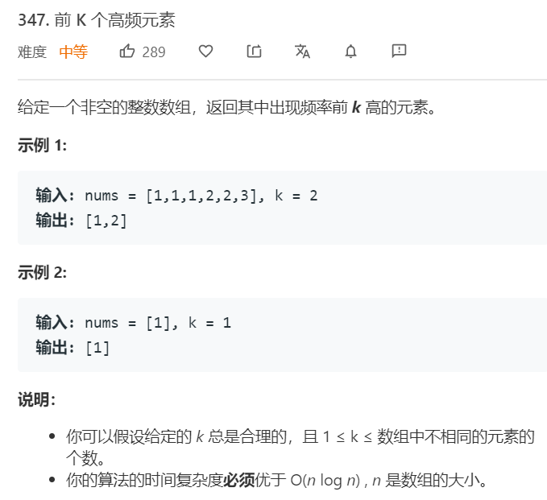

# 并查集
---

```python

class UnionFind:
    def __init__(self, n):
        self.parents = [i for i in range(n)]
        self.count = n
    
    def find(self, i):
        if self.parents[i] == i:
            return i 
        else:
            self.parents[i] = self.find(self.parents[i])
            return self.parents[i]
    
    def union(self, i, j):
        pi = self.find(i)
        pj = self.find(j)
        if pi != pj:
            self.parents[pi] = pj 
            self.count -= 1
```

连通性问题，团问题使用并查集求解。


### 1319. [连通网络的操作次数](https://leetcode-cn.com/problems/number-of-operations-to-make-network-connected/) ```middle```


**分析**<br/><br/>
这道题主要是要找到有多少个线是多余的，并且在连接之后还剩多少个团（没有互相连接）。当union时，两个本来就属于同一个团的算一次多余连线，获得所有多余连线后，检查是否可以满足剩下团的连接即可。N个团需要N-1根线去连接。

**算法如下**<br/>
```python
class UnionFind:
    def __init__(self, n):
        self.parents = [i for i in range(n)]
        self.count = n
        self.dup = 0
    
    def find(self, i):
        if self.parents[i] == i:
            return i 
        else:
            self.parents[i] = self.find(self.parents[i])
            return self.parents[i]
    
    def union(self, i, j):
        pi = self.find(i)
        pj = self.find(j)
        if pi != pj:
            self.parents[pi] = pj 
            self.count -= 1
        else:
            self.dup += 1

class Solution:
    def makeConnected(self, n: int, connections: List[List[int]]) -> int:
        uf = UnionFind(n)
        L = len(connections)
        for i, j in connections:
            uf.union(i, j)
        remain = uf.dup
        return -1 if remain < uf.count - 1 else uf.count - 1
```