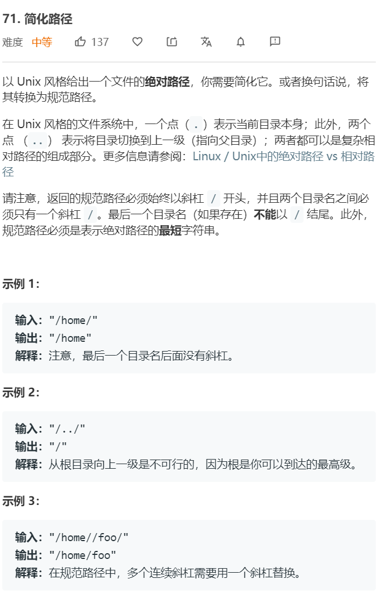

# 并查集
---

```python

class UnionFind:
    def __init__(self, n):
        self.parents = [i for i in range(n)]
        self.count = n
    
    def find(self, i):
        if self.parents[i] == i:
            return i 
        else:
            self.parents[i] = self.find(self.parents[i])
            return self.parents[i]
    
    def union(self, i, j):
        pi = self.find(i)
        pj = self.find(j)
        if pi != pj:
            self.parents[pi] = pj 
            self.count -= 1
```

连通性问题，团问题使用并查集求解。


### 946. [验证栈序列](https://leetcode-cn.com/problems/validate-stack-sequences/) ```middle```


**分析**<br/><br/>
模拟栈，两种解法。第一种解法，判断目前的栈顶元素是否等于出栈序列当前位置的元素，若不等则入栈（找到可以出栈的元素）。若等于出栈序列当前位置的元素，则出栈。循环。当遍历完入栈序列后，一个个出栈，判断是否和出栈序列相等。

第二种解法，遍历入栈元素，一个个入栈，同时内部循环出栈。循环结束后，判断栈内是否还有元素。


**算法如下**<br/>
解法1
```python
class Solution:
    def validateStackSequences(self, pushed: List[int], popped: List[int]) -> bool:
        stack = []
        push_idx, pop_idx = 0, 0
        while push_idx < len(pushed):
            if len(stack) == 0 or stack[-1] != popped[pop_idx]:
                stack.append(pushed[push_idx])
                push_idx += 1
            if stack[-1] == popped[pop_idx]:
                stack.pop(-1)
                pop_idx += 1
        while stack:
            if stack.pop() != popped[pop_idx]:
                return False
            pop_idx += 1
        return True
```

解法2
```python
class Solution:
    def validateStackSequences(self, pushed: List[int], popped: List[int]) -> bool:
        stack = []
        idx = 0
        for num in pushed:
            stack.append(num)
            while stack and stack[-1] == popped[idx]:
                stack.pop()
                idx += 1
        return not stack
```


### 41. [缺失的第一个正数](https://leetcode-cn.com/problems/first-missing-positive/) ```hard```


**分析**<br/><br/>
该题原理其实是鸽巢原理，数组有N个元素，若这N个元素各不相同且为1-N则缺失的第一个正数就是N+1，若这N个元素相同，或存在小于等于0或大于N的元素，则1-N中存在缺失的数。我们给出N个大小的位置，把这些元素填到相应的位置上，
若出现了位置的缺失就相当于缺少了这个数字。可以直接利用原数组来完成这一任务，首先检查1是否存在于数组中，若存在则将小于等于0或大于N的元素设置为1。然后遍历数组，我们用负数来标识该位存在。

还有另外一种方法是通过swap


**算法如下**<br/>
解法1
```python
class Solution:
    def firstMissingPositive(self, nums: List[int]) -> int:
        for n in nums:
            if n == 1:
                break 
        else:
            return 1 

        N = len(nums)
        nums = [n if 1 <= n and n <= N else 1 for n in nums]
        for n in nums:
            n = abs(n)
            nums[n-1] = nums[n-1] if nums[n-1] < 0 else -nums[n-1]
        for idx, n in enumerate(nums):
            if n > 0:
                return idx + 1
        return N+1
```

### 442. [数组中重复的数据](https://leetcode-cn.com/problems/find-all-duplicates-in-an-array/) ```middle```


**分析**<br/><br/>
与之前的题目类似，用负数来标识这个位置的元素已经出现过一次，当我们标识的时候发现位置已经是负数，就把这个数加入结果列表。（这是因为已经说明好，只会出现1次或2次）


**算法如下**<br/>
```python
class Solution:
    def findDuplicates(self, nums: List[int]) -> List[int]:
        res = []
        for n in nums:
            n = abs(n)
            if nums[n-1] < 0:
                res.append(n)
            else:
                nums[n-1] = -nums[n-1]
        return res
```


### 71. [简化路径](https://leetcode-cn.com/problems/simplify-path/) ```middle```


**分析**<br/><br/>
这道题用'/'去split数组后，记录当前的工作目录。碰到空或者'.'则不变，碰到'..'则弹出当前目录。


**算法如下**<br/>
```python
class Solution:
    def simplifyPath(self, path: str) -> str:
        split_path = path.split('/')
        folders = []
        for temp in split_path:
            if temp.strip() == '' or temp == '.':
                continue 
            if temp == '..':
                if len(folders):
                    folders.pop(-1)
            else:
                folders.append(temp)

        if len(folders) == 0:
            return '/'
        else:
            return '/' + '/'.join(folders)
```


### 15. [三数之和](https://leetcode-cn.com/problems/3sum/) ```middle```


**分析**<br/><br/>
三数之和等价于固定一个数，找另外两数之和。遍历数组并排序，然后用双指针法做两数之和即可。这道题的难点在于需要去重。首先需要做的去重是在找两数之和时，当我们检测完一组值后，需要移动L或者R指针或L和R指针，此时我们将所有等于当前这个数的后续全部跳过。第二步需要做的去重是，遍历固定数的去重，该步去重我们记录一下之前的数即可，若相等则跳过。

值得注意的是，假设固定的数为X，那我们应该以如下去寻找 【X,L,R】。若我们以【L,X,R】去查找，会出现去重的问题。假设 -1 -1 -1 0 0 0 1 1 1，在遍历X时，我们不得不遍历两次0，因为只有遍历了第二次0，才可以找到0 0 0这样的组合，但这样就会造成重复。如第一个0，找到-1 0 1，第二个0找到同样的。


**算法如下**<br/>
```python
class Solution:
    def threeSum(self, nums: List[int]) -> List[List[int]]:
        nums.sort()
        ans = []
        for m in range(len(nums)):
            if m >= 1 and nums[m] == nums[m-1]:
                continue
            ans.extend(self.find_target(m, nums, -nums[m]))
        return ans

    
    def find_target(self, m, nums, target):
        l, r = m+1, len(nums)-1
        ans = []
        while l < r:
            cur = nums[l] + nums[r]
            if cur < target:
                while l < r and nums[l] == nums[l+1]:
                    l += 1
                l += 1
            elif cur > target:
                while l < r and nums[r] == nums[r-1]:
                    r -= 1
                r -= 1 
            else:
                ans.append([nums[m], nums[l], nums[r]])
                while l < r and nums[l] == nums[l+1]:
                    l += 1
                while l < r and nums[r] == nums[r-1]:
                    r -= 1
                l += 1
                r -= 1
        return ans
```

### 16. [最接近的三数之和](https://leetcode-cn.com/problems/3sum-closest/solution/) ```middle```


**分析**<br/><br/>
和三数之和几乎一样，区别仅在于需要更新的答案不同。


**算法如下**<br/>
```python
import math
class Solution:
    def threeSumClosest(self, nums: List[int], target: int) -> int:
        nums.sort()
        ans = math.inf

        for i, n in enumerate(nums):
            if i > 0 and nums[i] == nums[i-1]:
                continue
            l, r = i+1, len(nums)-1
            while l < r:
                sum = n+nums[l]+nums[r]
                if abs(sum-target) < abs(ans-target):
                    ans = sum 
                if sum > target:
                    while l < r and nums[r] == nums[r-1]:
                        r -= 1
                    r -= 1
                elif sum < target:
                    while l < r and nums[l] == nums[l+1]:
                        l += 1
                    l += 1
                else:
                    return sum
        return ans 
```


### 18. [四数之和](https://leetcode-cn.com/problems/4sum/) ```middle```


**分析**<br/><br/>
通过递归的方式，可以直接写出n数之和。

**算法如下**<br/>
```python
class Solution:
    def fourSum(self, nums: List[int], target: int) -> List[List[int]]:
        nums = sorted(nums)
        return self.nsum(nums, target, 4, 0)
        
    def nsum(self, nums, target, n, start):
        if n == 2:
            return self.twosum(nums, start, target)
        ans = []
        idx = start
        while idx < len(nums):
            cur = nums[idx]
            if cur > target and cur > 0:
                break
            if idx > start and nums[idx] == nums[idx-1]:
                idx += 1
                continue
            res = self.nsum(nums, target-cur, n-1, idx+1)
            ans.extend([[cur]+r for r in res])
            idx += 1
        return ans      

    
    def twosum(self, nums, start, target):
        l, r = start, len(nums)-1
        ans = []
        while l < r:
            cur = nums[l] + nums[r]
            if cur < target:
                l += 1
            elif cur > target:
                r -= 1
            else:
                ans.append([nums[l], nums[r]])
                while l < r and nums[l] == nums[l+1]:
                    l += 1
                while l < r and nums[r] == nums[r-1]:
                    r -= 1
                l += 1
                r -= 1
        return ans
```


### 32. [最长有效括号](https://leetcode-cn.com/problems/longest-valid-parentheses/) ```middle```


**分析**<br/><br/>
三种解法，两种栈式解法，另外一种是动态规划。
1. 第一种解法，利用栈来求解。这道题需要注意的是，我们需要合并合法的括号序列长度，另外中间可能会有隔离。比如)()()(()，被(隔离，)()()()))被)隔离，但也存在这种情况)()(()())(，该情况的序列长度为2+4。第一种朴素的栈解法，用栈来保存三种元素，（，）和目前匹配的序列长度。当碰到（时直接入栈，而当碰到）需要检查是否可以匹配。此时需要分情况考虑，因为我们不仅需要做匹配，还需要合并序列长度。若栈不为空，有两种情况可以匹配。x（），或（x），x为保存的长度。因此检查这两种情况即可，若不满足匹配则将）入栈，否则将更新的序列长度入栈。
2. 第二种解法同样是利用栈来求解，是第一种解法的改进版。我们不再在栈内保存目前匹配序列的长度，而是保存最前一次没有匹配的坐标。首先将栈初始化为[-1]，当遇到（时直接将它的坐标入栈。当遇到）时需要出栈。分两种情况考虑，首先是出栈后，栈为空，该种情况下说明前面没有已经匹配过的元素，直接将当前坐标入栈（相当于更新障碍物）。若栈不为空，则当前栈顶就是最后一次没有匹配的位置，更新此时的max即可
3. 动态规划，dp[i]为以i为结尾的合法括号序列长度。分析详情见
https://leetcode-cn.com/problems/longest-valid-parentheses/solution/dong-tai-gui-hua-si-lu-xiang-jie-c-by-zhanganan042/

**算法如下**<br/>
解法1
```python
class Solution:
    def longestValidParentheses(self, s: str) -> int:
        stack = []
        ans = 0
        for c in s:
            if c == '(':
                stack.append(c)
            else:
                if len(stack):
                    if stack[-1] == '(':
                        stack.pop()
                        if len(stack) and isinstance(stack[-1], int):
                            prev = stack.pop()            
                        else:
                            prev = 0
                    elif isinstance(stack[-1], int):
                        if len(stack) >= 2 and stack[-2] == '(':
                            prev = stack.pop()
                            stack.pop()
                            if len(stack) and isinstance(stack[-1], int):
                                prev += stack.pop() 
                        else:
                            stack.append(')')
                            continue
                    else:
                        stack.append(')')
                        continue
                    stack.append(prev+2)
                    ans = max(ans, prev+2)
        return ans 
```

解法2
```python
class Solution:
    def longestValidParentheses(self, s: str) -> int:
        stack = [-1]
        ans = 0
        for idx, c in enumerate(s):
            if c == '(':
                stack.append(idx)
            else:
                top = stack.pop(-1)
                if len(stack) == 0:
                    stack.append(idx)
                else:
                    ans = max(idx-stack[-1], ans)
        return ans 
```

解法3
```python
class Solution:
    def longestValidParentheses(self, s: str) -> int:
        dp = [0 for i in range(len(s))]
        ans = 0
        for i, c in enumerate(s):
            if c == '(': continue 
            if i > 0:
                if s[i-1] == '(':
                    pp = dp[i-2] if i > 1 else 0
                    dp[i] = pp + 2
                else:
                    if i-1-dp[i-1] >= 0 and s[i-1-dp[i-1]] == '(':
                        prev = dp[i-2-dp[i-1]] if i-2-dp[i-1] >= 0 else 0
                        dp[i] = dp[i-1] + 2 + prev
            ans = max(dp[i], ans)
        return ans
```


### 228. [汇总区间](https://leetcode-cn.com/problems/summary-ranges/) ```middle```


**分析**<br/><br/>
这种就是用两个指针，遍历i，令j=i+1，并循环遍历j，直到不满足条件。然后把i设置成j

**算法如下**<br/>
```python
class Solution:
    def summaryRanges(self, nums: List[int]) -> List[str]:
        res = []
        i = 0 
        while i < len(nums):
            j = i + 1
            while j < len(nums) and nums[j] == nums[j-1]+1:
                j += 1
            interval = "{}->{}".format(nums[i], nums[j-1]) if j != i+1 else "{}".format(nums[i])
            res.append(interval)
            i = j
        return res
```


### 745. [前缀和后缀搜索](https://leetcode-cn.com/problems/prefix-and-suffix-search/) ```middle```


**分析**<br/><br/>
轮排索引 + 前缀树

**算法如下**<br/>
```python
class WordFilter:

    def __init__(self, words: List[str]):
        self.root = {}

        for idx, word in enumerate(words):
            for i in range(len(word)+1):
                cur_word = word[i:] + "$" + word
                root = self.root 
                for c in cur_word:
                    root = root.setdefault(c, {})
                    root['weight'] = idx
        
    def f(self, prefix: str, suffix: str) -> int:
        find = suffix + "$" + prefix
        root = self.root 
        for c in find:
            if c not in root:
                return -1
            root = root[c]
        return root['weight']
```

