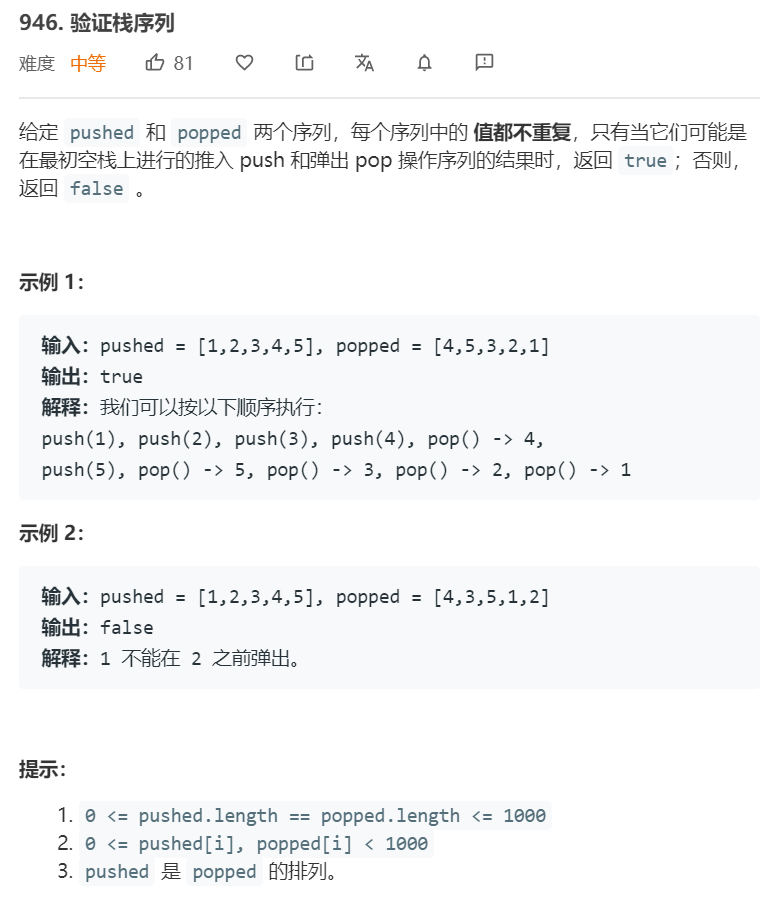

# 并查集
---

```python

class UnionFind:
    def __init__(self, n):
        self.parents = [i for i in range(n)]
        self.count = n
    
    def find(self, i):
        if self.parents[i] == i:
            return i 
        else:
            self.parents[i] = self.find(self.parents[i])
            return self.parents[i]
    
    def union(self, i, j):
        pi = self.find(i)
        pj = self.find(j)
        if pi != pj:
            self.parents[pi] = pj 
            self.count -= 1
```

连通性问题，团问题使用并查集求解。


### 946. [验证栈序列](https://leetcode-cn.com/problems/validate-stack-sequences/) ```middle```


**分析**<br/><br/>
模拟栈，两种解法。第一种解法，判断目前的栈顶元素是否等于出栈序列当前位置的元素，若不等则入栈（找到可以出栈的元素）。若等于出栈序列当前位置的元素，则出栈。循环。当遍历完入栈序列后，一个个出栈，判断是否和出栈序列相等。

第二种解法，遍历入栈元素，一个个入栈，同时内部循环出栈。循环结束后，判断栈内是否还有元素。


**算法如下**<br/>
解法1
```python
class Solution:
    def validateStackSequences(self, pushed: List[int], popped: List[int]) -> bool:
        stack = []
        push_idx, pop_idx = 0, 0
        while push_idx < len(pushed):
            if len(stack) == 0 or stack[-1] != popped[pop_idx]:
                stack.append(pushed[push_idx])
                push_idx += 1
            if stack[-1] == popped[pop_idx]:
                stack.pop(-1)
                pop_idx += 1
        while stack:
            if stack.pop() != popped[pop_idx]:
                return False
            pop_idx += 1
        return True
```

解法2
```python
class Solution:
    def validateStackSequences(self, pushed: List[int], popped: List[int]) -> bool:
        stack = []
        idx = 0
        for num in pushed:
            stack.append(num)
            while stack and stack[-1] == popped[idx]:
                stack.pop()
                idx += 1
        return not stack
```


### 41. [缺失的第一个正数](https://leetcode-cn.com/problems/first-missing-positive/) ```hard```


**分析**<br/><br/>
该题原理其实是鸽巢原理，数组有N个元素，若这N个元素各不相同且为1-N则缺失的第一个正数就是N+1，若这N个元素相同，或存在小于等于0或大于N的元素，则1-N中存在缺失的数。我们给出N个大小的位置，把这些元素填到相应的位置上，
若出现了位置的缺失就相当于缺少了这个数字。可以直接利用原数组来完成这一任务，首先检查1是否存在于数组中，若存在则将小于等于0或大于N的元素设置为1。然后遍历数组，我们用负数来标识该位存在。

还有另外一种方法是通过swap


**算法如下**<br/>
解法1
```python
class Solution:
    def firstMissingPositive(self, nums: List[int]) -> int:
        for n in nums:
            if n == 1:
                break 
        else:
            return 1 

        N = len(nums)
        nums = [n if 1 <= n and n <= N else 1 for n in nums]
        for n in nums:
            n = abs(n)
            nums[n-1] = nums[n-1] if nums[n-1] < 0 else -nums[n-1]
        for idx, n in enumerate(nums):
            if n > 0:
                return idx + 1
        return N+1
```

### 442. [数组中重复的数据](https://leetcode-cn.com/problems/find-all-duplicates-in-an-array/) ```middle```


**分析**<br/><br/>
与之前的题目类似，用负数来标识这个位置的元素已经出现过一次，当我们标识的时候发现位置已经是负数，就把这个数加入结果列表。（这是因为已经说明好，只会出现1次或2次）


**算法如下**<br/>
```python
class Solution:
    def findDuplicates(self, nums: List[int]) -> List[int]:
        res = []
        for n in nums:
            n = abs(n)
            if nums[n-1] < 0:
                res.append(n)
            else:
                nums[n-1] = -nums[n-1]
        return res
```


### 71. [简化路径](https://leetcode-cn.com/problems/simplify-path/) ```middle```


**分析**<br/><br/>
这道题用'/'去split数组后，记录当前的工作目录。碰到空或者'.'则不变，碰到'..'则弹出当前目录。


**算法如下**<br/>
```python
class Solution:
    def simplifyPath(self, path: str) -> str:
        split_path = path.split('/')
        folders = []
        for temp in split_path:
            if temp.strip() == '' or temp == '.':
                continue 
            if temp == '..':
                if len(folders):
                    folders.pop(-1)
            else:
                folders.append(temp)

        if len(folders) == 0:
            return '/'
        else:
            return '/' + '/'.join(folders)
```