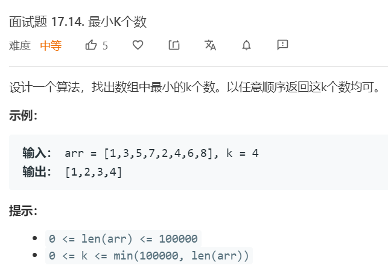
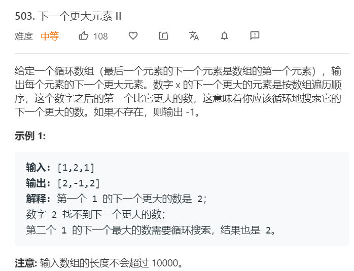
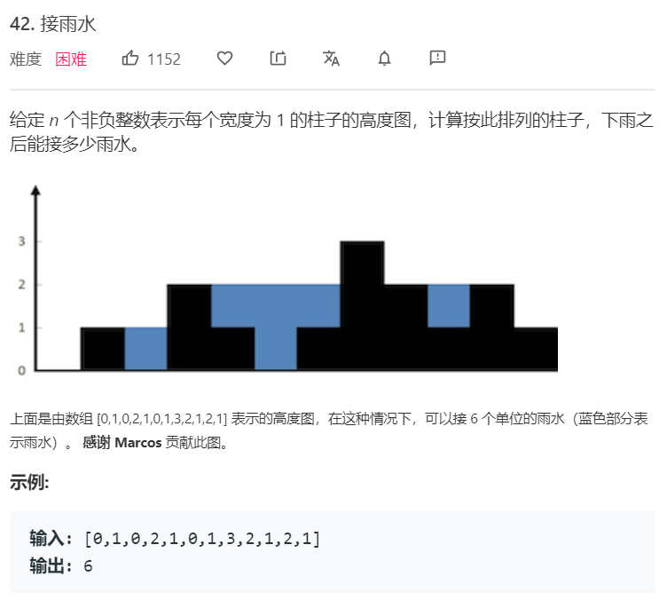
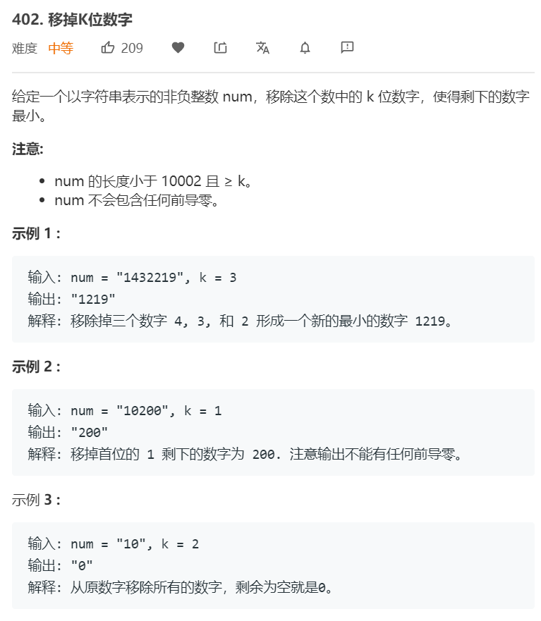

# 单调栈
---
单调栈是一种维持内部单调递增或递减的栈，能够在线性时间内计算每个元素向左或向右碰到的第一个比它大或小的元素值及位置。
如单调递减栈可以获得向右碰到的第一个比当前大的元素。遍历元素时，检查栈顶和当前元素的相对大小，并出栈所有比当前元素小的栈内元素。对这些出栈的元素而言，当前元素便是它们第一次碰到的大于它的元素。出栈完后将当前元素入栈。 在遍历结束后，栈内可能会剩下一些未出栈的元素，这些元素没有找到第一个比它们大的元素。


### 496 [下一个更大元素I](https://leetcode-cn.com/problems/next-greater-element-i/) ```easy```


**分析**<br/><br/>
直接使用单调递减栈解此题。由于nums1是nums2的子集，且要找到nums1中在nums2中更大的下一个元素，而且nums2中元素不重复。遍历nums2，利用单调栈获得每个元素的下一个更大元素，用hashtable存储起来。然后遍历nums1，从hashtable取得答案。

**算法如下**<br/>
```python
class Solution:
    def nextGreaterElement(self, nums1: List[int], nums2: List[int]) -> List[int]:
        memo = {}
        stack = []

        for n in nums2:
            while stack and stack[-1] < n:
                prev_small = stack.pop()
                memo[prev_small] = n
            stack.append(n)
        while stack:
            non_prev_small = stack.pop()
            memo[non_prev_small] = -1
        
        return [memo[n] for n in nums1]
```

### 503. [下一个更大元素II](https://leetcode-cn.com/problems/next-greater-element-ii/) ```middle```


**分析**<br/><br/>
由于循环的存在，因此我们可以遍历两次同一数组，利用单调栈求解。

**算法如下**<br/>
```python
class Solution:
    def nextGreaterElements(self, nums: List[int]) -> List[int]:
        stack = []
        ans = [-1 for i in range(len(nums))]

        for idx, n in enumerate(nums):
            while stack and stack[-1][1] < n:
                ps_idx, ps_v = stack.pop()
                ans[ps_idx] = n 
            stack.append((idx, n))
        
        for idx, n in enumerate(nums):
            while stack and stack[-1][1] < n:
                ps_idx, ps_v = stack.pop()
                if ans[ps_idx] == -1:
                    ans[ps_idx] = n 
            stack.append((idx, n))
        return ans
```


### 42. [接雨水](https://leetcode-cn.com/problems/trapping-rain-water/) ```hard```


**分析**<br/><br/>
所谓接雨水，实际上就是找后面第一个比当前元素大的元素的位置。因为可知，容器是由两边最高的柱子来决定的。假设序列为2,1,0,1,3，则水量为：3*2-1-0-1=4。其中3为底部宽度，2为两边柱子的较小值，1,0,1为容器内部不能盛水的区域。

**算法如下**<br/>
```python
class Solution:
    def nextGreaterElements(self, nums: List[int]) -> List[int]:
        stack = []
        ans = [-1 for i in range(len(nums))]

        for idx, n in enumerate(nums):
            while stack and stack[-1][1] < n:
                ps_idx, ps_v = stack.pop()
                ans[ps_idx] = n 
            stack.append((idx, n))
        
        for idx, n in enumerate(nums):
            while stack and stack[-1][1] < n:
                ps_idx, ps_v = stack.pop()
                if ans[ps_idx] == -1:
                    ans[ps_idx] = n 
            stack.append((idx, n))
        return ans
```

### 402. [移掉K位数字](https://leetcode-cn.com/problems/remove-k-digits/) ```middle```


**分析**<br/><br/>
这题实际上是在找去掉K个数字后，字典序最小的字符串。当删除第i位数字后，第i+1位数字会顶上第i位数字的位置。如何删能让字典序最小，即第i+1位数字应当比第i位数字要小。
为什么不能通过判断右边一位数字是否比当前小，若小则删除该数字？因为有可能之前没删这个元素，但删了它的后一个元素，使得它再次变成需要删除的元素。
例如：1432219这里例子
13421 -> 1321 -> 121 or 131 ?
若按照朴素的方法，会得到131，但实际上我们需要回过头来判断之前的元素是不是重新需要删除了。因为删除了它的后面元素后，它的后继改变了。这里可以使用单调栈来解决这个问题，
实际上我们要找的是，当到第i个元素时，向左数所有比它大的元素，然后将这些元素删除。我们使用递增栈来实现这一点，当元素小于栈顶时，pop出栈，并丢弃。记录个数，当大于等于k时即终止。
**算法如下**<br/>
```python
class Solution:
    def removeKdigits(self, num: str, k: int) -> str:
        new_num = []
        for n in num:
            while k and new_num and new_num[-1] > n:
                new_num.pop()
                k -= 1
            new_num.append(n)
        
        new_num = new_num[:-k] if k else new_num 
        return ''.join(new_num).lstrip('0') or '0'
```


