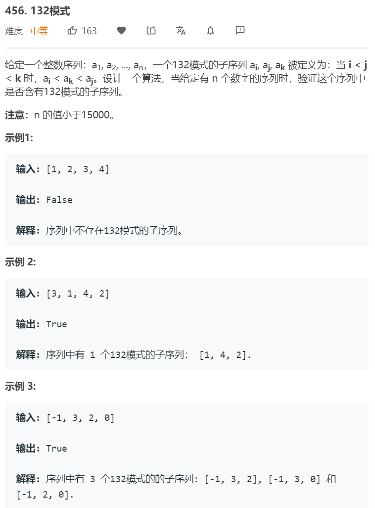

# 单调栈
---
单调栈是一种维持内部单调递增或递减的栈，能够在线性时间内计算每个元素向左或向右碰到的第一个比它大或小的元素值及位置。
如单调递减栈可以获得向右碰到的第一个比当前大的元素。遍历元素时，检查栈顶和当前元素的相对大小，并出栈所有比当前元素小的栈内元素。对这些出栈的元素而言，当前元素便是它们第一次碰到的大于它的元素。出栈完后将当前元素入栈。 在遍历结束后，栈内可能会剩下一些未出栈的元素，这些元素没有找到第一个比它们大的元素。

对于单调递减栈而言，当元素出栈时，目前出栈的栈顶元素的往右第一个比它大的元素是目前遍历到的元素（也即是即将入栈的元素），而往左第一个比它大的元素则一定是栈前面一个元素。
如给定数组 1 7 6 2 4 3 5 9 0 8，每个元素都将入栈一次，若在在最右边加上一个math.inf，则所有元素都将出栈一次。过程如下：
元素    栈
1       [1]
7       [7] 1出栈，1找到的右边第一个比它大的是7，而1并没有左边比它大的
6       [7,6] 直接入栈6，6左边第一个比它大的是7
2       [7,6,2] 直接入栈2，2左边第一个比它大的是6
4       [7,6,4] 出栈2，入栈4。2右边第一个比它大的是4，而4左边第一个比它大的是6
3       [7,6,4,3]
5       [7,6,5] 出栈3,4；入栈5。5左边第一个比它大的元素是6，中间出栈过的元素一定比它小
9       [9] 出栈5,6,7。9左边没有比它更大的元素
0       [9,0]   
8       [9,8] 出栈0，入栈8


### 496 [下一个更大元素I](https://leetcode-cn.com/problems/next-greater-element-i/) ```easy```


**分析**<br/><br/>
直接使用单调递减栈解此题。由于nums1是nums2的子集，且要找到nums1中在nums2中更大的下一个元素，而且nums2中元素不重复。遍历nums2，利用单调栈获得每个元素的下一个更大元素，用hashtable存储起来。然后遍历nums1，从hashtable取得答案。

**算法如下**<br/>
```python
class Solution:
    def nextGreaterElement(self, nums1: List[int], nums2: List[int]) -> List[int]:
        memo = {}
        stack = []

        for n in nums2:
            while stack and stack[-1] < n:
                prev_small = stack.pop()
                memo[prev_small] = n
            stack.append(n)
        while stack:
            non_prev_small = stack.pop()
            memo[non_prev_small] = -1
        
        return [memo[n] for n in nums1]
```

### 503. [下一个更大元素II](https://leetcode-cn.com/problems/next-greater-element-ii/) ```middle```


**分析**<br/><br/>
由于循环的存在，因此我们可以遍历两次同一数组，利用单调栈求解。

**算法如下**<br/>
```python
class Solution:
    def nextGreaterElements(self, nums: List[int]) -> List[int]:
        stack = []
        ans = [-1 for i in range(len(nums))]

        for idx, n in enumerate(nums):
            while stack and stack[-1][1] < n:
                ps_idx, ps_v = stack.pop()
                ans[ps_idx] = n 
            stack.append((idx, n))
        
        for idx, n in enumerate(nums):
            while stack and stack[-1][1] < n:
                ps_idx, ps_v = stack.pop()
                if ans[ps_idx] == -1:
                    ans[ps_idx] = n 
            stack.append((idx, n))
        return ans
```


### 42. [接雨水](https://leetcode-cn.com/problems/trapping-rain-water/) ```hard```


**分析**<br/><br/>
所谓接雨水，实际上就是找后面第一个比当前元素大的元素的位置。因为可知，容器是由两边最高的柱子来决定的。假设序列为2,1,0,1,3，则水量为：3*2-1-0-1=4。其中3为底部宽度，2为两边柱子的较小值，1,0,1为容器内部不能盛水的区域。

**算法如下**<br/>
```python
class Solution:
    def nextGreaterElements(self, nums: List[int]) -> List[int]:
        stack = []
        ans = [-1 for i in range(len(nums))]

        for idx, n in enumerate(nums):
            while stack and stack[-1][1] < n:
                ps_idx, ps_v = stack.pop()
                ans[ps_idx] = n 
            stack.append((idx, n))
        
        for idx, n in enumerate(nums):
            while stack and stack[-1][1] < n:
                ps_idx, ps_v = stack.pop()
                if ans[ps_idx] == -1:
                    ans[ps_idx] = n 
            stack.append((idx, n))
        return ans
```

### 402. [移掉K位数字](https://leetcode-cn.com/problems/remove-k-digits/) ```middle```


**分析**<br/><br/>
这题实际上是在找去掉K个数字后，字典序最小的字符串。当删除第i位数字后，第i+1位数字会顶上第i位数字的位置。如何删能让字典序最小，即第i+1位数字应当比第i位数字要小。
为什么不能通过判断右边一位数字是否比当前小，若小则删除该数字？因为有可能之前没删这个元素，但删了它的后一个元素，使得它再次变成需要删除的元素。
例如：1432219这里例子
13421 -> 1321 -> 121 or 131 ?
若按照朴素的方法，会得到131，但实际上我们需要回过头来判断之前的元素是不是重新需要删除了。因为删除了它的后面元素后，它的后继改变了。这里可以使用单调栈来解决这个问题，
实际上我们要找的是，当到第i个元素时，向左数所有比它大的元素，然后将这些元素删除。我们使用递增栈来实现这一点，当元素小于栈顶时，pop出栈，并丢弃。记录个数，当大于等于k时即终止。
**算法如下**<br/>
```python
class Solution:
    def removeKdigits(self, num: str, k: int) -> str:
        new_num = []
        for n in num:
            while k and new_num and new_num[-1] > n:
                new_num.pop()
                k -= 1
            new_num.append(n)
        
        new_num = new_num[:-k] if k else new_num 
        return ''.join(new_num).lstrip('0') or '0'
```


### 402. [132模式](https://leetcode-cn.com/problems/remove-k-digits/) ```middle```


**分析**<br/><br/>
这道题有个要点在于，当我们遍历j时，只需要选取0-j内的最小值为i，则一定是最优的i。因此，我们可以遍历j，然后min_nums[j]即为i，然后我们需要寻找k。k在j的后面，且min_nums[j] < nums[k] < nums[j]。这里可以用单调栈来处理这个问题，从后往前遍历构建一个单调递减的栈，遍历j，则出栈的元素均是在j后面，且比nums[j]小的元素。

值得注意的是，如果我们是遍历k找j则不行，因为遍历k找j我们需要从前往后遍历。此时，min_nums[k]是随着k在不断减小的，也就是说，我们选取的i在不断的往右移动。此时我们用单调栈弹出j，弹出的j可能在最优的i的左边，超出了范围。而对于遍历j找k而言，我们不断往左移动j指针，k一定在往右找，而i指针则不断左移。此时一定能保证，ijk的相对位置关系。


**算法如下**<br/>
```python
class Solution:
    def find132pattern(self, nums: List[int]) -> bool:
        min_nums = []
        for n in nums:
            if min_nums and n > min_nums[-1]:
                min_nums.append(min_nums[-1])
            else:
                min_nums.append(n)
        stack = []
        for j in range(len(nums)-1, 0, -1):
            while stack and nums[stack[-1]] < nums[j]:
                k = stack.pop()
                if nums[k] > min_nums[j]:
                    return True
            stack.append(j)
        return False
```
