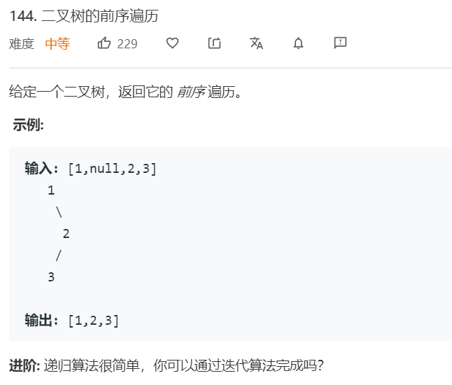
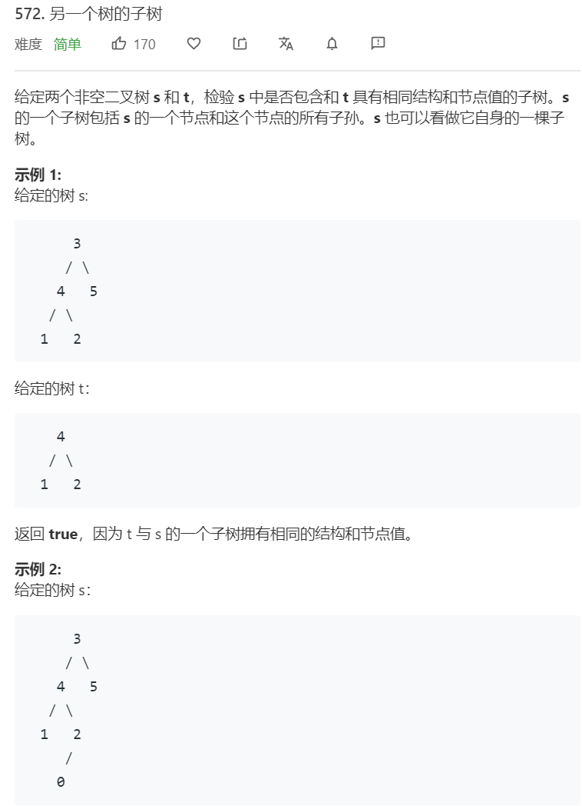
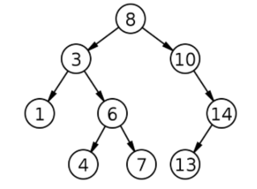

# 二叉树
---


树的问题大体可以利用深度优先遍历（前序、中序、后序）和广度优先遍历来求解。其中递归算法分为两种，一种是利用返回值，即先遍历到下面，然后逐层返回上来，函数利用子函数的返回值。另外一种是仅遍历，遍历的时候去修改一些全局变量。

## 路径问题
树的路径问题主要是一些不同的遍历方式，DFS（前序、中序、后序）、BFS（自顶向下，自底向上，锯齿层序遍历）

DFS遍历方式中，递归算法非常简单，只需要递归左右结点， 直到结点为空作为结束条件就可以， 哪种序就取决于你访问结点的时间。 而迭代算法需要利用辅助栈结构。

### 560. [二叉树的前序遍历](https://leetcode-cn.com/problems/binary-tree-preorder-traversal/) ```medium```


**分析**<br/><br/>
用一个栈来保存前驱的分支结点（相当于图的深度搜索的栈）， 然后用一个结点来记录当前结点就可以了。
前序遍历先访问当前节点，然后再分别访问左子数和右子树。构建一个栈，然后把根节点推入栈。循环直到栈为空，每次pop一个节点，打印并将右孩子和左孩子入栈。

**算法如下**<br/>
```python
class Solution:
    def preorderTraversal(self, root: TreeNode) -> List[int]:
        if root is None:
            return []
        
        stack, res = [root], []
        while stack:
            node = stack.pop(-1)
            res.append(node.val)
            if node.right: stack.append(node.right)
            if node.left: stack.append(node.left)
        return res
```

### 94. [二叉树的中序遍历](https://leetcode-cn.com/problems/binary-tree-inorder-traversal/) ```medium```


**分析**<br/><br/>
用一个栈来保存前驱的分支结点（相当于图的深度搜索的栈）， 然后用一个结点来记录当前结点就可以了。
中序遍历中，首先会不断迭代左子树，将左子树入栈以后访问，直到节点为空（到了叶子节点）。之后pop出最上层的节点，输出后，再到它的右子树。为了方便，需要有一个指针指向当前处理的节点，循环条件为node不为空且栈不为空。

**算法如下**<br/>
```python
class Solution:
    def inorderTraversal(self, root: TreeNode) -> List[int]:
        if root is None: return []
        res = []
        stack = []
        
        while root or len(stack):
            while root:
                stack.append(root)
                root = root.left 
            root = stack.pop(-1)
            res.append(root.val)
            root = root.right 
        return res
```

### 145. [二叉树的后序遍历](https://leetcode-cn.com/problems/binary-tree-postorder-traversal/) ```medium```


**分析**<br/><br/>
后序遍历大部分框架和中序遍历类似，但由于后序遍历需要两次遍历一个节点，第一次去将右孩子节点入栈，第二次才去输出这个节点。需要注意的是，在第二次访问这个节点时，一定需要把root置为None。否则会循环遍历。

**算法如下**<br/>
```python
class Solution:
    def postorderTraversal(self, root: TreeNode) -> List[int]:
        if root is None: return []
        res = []
        stack = []

        while root is not None or stack:
            while root is not None:
                stack.append((root, 1))
                root = root.left
            root, freq = stack.pop(-1)
            if freq == 1:
                stack.append((root, 2))
                root = root.right
            else:
                res.append(root.val)
                root = None 
        return res
```

### 102. [二叉树的层次遍历](https://leetcode-cn.com/problems/binary-tree-level-order-traversal/) ```medium```


**分析**<br/><br/>
层次遍历时一种BFS，是通过队列实现的。有一点值得注意的是，通过内部一个关于目前queue长度的循环可以实现对每一层节点的区分。

**算法如下**<br/>
```python
from collections import deque
class Solution:
    def levelOrder(self, root: TreeNode) -> List[List[int]]:
        if root is None:
            return []
        
        queue = deque([root])
        res = []
        while queue:
            res.append([])
            for _ in range(len(queue)):
                node = queue.popleft()
                res[-1].append(node.val)
                if node.left: queue.append(node.left)
                if node.right: queue.append(node.right)
        return res
```

### 102. [二叉树的层次遍历 II](https://leetcode-cn.com/problems/binary-tree-level-order-traversal-ii/) ```medium```


**分析**<br/><br/>
自底向上的层次遍历，把结果插在前面就行

**算法如下**<br/>
```python
from collections import deque
class Solution:
    def levelOrderBottom(self, root: TreeNode) -> List[List[int]]:
        if root is None: return []
        res = []
        queue = deque([root])

        while queue:
            res.insert(0, [])
            for _ in range(len(queue)):
                node = queue.popleft()
                res[0].append(node.val)
                if node.left: queue.append(node.left)
                if node.right: queue.append(node.right)
        return res
```

### 103. [二叉树的锯齿形层次遍历](https://leetcode-cn.com/problems/binary-tree-zigzag-level-order-traversal/) ```medium```


**分析**<br/><br/>
锯齿形的层次遍历，主要是需要记录层数的奇偶性，偶数层数直接reverse就行。或者偶数层数保存res时，append到第一个

**算法如下**<br/>
```python
from collections import deque
class Solution:
    def zigzagLevelOrder(self, root: TreeNode) -> List[List[int]]:
        if root is None: return []
        res = []
        queue = deque([root])
        level = -1
        while queue:
            level += 1
            res.append([])
            for _ in range(len(queue)):
                node = queue.popleft()
                res[-1].append(node.val)
                if node.left: queue.append(node.left)
                if node.right: queue.append(node.right)
            if level % 2 == 1:
                res[-1] = res[-1][::-1]
        return res
```

也可以采用DFS的方式去实现，由于前序遍历可以按照从左到右的顺序访问，且前序遍历可以确保按层访问的顺序是一级一级的，比较方便更新res数组，故采用前序遍历比较方便。采用DFS的话，传参传入当前的层数，并去更新全局的一个res数据即可

```python
from collections import deque
class Solution:
    def zigzagLevelOrder(self, root: TreeNode) -> List[List[int]]:
        self.res = []
        self.dfs(root, 0)
        return self.res

    def dfs(self, root, level):
        if root is None: return
        if len(self.res) <= level:
            self.res.append([])
        if level % 2 == 0:
            self.res[level].append(root.val)
        else:
            self.res[level].insert(0, root.val)
        self.dfs(root.left, level+1)
        self.dfs(root.right, level+1)
```

### 987. [二叉树的垂序遍历](https://leetcode-cn.com/problems/vertical-order-traversal-of-a-binary-tree/) ```medium```


**分析**<br/><br/>
垂序遍历，是按照从左到右，从上到下的顺序遍历二叉树。采用BFS的方式更方便，因为在每一层中可能出现X一样的节点，这种情况下需要按照节点值来排序这些节点。采用BFS方式比较方便在每一层中进行处理。（因为BFS固定了y）。而且由于采用BFS方式，每一层的最小x和最大x最多增加1，因此也比较方便更新res数组。

**算法如下**<br/>
```python
from collections import deque, defaultdict
class Solution:
    def verticalTraversal(self, root: TreeNode) -> List[List[int]]:
        if root is None: return []
        res = []
        queue = deque([(root, 0)])
        min_x = 0
        while queue:
            layer_res = defaultdict(list)
            for _ in range(len(queue)):
                node, x = queue.popleft()
                if x < min_x:
                    min_x = x 
                    res.insert(0, [])
                layer_res[x].append(node.val)
                if node.left: queue.append((node.left, x-1))
                if node.right: queue.append((node.right, x+1))
            for x, nodes in layer_res.items():
                if len(nodes) > 1:
                    nodes = sorted(nodes)
                shift = x-min_x
                if shift >= len(res):
                    res.append([])
                res[shift].extend(nodes)
        return res
```

也可以采用DFS方式，这种情况下利用字典保存xy的索引值

**算法如下**<br/>
```python
from collections import deque, defaultdict
class Solution:
    def verticalTraversal(self, root: TreeNode) -> List[List[int]]:
        self.res = {}
        self.dfs(root, 0, 0)
        
        res = [[] for i in range(len(self.res))]
        for xidx,x in enumerate(sorted(self.res.keys())):
            xres = self.res[x]
            for y in sorted(self.res[x].keys()):
                yres = xres[y]
                if len(yres) > 1:
                    yres = sorted(yres)
                res[xidx].extend(yres)
        return res

    def dfs(self, root, x, y):
        if root is None: return
        if x not in self.res:
            self.res[x] = {}
        if y not in self.res[x]:
            self.res[x][y] = []
        self.res[x][y].append(root.val)
        self.dfs(root.left, x-1, y+1)
        self.dfs(root.right, x+1, y+1)
```


### 114. [二叉树展开为链表](https://leetcode-cn.com/problems/flatten-binary-tree-to-linked-list/) ```medium```


**分析**<br/><br/>
用迭代式的先序遍历即可。保存之前的那个节点prev，每次把prev.right设置为出栈节点。

**算法如下**<br/>
```python
class Solution:
    def flatten(self, root: TreeNode) -> None:
        """
        Do not return anything, modify root in-place instead.
        """
        if not root:
            return None
        dummy = TreeNode(None)
        prev = dummy
        stack = [root]
        while stack:
            node = stack.pop()
            prev.left = None
            prev.right = node
            if node.right: stack.append(node.right)
            if node.left: stack.append(node.left)
            prev = node
        return dummy.right
```


---
各种遍历方式之后，是一些关于树的遍历的路径的题目

### 257. [二叉树所有路径](https://leetcode-cn.com/problems/binary-tree-paths/) ```medium```


**分析**<br/><br/>
这道题直接采用DFS求解即可。主要要点在于，需要有一个参数保存之前的路径，且该路径list需要进行回溯。当到达叶子节点时，将该路径保存到一个全局的list中。

**算法如下**<br/>
```python
class Solution:
    def binaryTreePaths(self, root: TreeNode) -> List[str]:
        self.res = []
        self.dfs(root, [])
        return self.res
    
    def dfs(self, root, path):
        if root is None: return 
        path.append(str(root.val))
        if root.left is None and root.right is None:
            self.res.append("->".join(path))
        self.dfs(root.left, path)
        self.dfs(root.right, path)
        path.pop(-1)
```

采用迭代法实现BFS如下，需要用一个辅助队列来保存路径。每次迭代到新的节点时，将它的左右孩子的路径加入路径队列。并将其左右孩子加入主队列。

```python
from collections import deque

class Solution:
    def binaryTreePaths(self, root: TreeNode) -> List[str]:
        res = []
        if root is None: return []
        path_queue = deque([[str(root.val)]])
        queue = deque([root])

        while queue:
            node = queue.popleft()
            path = path_queue.popleft()
            if node.left is None and node.right is None:
                res.append('->'.join(path))
            else:
                if node.left:
                    path_queue.append(path + [str(node.left.val)])
                    queue.append(node.left)
                if node.right:
                    path_queue.append(path + [str(node.right.val)])
                    queue.append(node.right)
        return res
```

### 979. [二叉树中分配硬币](https://leetcode-cn.com/problems/distribute-coins-in-binary-tree/) ```medium```


**分析**<br/><br/>
这道题的关键点在于，我们可以假设地把一个节点的值置为负数，这个意思是说，如果父节点不够分，可以看做父节点需要向它的父节点借相应个数的硬币。从这个角度看的话，只需要计算子节点缺的个数或者多的个数的加和即可。

**算法如下**<br/>
```python
class Solution:
    def distributeCoins(self, root: TreeNode) -> int:
        self.ans = 0
        self.dfs(root)
        return self.ans
    
    def dfs(self, root):
        if root is None: return 0
        left = self.dfs(root.left)
        right = self.dfs(root.right)
        self.ans += abs(left) + abs(right)
        return root.val + left + right - 1
```

该题为典型的后序遍历，可用迭代法解该题。使用一个value_stack来保存调用子树的返回值。

**算法如下**<br/>
```python
class Solution:
    def distributeCoins(self, root: TreeNode) -> int:
        ans = 0
        stack = []
        value_stack = []

        while root or stack:
            while root:
                stack.append((root, 1))
                root = root.left
            root, freq = stack.pop()
            if freq == 1:
                stack.append((root, 2))
                root = root.right 
            else:
                left = value_stack.pop() if root.left else 0
                right = value_stack.pop() if root.right else 0
                ans += abs(left) + abs(right)
                value_stack.append(root.val+left+right-1)
                root = None
        return ans
```

### 112. [路径总和](https://leetcode-cn.com/problems/path-sum/) ```easy```


**分析**<br/><br/>
值得注意的是，这道题是从根到叶子节点的路径，因此这个路径对于任何一个节点来说是唯一的。采用DFS求解即可，定义一个prev_path_sum参数为之前的路径的距离。

**算法如下**<br/>
```python
class Solution:
    def hasPathSum(self, root: TreeNode, sum: int) -> bool:
        if not root: return False
        cur = sum - root.val 
        if cur == 0 and root.left is None and root.right is None:
            return True 
        return self.hasPathSum(root.left, cur) or self.hasPathSum(root.right, cur)
```

该题为典型的先序遍历，可用迭代法解该题。使用一个value_stack来保存调用子树的返回值。

**算法如下**<br/>
```python

class Solution:
    def hasPathSum(self, root: TreeNode, sum: int) -> bool:
        if not root: return False

        stack = [root]
        value_stack = [sum-root.val]

        while stack:
            node = stack.pop()
            sum = value_stack.pop()
            if not node.left and not node.right and sum == 0:
                return True 
            if node.right:
                stack.append(node.right)
                value_stack.append(sum-node.right.val)
            if node.left:
                stack.append(node.left)
                value_stack.append(sum-node.left.val)
        return False
```

### 113. [路径总和II](https://leetcode-cn.com/problems/path-sum-ii/) ```middle```


**分析**<br/><br/>
这道题需要把所有路径输出出来，可以用DFS求解。只需要把之前的路径保存下来即可，作为一个参数。需要注意的是，为了减少内存使用，list是共享的，因此需要回溯

**算法如下**<br/>
```python
class Solution:
    def pathSum(self, root: TreeNode, sum: int) -> List[List[int]]:
        self.res = []
        self.dfs(root, sum, [])
        return self.res
    
    def dfs(self, root, sum, path):
        if not root: return 
        
        path.append(root.val)
        sum -= root.val
        if not root.left and not root.right and sum == 0:
            self.res.append(path.copy())

        self.dfs(root.left, sum, path)
        self.dfs(root.right, sum, path)

        path.pop(-1)
```

该题同样为典型的先序遍历，可用迭代法解该题。使用一个value_stack来保存调用子树的返回值。与上一题差异在于，需要对path list进行回溯。为避免回溯，stack中保存的是list的copy。

**算法如下**<br/>
```python
class Solution:
    def pathSum(self, root: TreeNode, sum: int) -> List[List[int]]:
        res = []
        if not root: return []

        stack = [root]
        value_stack = [sum-root.val]
        path_stack = [[root.val]]

        while stack:
            node = stack.pop()
            sum = value_stack.pop()
            path = path_stack.pop()

            if not node.left and not node.right and sum == 0:
                res.append(path)
            
            if node.right:
                stack.append(node.right)
                value_stack.append(sum-node.right.val)
                new_path = path.copy()
                new_path.append(node.right.val)
                path_stack.append(new_path)

            if node.left:
                stack.append(node.left)
                value_stack.append(sum-node.left.val)
                new_path = path.copy()
                new_path.append(node.left.val)
                path_stack.append(new_path)
    
        return res
```

这道题也可以用BFS求解，但存储效率很低。


### 437. [路径总和III](https://leetcode-cn.com/problems/path-sum-iii/) ```easy```


**分析**<br/><br/>
需要注意的是，这道题的路径不再需要从根节点开始，也不需要在叶子节点结束。也就是说，对于一个节点而言，存在很多条路径。这种情况下可以采用前缀和加上Hash Table求解。利用DFS进行先序遍历，并且同时维护一个前缀和dict，需要回溯。


**算法如下**<br/>
```python
class Solution:
    def pathSum(self, root: TreeNode, sum: int) -> int:
        self.res = 0
        self.helper(root, sum, {0:1}, 0)
        return self.res
    
    def helper(self, root, sum, prefixs, accu):
        if not root: return 
        accu += root.val
        target = accu - sum
        if target in prefixs:
            self.res += prefixs[target]
        prefixs[accu] = prefixs.get(accu, 0) + 1
        
        self.helper(root.left, sum, prefixs, accu)
        self.helper(root.right, sum, prefixs, accu)

        prefixs[accu] -= 1
```

该题为回溯法，实际上由于后序遍历迭代算法会两次访问节点，就是一个回溯法的框架。在不断入栈左子树的过程中，进行操作。然后再第二次访问同样的节点时，进行回溯操作。

**算法如下**<br/>
```python
class Solution:
    def pathSum(self, root: TreeNode, sum: int) -> int:
        ans = 0
        accu = 0
        prefix = {0:1}
        stack = []

        while root or stack:
            while root:
                stack.append((root, False))
                accu += root.val 
                if accu-sum in prefix:
                    ans += prefix[accu-sum]
                prefix[accu] = prefix.get(accu, 0)+1
                root = root.left
            
            root, visited = stack.pop()
            if visited:
                prefix[accu] -= 1
                accu -= root.val
                root = None
            else:
                stack.append((root, True))
                root = root.right
        
        return ans
```


### 124. [二叉树中的最大路径和](https://leetcode-cn.com/problems/binary-tree-maximum-path-sum/) ```hard```


**分析**<br/><br/>
这种路径可以是向下拐弯的，也就是说不一定需要从上到下。对于一个节点而言，经过它的路径和应该是左子数-》自己-》右子树，或者左子树或右子树-》自己-》继续往上。第一种情况不能再继续往上了，而第二种情况可以。采用DFS求解这个逻辑。需要注意的是，节点值可以是负数，因此也可以同时不要左子树和右子树。


**算法如下**<br/>
```python
class Solution:
    def maxPathSum(self, root: TreeNode) -> int:
        if not root: return 0
        self.ans = root.val 
        p = self.dfs(root)
        return max(p, self.ans)
        

    
    def dfs(self, root):
        if not root: return 0
        left = self.dfs(root.left)
        right = self.dfs(root.right)

        path = max(left, right, 0) + root.val
        non_path = max(left, 0) + max(right, 0) + root.val

        self.ans = max(self.ans, path, non_path)
        return path
```

该题同样为典型的后序遍历，可用迭代法解该题。

**算法如下**<br/>
```python
class Solution:
    def maxPathSum(self, root: TreeNode) -> int:
        if not root: return 0

        ans = root.val
        stack = []
        val_stack = []

        while root or stack:
            while root:
                stack.append((root, 1))
                root = root.left 
            
            root, freq = stack.pop()
            if freq == 1:
                stack.append((root, 2))
                root = root.right 
            else:
                left = val_stack.pop() if root.left else 0
                right = val_stack.pop() if root.right else 0
                path = max(left, right, 0) + root.val
                non_path = max(left, 0) + max(right, 0) + root.val
                ans = max(ans, path, non_path)
                val_stack.append(path)
                root = None
        return ans
```


### 687. [最长同值路径](https://leetcode-cn.com/problems/longest-univalue-path/) ```easy```


**分析**<br/><br/>
这道题寻找的路径同样是不需要经过根节点的，而且可以是拐弯的。使用后序遍历可以解此题，递归调用左子树和右子树。返回包含左子树和右子树的最大路径长度。根节点判断是否和左子树或右子树的值相等，若相等的话可以将路径累加，否则返回1.


**算法如下**<br/>
```python
class Solution(object):
    def longestUnivaluePath(self, root):
        self.ans = 0

        def arrow_length(node):
            if not node: return 0
            left_length = arrow_length(node.left)
            right_length = arrow_length(node.right)
            left_arrow = right_arrow = 0
            if node.left and node.left.val == node.val:
                left_arrow = left_length + 1
            if node.right and node.right.val == node.val:
                right_arrow = right_length + 1
            self.ans = max(self.ans, left_arrow + right_arrow)
            return max(left_arrow, right_arrow)

        arrow_length(root)
        return self.ans
```

该题同样为典型的后序遍历，可用迭代法解该题。


### 543. [二叉树的直径](https://leetcode-cn.com/problems/diameter-of-binary-tree/) ```easy```


**分析**<br/><br/>
和前一题类似


**算法如下**<br/>
```python
class Solution:
    def diameterOfBinaryTree(self, root: TreeNode) -> int:
        self.ans = 0
        self.helper(root)
        if self.ans == 0:
            return 0
        return self.ans - 1

    def helper(self, root):
        if not root: return 0
        left = self.helper(root.left)
        right = self.helper(root.right)
        path = max(left, right) + 1
        self.ans = max(left+right+1, self.ans, path)
        return path
```


### 129. [求根到叶子节点数字之和](https://leetcode-cn.com/problems/sum-root-to-leaf-numbers/) ```middle```


**分析**<br/><br/>
这道题既可以用DFS也可以用BFS求解


**算法如下**<br/>
```python
from collections import deque
class Solution:
    def sumNumbers(self, root: TreeNode) -> int:
        if not root: return 0
        queue = deque([root])
        value_queue = deque([0])
        sum = 0
        while queue:
            node = queue.popleft()
            prev_value = value_queue.popleft()
            cur_val = prev_value*10+node.val 
            if not node.left and not node.right:
                sum += cur_val
            if node.left:
                queue.append(node.left)
                value_queue.append(cur_val)
            if node.right:
                queue.append(node.right)
                value_queue.append(cur_val)
        return sum
```

DFS求解如下：

```python
class Solution:
    def sumNumbers(self, root: TreeNode) -> int:
        if not root: return 0
        self.ans = 0
        self.dfs(root, 0)
        return self.ans
    
    def dfs(self, root, prev):
        if not root: return 
        cur = prev * 10 + root.val 
        
        if not root.left and not root.right:
            self.ans += cur 
        
        self.dfs(root.left, cur)
        self.dfs(root.right, cur)
```


## 基本特性问题

### 971. [翻转二叉树以匹配先序遍历](https://leetcode-cn.com/problems/flip-binary-tree-to-match-preorder-traversal/) ```middle```


**分析**<br/><br/>
这道题，由于每个节点的大小都不一样，且只能翻转左右节点，因此只可能存在一种翻转方式。当我们先序遍历二叉树，发现下一个要遍历的节点与voyage下一个不相等时，就去翻转孩子节点。这里我们只需要去检查左节点就行了，若节点同时有左右孩子节点，则翻转节点，并检查右节点是否符合要求。若节点只有一个子节点，则判断失败。若节点没有子节点，不进行判断（因为此时下一个访问节点此时拿不到）。

这里需要掌握的一点是，当我们翻转一次后，下一次碰到这个节点若不满足要求，则可以直接判断失败。

采用迭代法求解

**算法如下**<br/>
```python
class Solution:
    def flipMatchVoyage(self, root: TreeNode, voyage: List[int]) -> List[int]:
        stack = [root]
        res = []
        next_idx = 0
        while stack:
            next_idx += 1
            node = stack.pop()
            if node.val != voyage[next_idx-1]:
                return [-1]
            
            if next_idx < len(voyage):
                if node.left is not None and node.left.val != voyage[next_idx]:
                    if node.right is None or node.right.val != voyage[next_idx]: return [-1]
                    res.append(node.val)
                    node.right, node.left = node.left, node.right 
            
            if node.right: stack.append(node.right)
            if node.left: stack.append(node.left)
        return res
```


### 101. [对称二叉树](https://leetcode-cn.com/problems/symmetric-tree/) ```easy```


**分析**<br/><br/>
所谓对称二叉树，实际上就是判断相反顺序读的两个树是不是同一个树。

**算法如下**<br/>
```python
class Solution:
    def isSymmetric(self, root: TreeNode) -> bool:
        if not root: return True
        return self.identical(root.left, root.right)

    def identical(self, r1, r2):
        if not r1 and not r2: return True
        if r1 and r2:
            return r1.val == r2.val and self.identical(r1.left, r2.right) and self.identical(r1.right, r2.left)
        return False
```

实际上是先序遍历，迭代法求解如下：

**算法如下**<br/>
```python
class Solution:
    def isSymmetric(self, root: TreeNode) -> bool:
        if not root: return True
        stack1 = [root.left]
        stack2 = [root.right]

        while stack1 and stack2:
            node1 = stack1.pop()
            node2 = stack2.pop()

            if node1 is None and node2 is None:
                continue
            elif node1 and node2:
                if node1.val != node2.val: return False
                stack1.append(node1.right)
                stack1.append(node1.left)
                stack2.append(node2.left)
                stack2.append(node2.right)
            else:
                return False
        
        if len(stack1) or len(stack2):
            return False
        
        return True
``` 


### 572. [另一个树的子树](https://leetcode-cn.com/problems/subtree-of-another-tree/) ```easy```


**分析**<br/><br/>
所谓对称二叉树，实际上就是判断相反顺序读的两个树是不是同一个树。

**算法如下**<br/>
```python
class Solution:
    def isSymmetric(self, root: TreeNode) -> bool:
        if not root: return True
        return self.identical(root.left, root.right)

    def identical(self, r1, r2):
        if not r1 and not r2: return True
        if r1 and r2:
            return r1.val == r2.val and self.identical(r1.left, r2.right) and self.identical(r1.right, r2.left)
        return False
```

实际上是先序遍历，迭代法求解如下：

**算法如下**<br/>
```python
class Solution:
    def isSymmetric(self, root: TreeNode) -> bool:
        if not root: return True
        stack1 = [root.left]
        stack2 = [root.right]

        while stack1 and stack2:
            node1 = stack1.pop()
            node2 = stack2.pop()

            if node1 is None and node2 is None:
                continue
            elif node1 and node2:
                if node1.val != node2.val: return False
                stack1.append(node1.right)
                stack1.append(node1.left)
                stack2.append(node2.left)
                stack2.append(node2.right)
            else:
                return False
        
        if len(stack1) or len(stack2):
            return False
        
        return True
``` 

### 814. [二叉树剪枝](https://leetcode-cn.com/problems/binary-tree-pruning/) ```middle```


**分析**<br/><br/>
后序遍历，检查子树中是否含有1，若不含有1则删掉。子树是否含有1通过自己是否等于1，左子树右子树是否含有1来判断。值得注意的是，当到根节点时需要判断一下。

**算法如下**<br/>
```python
class Solution:
    def pruneTree(self, root: TreeNode) -> TreeNode:
        self.helper(root)
        if root.left is None and root.right is None and root.val == 0:
            return None
        return root


    def helper(self, root):
        if root is None: return False
        left = self.helper(root.left)
        right = self.helper(root.right)
        if not left:
            root.left = None 
        if not right:
            root.right = None 
        return left or right or root.val == 1
```

迭代法如下，值得注意的是，在迭代后序遍历中，先出栈的右子树的结果

**算法如下**<br/>
```python
class Solution:
    def pruneTree(self, root: TreeNode) -> TreeNode:
        if root is None: return None 
        stack = []
        value_stack = []
        node = root
        while node or stack:
            while node:
                stack.append((node, False))
                node = node.left 
            node, visited = stack.pop()
            if visited:
                right = value_stack.pop() if node.right else False
                left = value_stack.pop() if node.left else False
                if not left: node.left = None 
                if not right: node.right = None 
                value_stack.append(left or right or node.val == 1)
                node = None
            else:
                stack.append((node, True))
                node = node.right

        if root.left is None and root.right is None and root.val == 0:
            return None
        return root
```

### 199. [二叉树的右视图](https://leetcode-cn.com/problems/binary-tree-right-side-view/) ```middle```


**分析**<br/><br/>
BFS，每次找到一层最后一个节点即可。

**算法如下**<br/>
```python
from collections import deque
class Solution:
    def rightSideView(self, root: TreeNode) -> List[int]:
        if root is None: return []
        ans = []
        queue = deque([root])
        while queue:
            T = len(queue)
            for i in range(T):
                node = queue.popleft()
                if i == T-1:
                    ans.append(node.val)
                if node.left: queue.append(node.left)
                if node.right: queue.append(node.right)
        return ans
```

实际上是先序遍历，迭代法求解如下：

**算法如下**<br/>
```python
class Solution:
    def pruneTree(self, root: TreeNode) -> TreeNode:
        self.helper(root)
        if root.left is None and root.right is None and root.val == 0:
            return None
        return root


    def helper(self, root):
        if root is None: return False
        left = self.helper(root.left)
        right = self.helper(root.right)
        if not left:
            root.left = None 
        if not right:
            root.right = None 
        return left or right or root.val == 1
```

# 其他树
---


## 二叉搜索树
二叉查找树，二叉排序树。若它的左子树不空，则左子树上所有结点的值均小于它的根结点的值；若它的右子树不空，则右子树上所有结点的值均大于它的根结点的值； 它的左、右子树也分别为二叉搜索树。参考示例图如下



**考察重点**：二叉搜索树的创建问题、删除二叉树的指定节点、修改二叉树节点的值、添加节点。 由于二搜索树自身的特殊性质，可知插入和查找具体节点的时间复杂度为O(logn)。另外，需要谨记应用中序遍历二叉搜索树得到的序列为升序序列。对于添加、修改二叉树的节点问题，中序遍历的思想一般能够提供较好的解答思路。


### 701. [二叉搜索树中的插入操作](https://leetcode-cn.com/problems/insert-into-a-binary-search-tree/) ```middle```


**分析**<br/><br/>
按照二叉搜索树的特性查找节点，直到节点为None即可插入。


**算法如下**<br/>
```python
class Solution:
    def insertIntoBST(self, root: TreeNode, val: int) -> TreeNode:
        if root is None:
            return TreeNode(val)
        if val < root.val:
            root.left = self.insertIntoBST(root.left, val)
        elif val > root.val:
            root.right = self.insertIntoBST(root.right, val)
        return root
```

### 96. [不同的二叉搜索树](https://leetcode-cn.com/problems/unique-binary-search-trees/) ```middle```


**分析**<br/><br/>


**算法如下**<br/>
```python
class Solution:
    def numTrees(self, n: int) -> int:
        dp = [None for i in range(n+1)]
        ans = self.dfs(1, n, dp)
        return ans

    def dfs(self, start, end, dp):
        n = end - start + 1
        if n <= 1:
            return 1
        elif dp[n] is not None:
            return dp[n]
        
        count = 0
        for i in range(1, n+1):
            left = self.dfs(1, i-1, dp)
            right = self.dfs(i+1, n, dp)
            count += left * right
        dp[n] = count
        return count
```


### 173. [二叉搜索树迭代器](https://leetcode-cn.com/problems/binary-search-tree-iterator/) ```middle```


**分析**<br/><br/>
实际上是需要实现一个中序遍历的迭代器。首先把所有左子数入栈。每次next时出栈一个，并将右子树的所有左子树入栈。

**算法如下**<br/>
```python
class BSTIterator:

    def __init__(self, root: TreeNode):
        self.stack = []
        self._left_most_inorder(root)

    
    def _left_most_inorder(self, root):
        stack = self.stack
        while root:
            stack.append(root)
            root = root.left 

    
    def next(self) -> int:
        """
        @return the next smallest number
        """
        root = self.stack.pop()
        ans = root.val 
        if root.right:
            self._left_most_inorder(root.right)
        return ans
```


### 222. [完全二叉树的节点个数](https://leetcode-cn.com/problems/count-complete-tree-nodes/) ```middle```


**分析**<br/><br/>
对于完全二叉树，假设是满二叉树，则节点数量为 2^h-1。对于满二叉树，计算节点数量的时间复杂度为O(N)。由于完全二叉树一定是从左子树开始填充的，分别计算左子树和右子树的高度，很容易观察到，当左子树和右子树的高度相等时，左子树一定是满二叉树。当高度不等时，右子树一定是满二叉树。通过这种方式一次可以减少一半的节点查找。


**算法如下**<br/>
```python
class Solution:
    def countNodes(self, root: TreeNode) -> int:
        if root is None:
            return 0
        
        lh = self.height(root.left)
        rh = self.height(root.right)

        if lh == rh:
            return 2**lh + self.countNodes(root.right)
        else:
            return 2**rh + self.countNodes(root.left)
                
    def height(self, root):
        if root is None:
            return 0 
        else:
            return self.height(root.left)+1
```


### 98. [验证二叉搜索树](https://leetcode-cn.com/problems/validate-binary-search-tree/) ```middle```


**分析**<br/><br/>
两种方法。
1. 递归法，对于任意一个节点，假设节点值为X，目前上界为upper，下界为lower。则其左子树的上界为X，下界为lower，右子树的上界为upper，下界为X。
2. 递归搜索是否符合该条件即可
3. 中序遍历，检查是否是有序的。


**算法如下**<br/>
解法1-1。自底向上
```python
class Solution:
    def isValidBST(self, root: TreeNode) -> bool:
        min_, max_, res = self.helper(root)
        return res
    

    def helper(self, root):
        if root is None:
            return None, None, True 
        
        lmin, lmax, lis = self.helper(root.left)
        rmin, rmax, ris = self.helper(root.right)

        if lis and ris and (lmax is None or lmax < root.val) and (rmin is None or rmin > root.val):
            min_ = lmin if lmin is not None else root.val 
            max_ = rmax if rmax is not None else root.val
            return min_, max_, True 
        return None, None, False
```

解法1-2
```python
class Solution:
    def isValidBST(self, root: TreeNode) -> bool:
        return self.helper(root, None, None)


    def helper(self, root, lower, upper):
        if root is None:
            return True

        if lower is not None and root.val <= lower:
            return False
        if upper is not None and root.val >= upper:
            return False
        
        return self.helper(root.left, lower, root.val) and self.helper(root.right, root.val, upper)
```

解法2
```python
class Solution:
    def isValidBST(self, root: TreeNode) -> bool:
        stack = []
        prev = None 
        while stack or root:
            while root:
                stack.append(root)
                root = root.left
            root = stack.pop()
            if prev is not None and root.val <= prev:
                return False
            prev = root.val 
            root = root.right 
        return True 
```


### 310. [最小高度树](https://leetcode-cn.com/problems/minimum-height-trees/) ```middle```


**分析**<br/><br/>
两种方法。
1. 两次遍历找到图的直径，然后在这个直径上找到中点即可。找任意一点，找到离它最远的点，该点一定是直径的其中一点，再从该点找最远的点，这两点构成了直径。利用DFS法可以更方便的输出路径。
2. 拓扑排序法，容易想像，根节点一定在藏在最里面的节点。我们每次把度为1的节点，也就是最外圈节点一层层删掉，那剩下的一个或两个节点一定是根节点。需要注意的是，要一次性把所有度为1的都删除。

**算法如下**<br/>
解法1
```python
from collections import defaultdict, deque
class Solution:
    def findMinHeightTrees(self, n: int, edges: List[List[int]]) -> List[int]:
        # create graph
        if len(edges) == 0: return [0]
        graph = defaultdict(list)
        for n1, n2 in edges:
            graph[n1].append(n2)
            graph[n2].append(n1)
        
        path1 = self.get_remotest_node_dfs(0, graph)
        r1 = path1[-1]
        path2 = self.get_remotest_node_dfs(r1, graph)
        r2 = path2[-1]

        total_depth = len(path2)
        if total_depth % 2 == 1:
            return [path2[total_depth // 2]]
        else:
            return [path2[total_depth // 2], path2[total_depth // 2 - 1]]
        
    def get_remotest_node_dfs(self, start, graph):
        visited = [False for n in range(len(graph))]

        max_path = [start]
        max_depth = 0

        def dfs(node, depth, path):
            visited[node] = True
            path.append(node)
            nonlocal max_depth
            nonlocal max_path
            if depth > max_depth:
                max_depth = depth
                max_path = path[:]

            for tnode in graph[node]:
                if visited[tnode]: continue
                dfs(tnode, depth+1, path)

            path.pop()
            visited[node] = False

        dfs(start, 0, [])
        return max_path
```

解法2
```python
from collections import defaultdict, deque
class Solution:
    def findMinHeightTrees(self, n: int, edges: List[List[int]]) -> List[int]:
        # create graph
        if len(edges) == 0: return [0]
        graph = defaultdict(list)
        degrees = [0 for i in range(n)]
        for n1, n2 in edges:
            graph[n1].append(n2)
            graph[n2].append(n1)
            degrees[n1] += 1
            degrees[n2] += 1

        degree_1 = deque([i for i, degree in enumerate(degrees) if degree == 1])

        # left_node_count = sum(1 for i, degree in enumerate(degrees) if degree > 0)
        delete_node = [False if degrees[i] != 0 else True for i in range(n) ] 
        left_node_count = n-sum(delete_node)

        
        while degree_1:
            if left_node_count == 1 or left_node_count == 2:
                break 
            for _ in range(len(degree_1)):
                node = degree_1.popleft()
                delete_node[node] = True
                left_node_count -= 1
                for tnode in graph[node]:
                    if delete_node[tnode]: continue 
                    degrees[tnode] -= 1
                    if degrees[tnode] == 1:
                        degree_1.append(tnode)
        
        return [i for i, d in enumerate(delete_node) if not d]
```